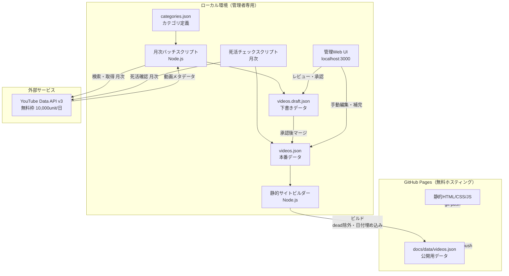
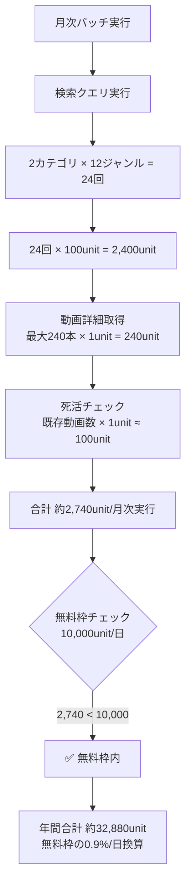
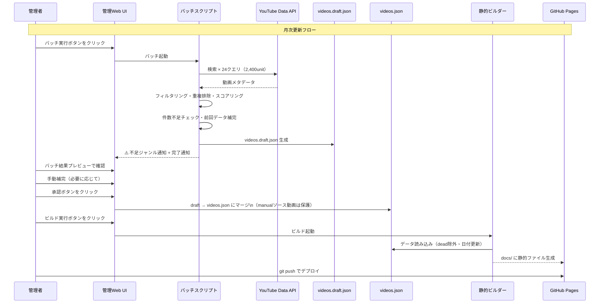
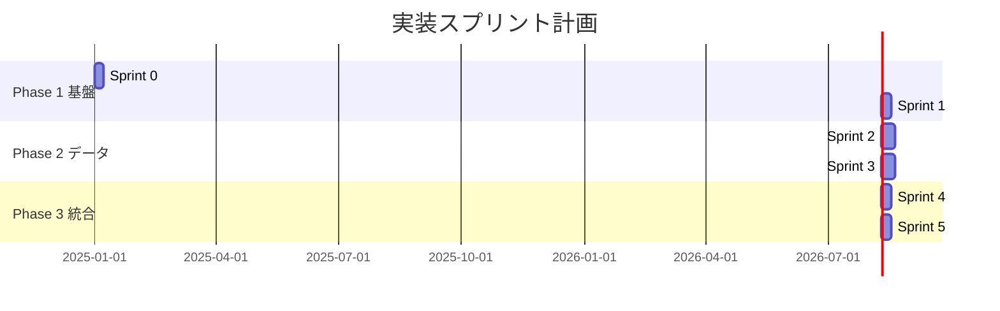

# 注文住宅YouTube動画マップ - 完全設計仕様書 v2.0

---

## 目次

1. [プロジェクト概要](#1-プロジェクト概要)
2. [システムアーキテクチャ](#2-システムアーキテクチャ)
3. [機能要件](#3-機能要件)
4. [非機能要件](#4-非機能要件)
5. [データ設計](#5-データ設計)
6. [UI/UX設計](#6-uiux設計)
7. [YouTube API・法的要件](#7-youtube-api法的要件)
8. [エッジケース対応](#8-エッジケース対応)
9. [実装計画（スプリント計画）](#9-実装計画スプリント計画)
10. [CLAUDE.md](#10-claudemd)

---

## 1. プロジェクト概要

### 1.1 目的・背景

注文住宅を検討し始めた初心者ユーザーが、YouTube上に散在する関連動画の全体像を把握し、自分の関心に合った動画へスムーズにたどり着けるナビゲーションサイトを構築する。

### 1.2 ターゲットユーザー

- 注文住宅を初めて検討し始めた一般消費者
- スマートフォン・PCいずれでも利用する想定

### 1.3 サービス形態

| 項目 | 内容 |
|------|------|
| 公開形態 | 公開Webサイト（誰でも無料閲覧可能） |
| 運営形態 | 個人運営・非商用 |
| ホスティング | GitHub Pages（無料） |
| ユーザー認証 | 不要 |
| 管理画面 | ローカル環境のみ（Web UI） |

---

## 2. システムアーキテクチャ

### 2.1 全体構成



### 2.2 技術スタック

| レイヤー | 技術選定 | 理由 |
|----------|----------|------|
| フロントエンド | HTML / CSS / Vanilla JS | 依存最小化・静的配信に最適 |
| PCビジュアル | D3.js（カスタムツリーレイアウト） | 動画カードをサイドパネルに表示する設計で実装難易度を管理 |
| モバイルUI | CSS アニメーション付きアコーディオン | 操作性◎・実装難易度中 |
| バッチ/ビルド | Node.js スクリプト | フロントとの言語統一・テスト容易 |
| データストア | JSON ファイル群 | 静的サイトとの親和性が高い |
| ローカル管理UI | Node.js + Express（localhost） | ブラウザで操作可・GUIに近い体験 |
| ホスティング | GitHub Pages | 無料・シンプル |
| 単体・結合テスト | Jest | Node.jsとの相性が良い |
| 管理APIテスト | supertest | Expressサーバーへの直接HTTPテスト |
| YouTube APIモック | nock | HTTPリクエストを決定論的にインターセプト |
| E2Eテスト（多用） | Playwright | レスポンシブ・タイムアウト・ネットワーク制御を自動化 |
| アクセシビリティ自動チェック | axe-playwright | WCAG AA違反を自動検出 |

### 2.3 D3.jsツリーレイアウト設計方針

**採用設計：動画カードをサイドパネルに表示する方式**

```
[マインドマップ領域]          [サイドパネル]
                              ┌─────────────────┐
 ルート                        │ 間取り の動画     │
   ├── 施主目線                │                 │
   │    ├── 間取り ◀クリック  │ ┌─────────────┐ │
   │    ├── 外壁               │ │[サムネイル]  │ │
   │    └── ...                │ │ タイトル    │ │
   └── 専門家目線              │ │ チャンネル名│ │
        ├── 間取り             │ └─────────────┘ │
        └── ...                │ ┌─────────────┐ │
                              │ │[サムネイル]  │ │
                              └─────────────────┘
```

**選定理由：**
- 動画カード（サムネイル・タイトル・バッジ）をD3.jsノード内に埋め込む場合、SVG内のHTML要素管理が複雑化してメンテナンスが困難になる
- サイドパネル方式であれば、D3.jsはノードのクリックイベントのみを担当し、動画カードは通常のHTML/CSSで実装できる
- Sprint 1での実装工数を現実的な範囲に収められる

---

## 3. 機能要件

### 3.1 公開サイト機能

#### FR-01 マインドマップ表示（PC）

- カテゴリ → ジャンル の2階層ツリーをD3.jsで表示する
- ジャンルノードをクリックすると、右側のサイドパネルに動画カード一覧を表示する
- 各ノードはクリック/タップで展開・折りたたみができる
- ノードホバー時にアニメーション（拡大・ハイライト）を付与する
- マインドマップはズーム・パン操作に対応する（ノードが画面外にはみ出した場合の対策）

#### FR-02 アコーディオン表示（モバイル）

- 画面幅768px未満でアコーディオンUIに自動切り替えする
- カテゴリ → ジャンル → 動画カード の順に階層展開する
- 展開・折りたたみにCSSアニメーション（`max-height` + `opacity`、300ms ease-in-out）を付与する
- アイコン（`▶`→`▼`）を90°回転アニメーションで切り替える
- 動画カードのフェードイン：展開時に上からスライドインするスタガーアニメーション

#### FR-03 動画カード表示

各カードに以下を表示する：

| 表示要素 | 内容 | 備考 |
|----------|------|------|
| サムネイル | `https://img.youtube.com/vi/{videoId}/hqdefault.jpg` | 404時はフォールバック画像を表示 |
| タイトル | 動画タイトル（最大2行で省略、`-webkit-line-clamp: 2`） | 100文字超も対応 |
| チャンネル名 | 投稿者名（絵文字・特殊文字はエスケープ処理） | XSS対策必須 |
| 投稿日 | `YYYY年MM月DD日` 形式 | 情報鮮度の判断に有用 |
| 動画時間 | `MM:SS` または `HH:MM:SS` 形式 | 視聴判断に影響大 |
| 急上昇バッジ | 🔥「急上昇」ラベル（対象動画のみ） | |
| おすすめバッジ | ⭐「管理者おすすめ」ラベル（手動追加動画のみ） | |

#### FR-04 YouTube遷移

- 動画カードをクリックすると `https://www.youtube.com/watch?v={videoId}` を別タブで開く
- サイト内での動画再生は行わない（法的リスク低減）

#### FR-05 サムネイルフォールバック

```html
<!-- フロントエンド実装必須 -->

```

#### FR-06 カテゴリ・ジャンル構成

**カテゴリ（2種）**

| ID | カテゴリ名 |
|----|-----------|
| CAT-01 | 施主目線 |
| CAT-02 | 専門家目線（工務店・ハウスメーカー・設計士） |

**ジャンル（12種）**

| ID | ジャンル名 | 施主目線クエリ | 専門家目線クエリ | 代替クエリ |
|----|-----------|--------------|----------------|-----------|
| GNR-01 | 間取り | `注文住宅 間取り 施主 体験談` | `注文住宅 間取り 設計士 プロ` | `注文住宅 間取り 失敗 後悔` |
| GNR-02 | 外壁 | `注文住宅 外壁 施主 選び方` | `注文住宅 外壁 工務店 おすすめ` | `注文住宅 外壁 種類 比較` |
| GNR-03 | 屋根 | `注文住宅 屋根 施主 選び方` | `注文住宅 屋根 工務店 おすすめ` | `注文住宅 屋根 種類 比較` |
| GNR-04 | 風呂 | `注文住宅 お風呂 施主 体験談` | `注文住宅 お風呂 設計士 おすすめ` | `注文住宅 浴室 選び方` |
| GNR-05 | トイレ | `注文住宅 トイレ 施主 体験談` | `注文住宅 トイレ 設計士 おすすめ` | `注文住宅 トイレ 選び方` |
| GNR-06 | キッチン | `注文住宅 キッチン 施主 体験談` | `注文住宅 キッチン 設計士 おすすめ` | `注文住宅 キッチン 選び方` |
| GNR-07 | 床 | `注文住宅 床材 施主 体験談` | `注文住宅 床材 工務店 おすすめ` | `注文住宅 フローリング 選び方` |
| GNR-08 | リビング | `注文住宅 リビング 施主 体験談` | `注文住宅 リビング 設計士 間取り` | `注文住宅 リビング 後悔` |
| GNR-09 | ダイニング | `注文住宅 ダイニング 施主 体験談` | `注文住宅 ダイニング 設計士 おすすめ` | `注文住宅 ダイニング 選び方` |
| GNR-10 | 照明計画 | `注文住宅 照明 施主 体験談` | `注文住宅 照明計画 設計士 解説` | `注文住宅 照明 後悔` |
| GNR-11 | 庭 | `注文住宅 外構 庭 施主 体験談` | `注文住宅 外構 工務店 おすすめ` | `注文住宅 庭 ガーデニング` |
| GNR-12 | ランドリールーム | `注文住宅 ランドリールーム 施主 体験談` | `注文住宅 ランドリールーム 設計士 解説` | `注文住宅 洗濯 動線` |

> **⚠️ 重要：Sprint 0またはSprint 2開始前に、上記クエリを実際にYouTubeで検索し、意図通りの動画が返ってくるかを人手で検証すること。**

#### FR-07 動画表示件数ルール

| 種別 | 件数 | 選定基準 |
|------|------|----------|
| 人気動画 | 上位5件 | 再生数の多い順 |
| 急上昇動画 | 上位3件 | 下記「急上昇」定義を満たす動画 |
| 合計（目標） | 最大8件 / カテゴリ×ジャンル | 重複排除後 |

**「急上昇」コンテンツ定義：**
- チャンネル登録者数：2万人以下（登録者数が非公開の場合はtrendingタグ対象外、ただし通常動画として保持）
- エンゲージメント率：`再生数 ÷ 登録者数 ≥ 0.3`（30%以上）
- 投稿日：直近1年以内
- 登録者数が0の場合：ゼロ除算ガード処理を必須実装し、trending判定スキップ

#### FR-08 検索品質フィルタリング

バッチ実行時、以下のフィルタをYouTube API検索パラメータに設定する：

```javascript
const searchParams = {
  type: 'video',
  regionCode: 'JP',
  relevanceLanguage: 'ja',
  videoEmbeddable: 'true',   // 埋め込み可能動画のみ
  videoDuration: 'medium',   // 4〜20分（品質向上）
  safeSearch: 'strict'
}
```

また、グローバルブロックリストによる除外処理を実施する：

```json
// data/categories.json globalSettings
{
  "globalSettings": {
    "blockedChannelIds": [],
    "blockedVideoIds": []
  }
}
```

#### FR-09 データ更新日時表示

- サイトフッターまたはヘッダーに「最終更新日：YYYY年MM月DD日」を表示する

#### FR-10 フッター法的表示

```
本サイトはGoogleおよびYouTubeとは無関係の独立したサービスです。
動画の権利は各動画制作者に帰属します。
Powered by YouTube Data API | YouTube利用規約
```

#### FR-11 エラー表示UI

| シナリオ | 表示内容 |
|----------|----------|
| JSONファイルの読み込み失敗 | 「データの読み込みに失敗しました。ページを再読み込みしてください。」+ リロードボタン |
| ジャンルの動画が0件 | 「このジャンルは現在収集中です。しばらくお待ちください。」 |
| JSONロードが5秒超過 | ローディングスピナーを表示し、タイムアウト後にエラーメッセージ |

---

### 3.2 ローカル管理機能

#### FR-12 月次バッチ実行（更新フロー）

コマンド1つで以下を自動実行する：

1. YouTube Data API で全カテゴリ×ジャンルを検索（最大10件取得/組み合わせ）
2. 品質フィルタリング（`videoDuration: 'medium'` 等）
3. グローバルブロックリストによる除外
4. 重複排除（同一videoIdが複数カテゴリにヒットした場合、カテゴリ順序の前を優先。manual動画も対象）
5. 「急上昇」スコアリング・フラグ付与
6. 件数不足チェック（8件未満のカテゴリ×ジャンルをコンソールとログに出力）
7. **`data/videos.draft.json` に出力**（本番データには即時反映しない）
8. 管理UIでレビュー・承認後に `data/videos.json` にマージ

**マージ戦略（重要）：**
- `source: "manual"` の動画は、バッチ更新時に**上書きせず固定で保持**する
- 件数不足分（8件未満）は前回の `videos.json` から自動補完する
- 承認前は `videos.draft.json` を参照し、`videos.json` は変更しない

#### FR-13 死活チェック（月次）

- 保存済み動画IDに対してAPI経由で存在確認を行う
- 削除・非公開になった動画を検出し、ターミナルおよびログファイルに通知する
- 対象動画を `status: "dead"` としてフラグ立てし、サイト表示から除外する
- ログ出力先：`logs/health-YYYY-MM-DD.log`

#### FR-14 ローカル管理Web UI（localhost）

`npm run admin` で localhost:3000 が起動する。以下の操作をブラウザから実施できる：

| 機能 | 内容 |
|------|------|
| 動画一覧表示 | カテゴリ×ジャンル別に現在の動画を確認 |
| 件数不足一覧 | 8件未満のジャンルを色付き（赤/黄）でハイライト表示 |
| バッチ結果プレビュー | `videos.draft.json` の内容をレビュー・承認または差し戻し |
| 動画手動追加 | videoIDまたはURLを入力して動画を追加（「管理者おすすめ」タグ付与） |
| 動画手動削除 | 一覧から任意の動画を削除 |
| 動画順序変更 | 上下ボタンで並び替え |
| カテゴリ・ジャンル管理 | カテゴリ・ジャンルの追加・編集・削除 |
| ブロックリスト管理 | チャンネルIDおよび動画IDのブロックリスト編集 |
| バッチ実行ボタン | UIからワンクリックでバッチを実行（結果は draft に保存） |
| ビルド実行ボタン | UIからワンクリックで静的サイトをビルド |

#### FR-15 静的サイトビルド

- `npm run build` で `docs/` ディレクトリに静的ファイルを生成する
- `status: "dead"` の動画を公開データから除外する
- `meta.last_updated` を現在日付に更新する
- GitHub Pages の配信元は `docs/` ディレクトリに設定する

---

## 4. 非機能要件

### 4.1 パフォーマンス

| 項目 | 要件 |
|------|------|
| 初回表示速度 | 静的HTML配信のため3秒以内を目標（Lighthouse Performance 80点以上） |
| データ形式 | 事前ビルド済みの静的JSON（ランタイムAPI呼び出しなし） |
| サムネイル | YouTube CDN から直接取得（自サーバー保存なし） |
| JSONロード | 5秒超過でタイムアウト・エラー表示 |

### 4.2 YouTube API コスト管理



| 項目 | 値 |
|------|-----|
| 月次バッチ消費量 | 約2,740ユニット |
| 無料枠 | 10,000ユニット/日 |
| 年間合計 | 約32,880ユニット（問題なし） |
| ランタイム呼び出し | **なし**（静的配信のみ） |

### 4.3 セキュリティ

| 項目 | 対応 |
|------|------|
| APIキー管理 | `.env` ファイルで管理、`.gitignore` で除外 |
| フロントエンドへのキー混入 | `docs/` 以下のJSファイルへのAPIキー記述を禁止 |
| 管理画面 | localhost限定（外部公開なし） |
| 公開サイト | 静的ファイルのみ（サーバーサイド処理なし） |
| XSS対策 | チャンネル名・タイトル等の外部データは必ずエスケープ処理 |
| APIキー漏洩時 | Google Cloud ConsoleでAPIキーを即時無効化・再発行。手順を `OPERATION.md` に明記 |

### 4.4 可用性・スケーラビリティ

| 項目 | 方針 |
|------|------|
| SLA | GitHub Pages依存（99.9%程度）、個人運用のため低SLAで可 |
| アクセス数 | 静的HTML配信のためスケールアウト不要 |
| CDN | GitHub Pages に付属のCDNを利用 |

### 4.5 アクセシビリティ

- 画像（サムネイル）に `alt` 属性を設定する（`"{title}のサムネイル"` 形式）
- キーボードナビゲーション対応（Tabキーで動画カードを移動可能）
- カラーコントラスト比 WCAG AA 基準（4.5:1以上）を目標とする
- Lighthouse Accessibility スコア 80点以上を目標とする

### 4.6 SEO

```html
<!-- docs/index.html に必須実装 -->
<title>注文住宅YouTube動画マップ | 間取り・外壁・キッチンetc.</title>
<meta name="description" content="注文住宅を検討中の方向けに、間取り・外壁・キッチンなど12ジャンルのYouTube動画をまとめたナビゲーションサイトです。">
<meta property="og:title" content="注文住宅YouTube動画マップ">
<meta property="og:description" content="注文住宅を検討中の方向けに、YouTube動画をカテゴリ別にまとめたナビゲーションサイトです。">
<meta property="og:image" content="https://{username}.github.io/{repo}/ogp-image.png">
<meta property="og:type" content="website">
<meta name="twitter:card" content="summary_large_image">
```

### 4.7 ログ管理

```
logs/
├── batch-YYYY-MM-DD.log    # バッチ実行ログ（実行結果・件数不足通知）
├── health-YYYY-MM-DD.log   # 死活チェックログ（dead動画一覧）
└── error.log               # エラーログ（API障害・スクリプトエラー）
```

---

## 5. データ設計

### 5.1 データ構造（JSON）

#### `data/videos.json`（メインデータ・本番）

```json
{
  "meta": {
    "last_updated": "2025-01-01",
    "schema_version": "1.1"
  },
  "categories": [
    {
      "id": "CAT-01",
      "name": "施主目線",
      "genres": [
        {
          "id": "GNR-01",
          "name": "間取り",
          "videos": [
            {
              "videoId": "xxxxxxxxxxx",
              "title": "動画タイトル",
              "channelName": "チャンネル名",
              "thumbnailUrl": "https://img.youtube.com/vi/xxxxxxxxxxx/hqdefault.jpg",
              "publishedAt": "2024-06-01",
              "duration": "PT15M30S",
              "tags": ["trending"],
              "source": "auto",
              "status": "active",
              "order": 1
            }
          ]
        }
      ]
    }
  ]
}
```

#### フィールド定義

| フィールド | 型 | 値の例 | 説明 |
|------------|-----|--------|------|
| `videoId` | string | `"abc123"` | YouTube動画ID（11文字） |
| `title` | string | `"間取りの考え方"` | 動画タイトル |
| `channelName` | string | `"〇〇チャンネル"` | チャンネル名 |
| `thumbnailUrl` | string | URL | サムネイルURL |
| `publishedAt` | string | `"2024-06-01"` | 投稿日（YYYY-MM-DD） |
| `duration` | string | `"PT15M30S"` | 動画時間（ISO 8601形式） |
| `tags` | array | `["trending"]`, `["manual"]` | 急上昇=trending、手動=manual |
| `source` | string | `"auto"` / `"manual"` | 収集方法 |
| `status` | string | `"active"` / `"dead"` | 死活状態 |
| `order` | number | 1〜10 | 表示順序 |

> **注意：再生数・登録者数などのAPIデータはこのJSONに保存しない（YouTube利用規約遵守）**

#### `data/videos.draft.json`（バッチ実行後の下書き）

- `data/videos.json` と同一スキーマ
- バッチ実行のたびに上書きされる
- 管理UIでレビュー・承認後、`videos.json` にマージされる

#### `data/categories.json`（カテゴリ・ジャンル管理）

```json
{
  "globalSettings": {
    "blockedChannelIds": [],
    "blockedVideoIds": []
  },
  "categories": [
    {
      "id": "CAT-01",
      "name": "施主目線",
      "order": 1,
      "genres": [
        {
          "id": "GNR-01",
          "name": "間取り",
          "order": 1,
          "searchQuery": "注文住宅 間取り 施主 体験談",
          "searchQueryAlt": "注文住宅 間取り 失敗 後悔"
        }
      ]
    }
  ]
}
```

#### フォルダ・ファイル構成

```
/
├── docs/                       # GitHub Pages 配信ディレクトリ
│   ├── index.html
│   ├── style.css
│   ├── app.js
│   ├── images/
│   │   └── no-thumbnail.png    # サムネイルフォールバック画像
│   └── data/
│       └── videos.json         # ビルド生成物（src/builder/build.js が生成）
├── src/
│   ├── batch/
│   │   ├── index.js            # バッチエントリーポイント
│   │   ├── fetch.js            # YouTube API 検索・取得
│   │   ├── score.js            # 急上昇スコアリング
│   │   ├── dedup.js            # 重複排除
│   │   └── health.js           # 死活チェック
│   ├── builder/
│   │   └── build.js            # 静的サイトビルド
│   └── admin/
│       ├── server.js           # Express 管理サーバー
│       └── public/             # 管理UI フロント
├── data/
│   ├── categories.json         # カテゴリ・ジャンル定義（手動編集可）
│   ├── videos.json             # メインデータ・本番（バッチ + 手動管理）
│   └── videos.draft.json       # バッチ実行後の下書き（承認前）
├── logs/
│   ├── batch-YYYY-MM-DD.log
│   ├── health-YYYY-MM-DD.log
│   └── error.log
├── tests/
│   ├── score.test.js
│   ├── dedup.test.js
│   ├── health.test.js
│   └── build.test.js
├── .env                        # 🔴 gitignore 対象
├── .env.example
├── .gitignore
├── package.json
├── CLAUDE.md
├── OPERATION.md                # Sprint5で作成
└── README.md
```

### 5.2 バリデーションルール

| フィールド | バリデーション | 実装箇所 |
|------------|----------------|----------|
| `videoId` | 11文字の英数字・ハイフン・アンダーバーのみ | 管理UI入力時 + batch/fetch.js |
| `publishedAt` | YYYY-MM-DD 形式 | batch/fetch.js |
| `duration` | ISO 8601 形式（PT...) | batch/fetch.js |
| `order` | 1以上の整数 | batch/dedup.js |
| `status` | `"active"` または `"dead"` のみ | スキーマ定義 |

### 5.3 アトミックファイル書き込み

データ破損防止のため、全JSONファイルの書き込みは一時ファイル経由で行う：

```javascript
// 推奨実装パターン（batch/index.js, admin/server.js で共通使用）
const writeJsonAtomic = async (filePath, data) => {
  const tmpPath = filePath + '.tmp';
  await fs.writeFile(tmpPath, JSON.stringify(data, null, 2), 'utf-8');
  await fs.rename(tmpPath, filePath); // アトミックリネーム
};
```

### 5.4 データフロー



---

## 6. UI/UX設計

### 6.1 PC版：マインドマップ表示

```
┌──────────────────────────────────────────────────────────┐
│  🏠 注文住宅 YouTube ガイドマップ          最終更新: 2025/01/01 │
├─────────────────────────────────┬────────────────────────┤
│                                  │  📁 施主目線 > 間取り    │
│     [D3.js ツリーレイアウト]      │  ─────────────────────  │
│                                  │  ┌──────────────────┐  │
│  ルート                           │  │[サムネイル]       │  │
│   ├── 施主目線                    │  │ タイトルタイトル   │  │
│   │    ├── 間取り ◀選択中         │  │ チャンネル名      │  │
│   │    ├── 外壁                   │  │ 2024/06/01 15:30  │  │
│   │    └── ...                   │  │ 🔥急上昇          │  │
│   └── 専門家目線                  │  └──────────────────┘  │
│        ├── 間取り                 │  ┌──────────────────┐  │
│        └── ...                   │  │[サムネイル]       │  │
│                                  │  │ タイトル          │  │
│   [ズーム: + - リセット]          │  └──────────────────┘  │
│                                  │  ... (最大8件)          │
└──────────────────────────────────┴────────────────────────┘
│ 本サイトはGoogleおよびYouTubeとは無関係... | YouTube利用規約 │
└──────────────────────────────────────────────────────────┘
```

### 6.2 モバイル版：アコーディオン表示

```
┌────────────────────────┐
│ 🏠 注文住宅 YouTube ガイド │
├────────────────────────┤
│ ▼ 施主目線              │ ← タップで展開（300ms ease）
│   ▼ 間取り              │ ← タップで展開（300ms ease）
│   │ ┌──────────────┐   │
│   │ │[サムネイル]   │   │ ← スライドイン
│   │ │ タイトル2行   │   │
│   │ │ チャンネル名  │   │
│   │ │ 2024/06/01   │   │
│   │ │ 15:30        │   │
│   │ └──────────────┘   │
│   │ ┌──────────────┐   │
│   │ │[サムネイル]   │   │
│   │ │ 🔥急上昇      │   │
│   │ └──────────────┘   │
│   ▶ 外壁               │ ← 折りたたみ状態
│ ▶ 専門家目線            │ ← 折りたたみ状態
├────────────────────────┤
│ 最終更新日：2025年01月01日 │
│ 本サイトはGoogleおよび... │
└────────────────────────┘
```

### 6.3 ブレークポイント

| デバイス | 画面幅 | 表示形式 |
|----------|--------|----------|
| PC・タブレット横 | 768px以上 | マインドマップ（D3.js）+ サイドパネル |
| スマートフォン・タブレット縦 | 767px以下 | アコーディオン |

### 6.4 CSSアニメーション仕様（モバイル）

| 要素 | アニメーション | 値 |
|------|---------------|-----|
| アコーディオン展開 | `max-height` + `opacity` | 300ms ease-in-out |
| アイコン回転 | `transform: rotate(90deg)` | 300ms ease-in-out |
| 動画カードフェードイン | `opacity` + `translateY(-10px)` | 200ms ease、各カード50msずつ遅延（stagger） |

---

## 7. YouTube API・法的要件

### 7.1 YouTube利用規約 適合方針

| 項目 | 対応内容 |
|------|----------|
| API利用 | YouTube Data API v3 の利用規約に同意の上で使用 |
| サムネイル | `img.youtube.com/vi/{videoId}/hqdefault.jpg` をURLのみ参照（自サーバーに保存しない） |
| 再生数・登録者数 | ユーザー向けサイトには表示しない。バッチ処理にのみ利用し `videos.json` にも保存しない |
| 動画再生 | サイト内埋め込み再生は行わず、YouTubeへの外部リンク遷移のみ |
| 商用利用 | 非商用・広告なし |
| データ再配布 | APIから取得した数値データ（再生数等）は公開サイトに表示しない |
| 免責事項 | フッターに明記 |

### 7.2 フッター免責事項（確定文言）

```
本サイトはGoogleおよびYouTubeとは無関係の独立したサービスです。
動画の権利は各動画制作者に帰属します。
Powered by YouTube Data API | YouTube利用規約へ
```

---

## 8. エッジケース対応

### 8.1 データ整合性エッジケース

| # | エッジケース | 対応方針 |
|---|-------------|----------|
| E-01 | videoId が11文字の正規表現 `^[a-zA-Z0-9_-]{11}$` に不一致 | 管理UIと batch/fetch.js で入力バリデーション実施・エラーメッセージ表示 |
| E-02 | 同一動画をCAT-01とCAT-02に手動追加 | manual動画も重複排除ルール適用（カテゴリ順序前を残す） |
| E-03 | categories.json のジャンルIDが videos.json に存在しない | ビルド時の整合性チェックを実施・警告ログ出力 |
| E-04 | バッチ実行中にCtrl+Cで強制終了 | アトミック書き込み（tmp→rename）により中途半端なJSON生成を防止 |
| E-05 | videos.json が存在しない状態でビルドを実行 | 空のJSON構造を仮定して正常ビルド（空状態の表示UIで対応） |
| E-06 | 全ジャンルで急上昇動画が0件 | バッジ非表示でサイレント対応。ログに「急上昇動画なし」を記録 |

### 8.2 API関連エッジケース

| # | エッジケース | 対応方針 |
|---|-------------|----------|
| E-07 | 登録者数が0（ゼロ除算） | ゼロ除算ガード必須実装、trending判定スキップ |
| E-08 | 登録者数が非公開 | trending対象外として扱い、通常動画として保持 |
| E-09 | YouTube APIが503を返す | 指数バックオフでリトライ（最大3回、待機: 1s → 2s → 4s） |
| E-10 | APIクォータを誤って使い切った場合 | バッチ実行前にクォータ残量をログ出力（Google Cloud Console APIで確認可能な範囲で） |
| E-11 | APIキーが漏洩した場合 | Google Cloud Consoleで即時無効化・再発行。手順を `OPERATION.md` に明記 |

### 8.3 UI関連エッジケース

| # | エッジケース | 対応方針 |
|---|-------------|----------|
| E-12 | サムネイルが404を返す | `onerror` フォールバック画像（`/images/no-thumbnail.png`） |
| E-13 | 動画タイトルが100文字超 | CSSで2行省略（`-webkit-line-clamp: 2; overflow: hidden`） |
| E-14 | チャンネル名に絵文字・特殊文字 | DOM生成時にテキストノードまたは `textContent` を使用（XSS対策） |
| E-15 | JSONロードに5秒以上かかる | ローディングスピナー表示、タイムアウト後にエラーメッセージ＋リロードボタン |
| E-16 | マインドマップノードが画面外にはみ出す | D3.jsのズーム・パン機能で対応（`zoom.scaleExtent([0.3, 3])`） |

---

## 9. 実装計画（スプリント計画）

### フェーズ概要



---

### Sprint 0：プロジェクト基盤・テスト環境構築（1週間）

**目標：** 開発環境・**テスト環境**・データスキーマを確立し、Sprint 1以降をTDDで進められる状態にする。

**実装タスク：**
- [ ] GitHubリポジトリ作成・初期構成
- [ ] `package.json` 初期化（Node.js）
- [ ] フォルダ構成全体を作成（`docs/`, `src/`, `data/`, `logs/`, `tests/{unit,integration,e2e,security,schema,mocks}`）
- [ ] `.env.example` 作成（`YOUTUBE_API_KEY`, `ADMIN_PORT=3000`）
- [ ] `.gitignore` 設定（`.env`, `node_modules`, `data/raw/`, `logs/`, `coverage/`, `test-results/`, `playwright-report/`）
- [ ] GitHub Pages 設定（`docs/` ディレクトリ）・Hello World 配置
- [ ] `data/categories.json` 初期データ作成（2カテゴリ×12ジャンル・全検索クエリ・`globalSettings`）
- [ ] `data/videos.json` スキーマ確定・空の初期ファイル作成
- [ ] `docs/images/no-thumbnail.png` フォールバック画像作成
- [ ] アトミック書き込みユーティリティ実装（`src/utils/fileUtils.js`）
- [ ] バリデーション関数実装（`src/utils/validation.js`：`validateVideoId`, `validatePublishedAt`, `validateDuration`）
- [ ] **検索クエリ24本の人手検証**（YouTubeで実際に検索して品質確認）

**テスト環境構築タスク：**
- [ ] `npm i -D jest supertest nock @playwright/test axe-playwright jest-junit` インストール
- [ ] `npx playwright install` でブラウザ取得
- [ ] `jest.config.js` 作成（`testMatch`, `coverageThreshold` statements/lines 85%, branches 80%）
- [ ] `playwright.config.js` 作成（`webServer: serve docs -p 8080`、`chromium-desktop`/`chromium-mobile(iPhone 14)`/`boundary-768` の3プロジェクト）
- [ ] `tests/setup.js` 共通セットアップ
- [ ] `tests/mocks/youtube-api.js` 雛形作成
- [ ] **UT-03** `tests/unit/fileUtils.test.js`（5ケース）
- [ ] **UT-04** `tests/unit/validation.test.js`（14ケース）
- [ ] **SEC** `tests/security/secrets.test.js`（SEC-01〜03）

**完了条件：**
- `npm test` で全テスト GREEN（UT-03: 5 + UT-04: 14 + SEC: 3 ＝ 22ケース）
- `npx playwright test --list` で3プロジェクトが認識される
- GitHub Pages に `Hello World` が表示される
- `data/categories.json` の全クエリが人手検証済みである
- `git log -p` 上にAPIキー混入なし

---

### Sprint 1：UIプロトタイプ・アニメーション確認（1週間）

**目標：** 早期にデザイン・アニメーションを管理者が確認・承認できる状態にする

**タスク：**
- [ ] モバイル用アコーディオンUIのプロトタイプ作成（サンプルデータ使用）
  - CSS アニメーション実装（展開/折りたたみ 300ms ease-in-out）
  - アイコン回転アニメーション実装
  - 動画カードのスタガーアニメーション実装（各カード50msずつ遅延）
- [ ] PC用D3.jsマインドマップのプロトタイプ作成
  - カスタムツリーレイアウト実装
  - ジャンルノードクリックでサイドパネルに動画カード一覧表示
  - ノードホバーアニメーション実装
  - ズーム・パン機能実装（`zoom.scaleExtent([0.3, 3])`）
- [ ] ブレークポイント切り替え実装（768px）
- [ ] 動画カードデザイン実装
  - サムネイル表示（フォールバック付き）
  - タイトル2行省略（`-webkit-line-clamp: 2`）
  - 投稿日・動画時間表示
  - 🔥「急上昇」バッジ表示
  - ⭐「管理者おすすめ」バッジ表示
- [ ] フッター実装（免責事項・YouTube利用規約リンク・最終更新日）
- [ ] SEO基本実装（title, meta description, OGP）
- [ ] エラー表示UIプロトタイプ（ローディングスピナー・エラーメッセージ）

**テストタスク：**
- [ ] **UT-05** `tests/unit/formatDuration.test.js`（6ケース：`PT15M30S`/`PT1H5M30S`/`PT5M0S`/`PT30S`/`PT0S`/不正フォーマット）
- [ ] **E2E-03** `tests/e2e/responsive.spec.js`（3ケース：1280px=D3 / 767px=アコーディオン / 768px境界）
- [ ] 🖐 UIアニメーション目視確認チェックリスト作成

**完了条件：**
- `docs/index.html` をブラウザで開いてアニメーションが確認できる
- PC/モバイル両方でレイアウトが崩れない
- `npm test` 全GREEN（UT-05: 6）・`npx playwright test responsive` 全PASS
- **管理者（ユーザー）がアニメーションを確認・承認する**（次スプリント進行の前提条件）

---

### Sprint 2：バッチ・データ収集機能（10日間）

**目標：** YouTube APIからデータを自動収集・下書き生成できる状態にする

**タスク：**
- [ ] YouTube Data API 接続実装（`src/batch/fetch.js`）
  - APIキー認証設定
  - 検索パラメータ：`regionCode=JP`, `relevanceLanguage=ja`, `type=video`, `videoEmbeddable=true`, `videoDuration=medium`, `safeSearch=strict`
  - 最大10件取得（`searchQueryAlt` を使った代替クエリ対応）
  - **指数バックオフリトライ実装**（最大3回: 1s → 2s → 4s）
  - 動画詳細取得：`contentDetails.duration`, `snippet.channelTitle` 等
- [ ] グローバルブロックリストフィルタリング実装
- [ ] スコアリング実装（`src/batch/score.js`）
  - ゼロ除算ガード（`subscriberCount === 0` の場合はtrendingスキップ）
  - 登録者数非公開の場合はtrendingスキップ（通常動画として保持）
  - 急上昇判定：登録者数2万以下 + 再生数/登録者数 >= 0.3 + 投稿日直近1年
- [ ] 重複排除実装（`src/batch/dedup.js`）
  - 同一videoIdはカテゴリ順序前を残す（auto・manual共通）
- [ ] 件数不足チェック・前回データ補完実装
  - 8件未満のカテゴリ×ジャンルをログ出力
  - `source: "manual"` の動画は前回 `videos.json` から保護・引き継ぎ
  - 件数不足分は前回 `videos.json` の自動動画で補完
- [ ] **`data/videos.draft.json` への出力**（本番データには反映しない）
- [ ] 死活チェック実装（`src/batch/health.js`）
  - 保存済み動画IDのステータス確認
  - `status: "dead"` フラグ更新
  - `logs/health-YYYY-MM-DD.log` 出力
- [ ] ログ実装（`logs/batch-YYYY-MM-DD.log`, `logs/error.log`）
- [ ] `npm run batch` コマンド設定

**テストタスク（TDD推奨）：**
- [ ] **UT-01** `tests/unit/score.test.js`（11ケース：ゼロ除算 / 非公開 / undefined / 境界値20000・20001・0.29・0.30・364日・366日 / `_tempApiData` 欠落）
- [ ] **UT-02** `tests/unit/dedup.test.js`（7ケース：重複なし / CAT間 / manual重複 / ジャンルorder / 空配列 / 全重複 / auto-manual混在）
- [ ] **IT-01** `tests/integration/batch.test.js`（8ケース：draft生成 / スキーマ一致 / manualがdraft混入しない / ブロックリスト除外 / 件数不足ログ / 前回manual補完 / 503で3回リトライ / 指数バックオフ）
- [ ] **IT-03** `tests/integration/health.test.js`（5ケース：dead付与 / active保持 / ログ生成 / dead一覧記録 / 全dead時もJSON破損なし）
- [ ] `tests/mocks/youtube-api.js` モックデータ整備（正常10件 / 不足3件 / 503 / 空 / 登録者数0 / 非公開）

**完了条件：**
- `npm run batch` で `data/videos.draft.json` が生成される
- ゼロ除算ガード（UT-01-05〜07）GREEN
- リトライロジック（IT-01-07〜08）GREEN・指数バックオフ 1s/2s/4s 確認
- `source: "manual"` の動画が前回データから保護されている
- `npm test -- --coverage` で `src/batch/` ブランチカバレッジ ≥ 80%

---

### Sprint 3：ローカル管理Web UI（10日間）

**目標：** ブラウザからデータを管理・承認できる状態にする

**タスク：**
- [ ] Express サーバー構築（`src/admin/server.js`）
- [ ] 動画一覧表示画面
  - カテゴリ×ジャンル別に動画を一覧表示
  - 件数不足ジャンルのハイライト表示（赤: 5件未満、黄: 8件未満）
- [ ] **バッチ結果プレビュー画面**（`videos.draft.json` の確認）
  - 前回との差分表示（新規追加・削除・変更）
  - 承認ボタン（draft → 本番マージ）
  - 差し戻しボタン（draftを破棄）
- [ ] 動画手動追加機能
  - YouTube URL または videoID 入力
  - videoID バリデーション（`^[a-zA-Z0-9_-]{11}$`）
  - APIで動画情報取得・プレビュー表示
  - カテゴリ・ジャンル選択
  - 「管理者おすすめ」タグ自動付与（`source: "manual"`, `tags: ["manual"]`）
- [ ] 動画手動削除機能
- [ ] 動画順序変更機能（上下ボタン）
- [ ] カテゴリ・ジャンル管理機能（追加・編集・削除・検索クエリ編集）
- [ ] **ブロックリスト管理UI**（チャンネルID・動画IDの追加・削除）
- [ ] バッチ実行ボタン（UIからバッチ起動・結果をdraftに保存）
- [ ] ビルド実行ボタン（UIからビルド起動）
- [ ] `npm run admin` コマンド設定

**テストタスク：**
- [ ] **IT-02** `tests/integration/merge.test.js`（5ケース：承認後draft反映 / **manual保持** / auto更新 / dead保持 / アトミック書込）
- [ ] **IT-04** `tests/integration/admin-api.test.js`（11ケース・supertest：`/api/videos`・`/api/batch`・`/api/blocklist` 全エンドポイント）
- [ ] **NS-010** localhost以外（非ループバック）からのアクセス拒否テスト
- [ ] 🖐 管理UI操作性チェックリスト（FN-029, FN-035, NU-014）

**完了条件：**
- `npm run admin` で localhost:3000 が起動する
- 動画の追加・削除・並び替えが正しく `data/videos.json` に反映される
- バッチ実行後に draft プレビューが表示され、承認後に本番マージされる
- `source: "manual"` の動画が承認・マージ後も保護されている（IT-02-02 必ずGREEN）

---

### Sprint 4：静的ビルド・公開サイト統合 + E2E強化（1週間）

**目標：** 公開サイトを生成・デプロイし、**Playwrightによる自動E2Eテストを多用して品質を担保**する。

**実装タスク：**
- [ ] 静的サイトビルダー実装（`src/builder/build.js`）
  - `data/videos.json` を読み込み
  - `status: "dead"` の動画を除外
  - `meta.last_updated` を現在日付に更新
  - `docs/data/videos.json` をアトミック書き込みで生成
  - `categories.json` との整合性チェック（孤立IDがあれば警告ログ）
- [ ] 公開サイト側で `docs/data/videos.json` を読み込む処理実装
  - `fetch()` で JSON 取得（ローディングスピナー・エラーUI対応）
  - マインドマップ・アコーディオンにデータをバインド
  - `AbortController` で5秒タイムアウト実装
- [ ] **XSS対策最終確認**（全 `innerHTML` を `textContent` に置換）
- [ ] `npm run build` コマンド設定
- [ ] GitHub Pages デプロイ確認
- [ ] 本番環境での動作確認（PC・スマートフォン）

**テストタスク（Playwright重点）：**
- [ ] **UT-06** `tests/unit/build.test.js`（6ケース：dead除外 / active保持 / 全dead / `last_updated` 更新 / 孤立ID警告 / 整合性OK）
- [ ] **IT-05** `tests/integration/build.test.js`（6ケース：`docs/data/videos.json` 生成 / dead除外 / `last_updated` / 空 `videos.json` でも動作 / 孤立ID警告 / アトミック書込）
- [ ] **E2E-01** `tests/e2e/public-site.spec.js`（7ケース：3秒以内表示 / ロード成功 / ロード失敗UI / 5秒タイムアウトUI / リロードボタン / 免責 / 最終更新日）
- [ ] **E2E-02** `tests/e2e/video-card.spec.js`（6ケース：別タブ遷移 / URL形式 / fallback画像 / 🔥バッジ / ⭐バッジ / 2行省略）
- [ ] **E2E-04** `tests/e2e/accessibility.spec.js`（3ケース：alt属性 / Tabキー移動 / axe-playwright 違反 0件）
- [ ] **SCHEMA** `tests/schema/videos-schema.test.js`（7ケース：スキーマ準拠 / videoId形式 / publishedAt / duration / status / source / schema_version="1.1"）

**完了条件：**
- `npm run build && git push` でサイトが更新される
- 実際のYouTubeデータがサイトに表示される
- モバイルでアコーディオンが正しく動作する
- サムネイルフォールバックが正しく動作する
- `npm run test:all`（Jest + Playwright）全PASS
- axe-playwright によるアクセシビリティ違反 0件
- 全体カバレッジ Statements ≥ 85%・自動化率 ≥ 70%

---

### Sprint 5：品質・仕上げ・運用ドキュメント（1週間）

**目標：** 公開リリース判定基準を全て満たし、運用ドキュメントを整備する。

**実装・確認タスク：**
- [ ] エッジケース 16件（E-01〜E-16）の全件動作確認と修正
- [ ] スキーマバリデーションチェック実装（ビルド時）
- [ ] Lighthouse スコア確認・改善（Performance・Accessibility 80点以上目標）
- [ ] アクセシビリティ対応
  - `alt` 属性設定（`"{title}のサムネイル"` 形式）
  - キーボードナビゲーション確認
  - カラーコントラスト比確認（WCAG AA: 4.5:1以上）
- [ ] 🖐 クロスブラウザ確認（Chrome, Safari, Firefox, iPhone Safari, Android Chrome）
- [ ] セキュリティ最終チェック：`git log --all -S "AIza"` および `git grep -E "AIza[0-9A-Za-z_-]{35}"` でAPIキー漏洩なし
- [ ] 運用マニュアル作成（`OPERATION.md`）
  - 月次バッチ実行手順
  - バッチ結果レビュー・承認手順
  - 手動動画追加手順
  - デプロイ手順
  - **APIキー漏洩時の即時無効化・再発行手順**
  - ブロックリスト管理手順
  - 障害対応手順
- [ ] `README.md` 作成

**テストタスク：**
- [ ] `npm run test:all` 最終実行・全テスト 0 FAIL
- [ ] `npm run test:coverage` でカバレッジレポート確認・不足ブランチがあればテスト追加
- [ ] エッジケース 16件 ↔ テストケースのマッピング検証（テスト計画書 §5.2 参照）
- [ ] `scripts/run-tests.sh` 作成（unit → integration → security → schema → e2e → coverageサマリ → 自動化率レポートの順）

**完了条件（最終リリース判定 — 必須🔴 / 目標🟡）：**

| 基準 | 判定方法 | 合格条件 | 優先度 |
|------|---------|---------|--------|
| 全自動テスト GREEN | `npm run test:all` | 0 FAIL | 🔴必須 |
| コードカバレッジ | `npm run test:coverage` | Statements ≥ 85% | 🔴必須 |
| エッジケース16件対応 | テスト結果 + 手動確認 | 全件対応済み | 🔴必須 |
| セキュリティ（APIキー） | `git log --all -S` | 検出ゼロ | 🔴必須 |
| 自動化率 | テストケース集計 | ≥ 70% | 🔴必須 |
| Lighthouse Performance | Lighthouseレポート | ≥ 80点 | 🟡目標 |
| Lighthouse Accessibility | Lighthouseレポート | ≥ 80点 | 🟡目標 |
| クロスブラウザ表示 | 手動（5環境） | 表示崩れなし | 🟡目標 |
| `OPERATION.md` / `README.md` | 目視 | 整備済み | 🔴必須 |

---

### 将来対応（2nd Step以降）

| 機能 | 概要 |
|------|------|
| 急上昇アルゴリズム精緻化 | 初回バッチ後の実データでエンゲージメント率閾値を検証・調整 |
| カテゴリ拡張 | 新ジャンル追加（資金計画・土地探し 等） |
| オンボーディング | 初回訪問ユーザーへの使い方ガイド |
| アクセス解析 | Google Analytics 等の導入 |
| 動画時間フィルタ | 短尺（Shorts）除外の精緻化 |

---

以上が完全な設計仕様書 v2.0 と CLAUDE.md です。

**v1.0からの主な変更点：**

| 変更点 | 内容 |
|--------|------|
| バッチフロー | 即時反映 → `videos.draft.json` 経由の承認フロー |
| D3.js方針 | ノード内埋め込み → サイドパネル方式に変更（実装難易度低減） |
| manual動画保護 | マージ時の保護ロジックを明確化 |
| 検索クエリ | 全カテゴリ×ジャンルの具体的なクエリを定義・代替クエリ追加 |
| エッジケース | 16件の具体的な対応方針を追加 |
| データ項目 | `duration`（動画時間）を追加 |
| セキュリティ | XSS対策・アトミック書き込みを実装必須として明記 |
| SEO | OGP・meta設定をSprint 1に前倒し |
| ログ管理 | ログファイル体系を明確化 |