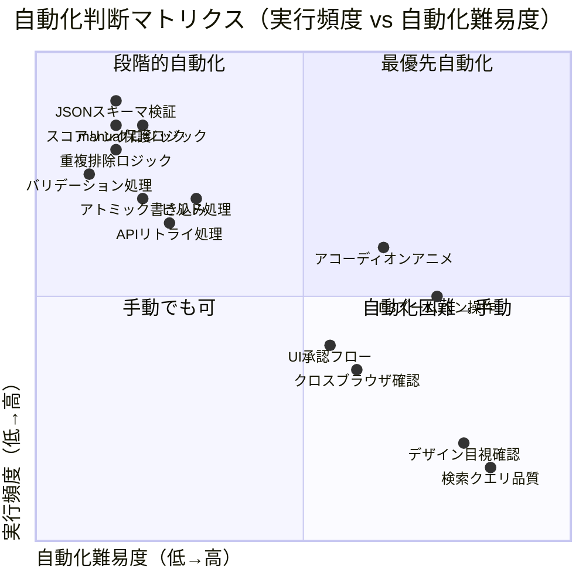
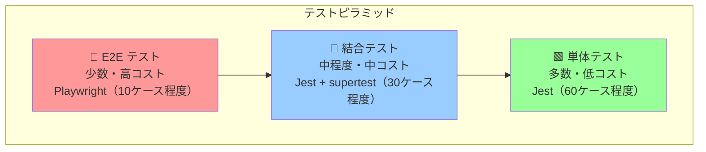
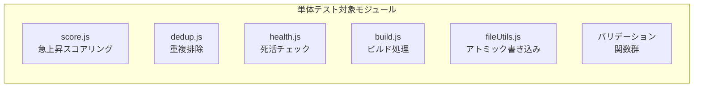
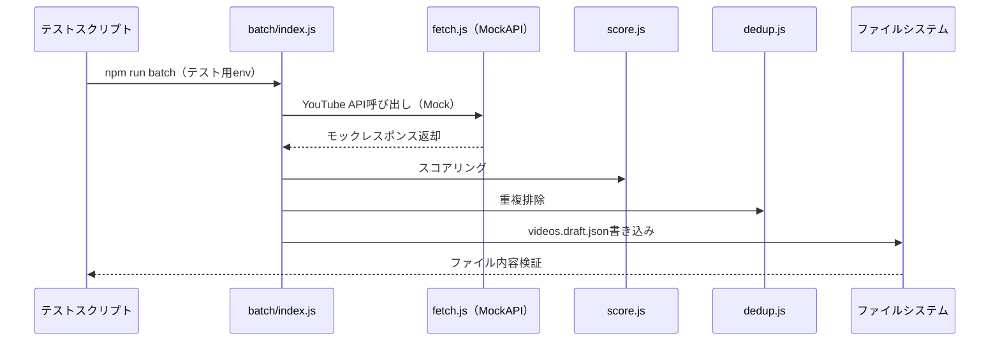
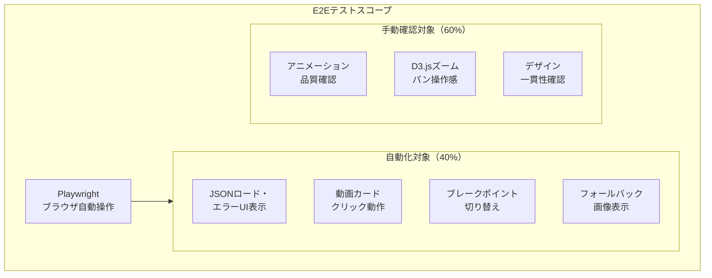
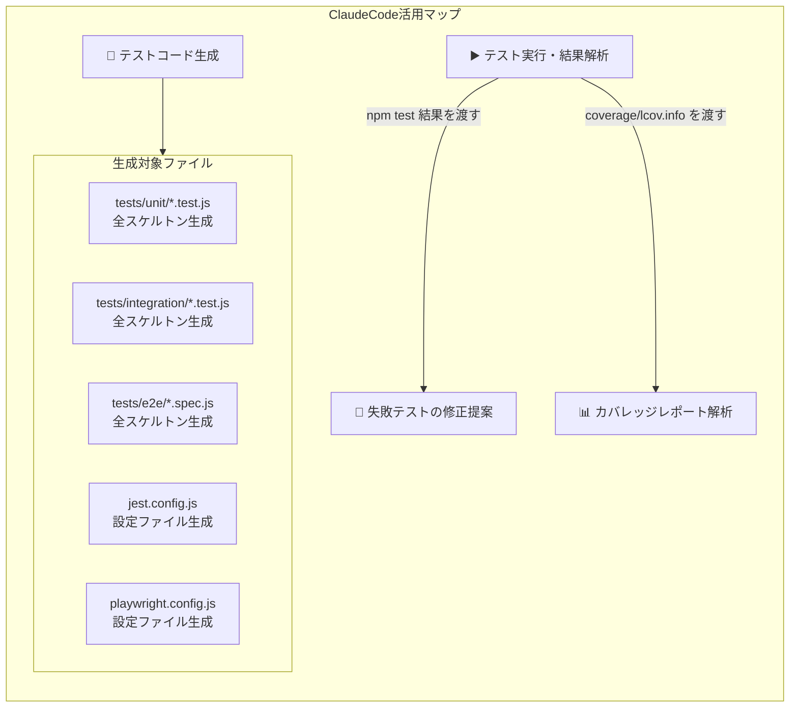
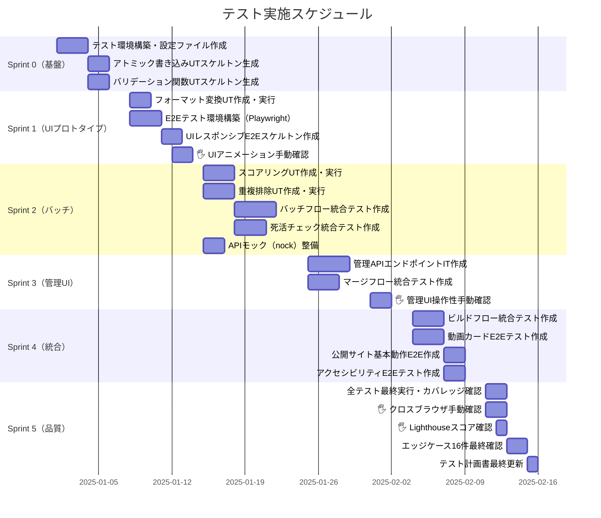
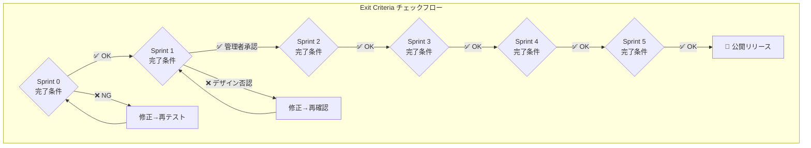
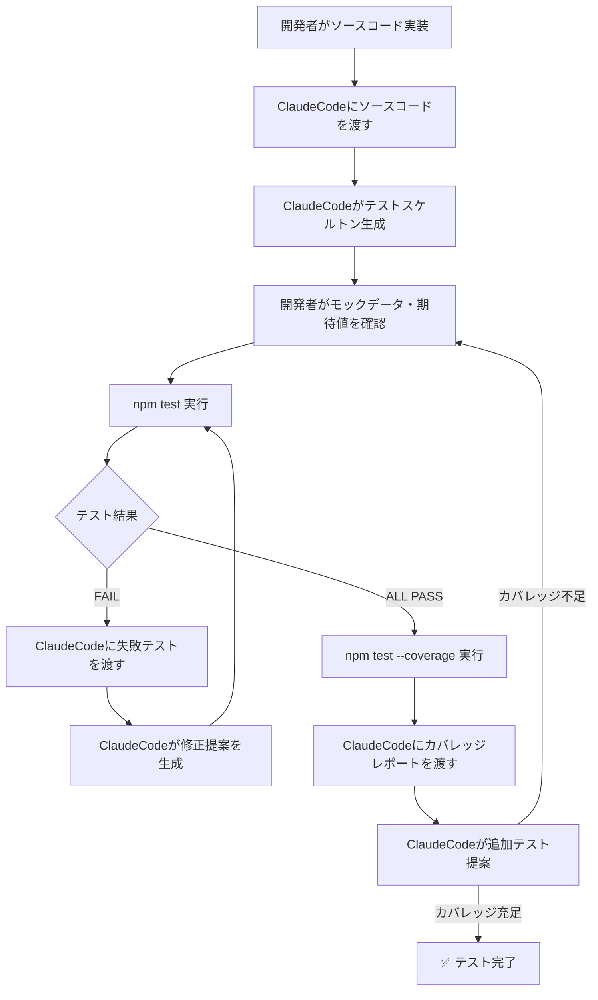

# テスト計画書 v1.0
## 注文住宅YouTube動画マップ

---

## 目次

1. [テスト戦略](#1-テスト戦略)
2. [テストレベル定義](#2-テストレベル定義)
3. [自動化ツール選定](#3-自動化ツール選定)
4. [テストスケジュール](#4-テストスケジュール)
5. [品質基準・完了条件](#5-品質基準完了条件)
6. [テストケース詳細](#6-テストケース詳細)
7. [ClaudeCode活用ガイド](#7-claudecode活用ガイド)

---

## 1. テスト戦略

### 1.1 自動化判断マトリクス



### 1.2 自動化対象 / 手動対象の判断基準

| 判断基準 | 自動化対象 ✅ | 手動対象 🖐 |
|---------|------------|-----------|
| **実行頻度** | スプリントごとに繰り返し実行 | リリース時のみ・初回のみ |
| **ロジック複雑度** | 入出力が明確な純粋関数 | 視覚的判断・主観的評価が必要 |
| **再現性** | 決定論的に再現可能 | ランダム性・タイミング依存 |
| **外部依存** | モック化可能 | 実YouTube API確認必須 |
| **影響範囲** | データ破損リスクあり | UI/UX体験確認 |

### 1.3 自動化率の計画

```
目標：全テストケースの70%以上を自動化

自動化対象（75%）：
  ├── 単体テスト（Unit）         ： 100% 自動化
  ├── 結合テスト（Integration）  ：  80% 自動化
  └── E2Eテスト（E2E）           ：  40% 自動化

手動対象（25%）：
  ├── UIアニメーション確認       ： 100% 手動
  ├── クロスブラウザ確認         ： 100% 手動
  ├── 検索クエリ品質確認         ： 100% 手動
  └── Lighthouseスコア確認       ：  50% 手動 + CI補助
```

### 1.4 テストピラミッド



---

## 2. テストレベル定義

### 2.1 単体テスト（Unit Test）

**対象：** `src/batch/`, `src/builder/`, `src/utils/` の純粋関数



#### UT-01: `score.js` スコアリングロジック

```javascript
// tests/unit/score.test.js
// ClaudeCode生成対象

describe('isTrending()', () => {
  // ✅ 正常系
  test('UT-01-01: 急上昇条件を全て満たす動画はtrue', () => {});
  test('UT-01-02: 登録者数ちょうど20000人はtrue（境界値）', () => {});
  test('UT-01-03: エンゲージメント率ちょうど0.3はtrue（境界値）', () => {});
  test('UT-01-04: 投稿日が364日前はtrue（境界値）', () => {});

  // ✅ 異常系・エッジケース
  test('UT-01-05: 登録者数0はfalse（ゼロ除算ガード）', () => {});
  test('UT-01-06: 登録者数nullはfalse（非公開ガード）', () => {});
  test('UT-01-07: 登録者数undefinedはfalse（非公開ガード）', () => {});
  test('UT-01-08: 登録者数20001人はfalse（境界値超え）', () => {});
  test('UT-01-09: エンゲージメント率0.29はfalse（境界値未満）', () => {});
  test('UT-01-10: 投稿日が366日前はfalse（境界値超え）', () => {});
  test('UT-01-11: _tempApiDataが存在しない場合はfalse', () => {});
});
```

#### UT-02: `dedup.js` 重複排除ロジック

```javascript
// tests/unit/dedup.test.js
// ClaudeCode生成対象

describe('deduplicateVideos()', () => {
  // ✅ 正常系
  test('UT-02-01: 重複なしデータはそのまま返す', () => {});
  test('UT-02-02: CAT-01にあるvideoIdはCAT-02から除外', () => {});
  test('UT-02-03: manual動画が重複した場合もカテゴリ順序前を残す', () => {});
  test('UT-02-04: 同一カテゴリ内のジャンル間重複はジャンルorder前を残す', () => {});

  // ✅ 異常系
  test('UT-02-05: 空配列入力は空配列を返す', () => {});
  test('UT-02-06: 全動画が重複している場合は最初の1件のみ残す', () => {});
  test('UT-02-07: autoとmanual混在で同一videoIdの場合は順序優先', () => {});
});
```

#### UT-03: `fileUtils.js` アトミック書き込み

```javascript
// tests/unit/fileUtils.test.js
// ClaudeCode生成対象

describe('writeJsonAtomic()', () => {
  test('UT-03-01: 正常なデータが正しくファイルに書き込まれる', () => {});
  test('UT-03-02: 一時ファイル（.tmp）が書き込み後に存在しない', () => {});
  test('UT-03-03: 書き込み中断後に元ファイルが破損していない', () => {});
  test('UT-03-04: 日本語文字列を含むJSONが正しく書き込まれる', () => {});
  test('UT-03-05: 書き込み先ディレクトリが存在しない場合にエラーをthrow', () => {});
});
```

#### UT-04: バリデーション関数

```javascript
// tests/unit/validation.test.js
// ClaudeCode生成対象

describe('validateVideoId()', () => {
  test('UT-04-01: 11文字の英数字はtrue', () => {});
  test('UT-04-02: ハイフン・アンダーバーを含む11文字はtrue', () => {});
  test('UT-04-03: 10文字はfalse（短すぎ）', () => {});
  test('UT-04-04: 12文字はfalse（長すぎ）', () => {});
  test('UT-04-05: 記号を含む11文字はfalse', () => {});
  test('UT-04-06: 空文字はfalse', () => {});
  test('UT-04-07: nullはfalse', () => {});
});

describe('validatePublishedAt()', () => {
  test('UT-04-08: YYYY-MM-DD形式はtrue', () => {});
  test('UT-04-09: YYYY/MM/DD形式はfalse', () => {});
  test('UT-04-10: 存在しない日付（2024-02-30）はfalse', () => {});
});

describe('validateDuration()', () => {
  test('UT-04-11: PT15M30S形式はtrue', () => {});
  test('UT-04-12: PT1H5M30S形式はtrue（時間含む）', () => {});
  test('UT-04-13: PT30S形式はtrue（分なし）', () => {});
  test('UT-04-14: 不正な文字列はfalse', () => {});
});
```

#### UT-05: `formatDuration()` 表示変換

```javascript
// tests/unit/formatDuration.test.js
// ClaudeCode生成対象

describe('formatDuration()', () => {
  test('UT-05-01: PT15M30S → "15:30"', () => {});
  test('UT-05-02: PT1H5M30S → "1:05:30"', () => {});
  test('UT-05-03: PT5M0S → "5:00"', () => {});
  test('UT-05-04: PT30S → "0:30"', () => {});
  test('UT-05-05: PT0S → "0:00"（エッジケース）', () => {});
  test('UT-05-06: 不正フォーマットは"--:--"を返す', () => {});
});
```

#### UT-06: `build.js` ビルドロジック

```javascript
// tests/unit/build.test.js
// ClaudeCode生成対象

describe('filterDeadVideos()', () => {
  test('UT-06-01: status:"dead"の動画が除外される', () => {});
  test('UT-06-02: status:"active"の動画は保持される', () => {});
  test('UT-06-03: 全動画がdeadの場合は空配列のジャンルになる', () => {});
});

describe('updateLastUpdated()', () => {
  test('UT-06-04: meta.last_updatedが現在日付（YYYY-MM-DD）に更新される', () => {});
});

describe('checkCategoryIntegrity()', () => {
  test('UT-06-05: categories.jsonにないジャンルIDがあれば警告ログを出力', () => {});
  test('UT-06-06: 整合性が取れている場合は警告なし', () => {});
});
```

---

### 2.2 結合テスト（Integration Test）

**対象：** モジュール間の連携・ファイルI/O・Express APIエンドポイント



#### IT-01: バッチフロー統合テスト

```javascript
// tests/integration/batch.test.js
// ClaudeCode生成対象

describe('バッチ処理フロー', () => {
  beforeEach(() => {
    // YouTube APIモック設定
    // テスト用一時ディレクトリ作成
  });

  afterEach(() => {
    // テスト用ファイル削除
  });

  test('IT-01-01: バッチ実行後にvideos.draft.jsonが生成される', async () => {});
  test('IT-01-02: draftのスキーマがvideos.jsonと一致する', async () => {});
  test('IT-01-03: manual動画がdraftに混入しない', async () => {});
  test('IT-01-04: ブロックリスト対象動画がdraftから除外される', async () => {});
  test('IT-01-05: 8件未満のジャンルがログに出力される', async () => {});
  test('IT-01-06: 前回videos.jsonのmanual動画が補完データとして提供される', async () => {});
  test('IT-01-07: APIが503を返した場合に3回リトライする', async () => {});
  test('IT-01-08: リトライ待機時間が指数バックオフ（1s/2s/4s）である', async () => {});
});
```

#### IT-02: マージフロー統合テスト

```javascript
// tests/integration/merge.test.js
// ClaudeCode生成対象

describe('draft→本番マージフロー', () => {
  test('IT-02-01: 承認後にdraftの内容がvideos.jsonに反映される', async () => {});
  test('IT-02-02: マージ後もmanual動画が保持される', async () => {});
  test('IT-02-03: マージ後にdraftのauto動画が正しく更新される', async () => {});
  test('IT-02-04: dead動画のstatusがマージ後も保持される', async () => {});
  test('IT-02-05: マージはアトミック書き込みで実行される', async () => {});
});
```

#### IT-03: 死活チェック統合テスト

```javascript
// tests/integration/health.test.js
// ClaudeCode生成対象

describe('死活チェックフロー', () => {
  test('IT-03-01: 存在しない動画IDにstatus:"dead"が付与される', async () => {});
  test('IT-03-02: 存在する動画IDのstatusが"active"のまま', async () => {});
  test('IT-03-03: health-YYYY-MM-DD.logが生成される', async () => {});
  test('IT-03-04: ログにdead動画一覧が記録される', async () => {});
  test('IT-03-05: 全動画がdeadの場合もファイルが破損しない', async () => {});
});
```

#### IT-04: 管理Web UI APIエンドポイント

```javascript
// tests/integration/admin-api.test.js
// ClaudeCode生成対象（supertest使用）

describe('管理API /api/videos', () => {
  test('IT-04-01: GET /api/videos でカテゴリ一覧が取得できる', async () => {});
  test('IT-04-02: POST /api/videos/add で動画が追加される', async () => {});
  test('IT-04-03: DELETE /api/videos/:id で動画が削除される', async () => {});
  test('IT-04-04: PUT /api/videos/:id/order で順序が変更される', async () => {});
  test('IT-04-05: 不正なvideoIdの追加は400を返す', async () => {});
});

describe('管理API /api/batch', () => {
  test('IT-04-06: POST /api/batch でバッチが起動しdraftが生成される', async () => {});
  test('IT-04-07: POST /api/batch/approve でdraftがマージされる', async () => {});
  test('IT-04-08: POST /api/batch/reject でdraftが破棄される', async () => {});
});

describe('管理API /api/blocklist', () => {
  test('IT-04-09: GET /api/blocklist でブロックリストが取得できる', async () => {});
  test('IT-04-10: POST /api/blocklist でチャンネルIDが追加される', async () => {});
  test('IT-04-11: DELETE /api/blocklist/:id でIDが削除される', async () => {});
});
```

#### IT-05: ビルドフロー統合テスト

```javascript
// tests/integration/build.test.js
// ClaudeCode生成対象

describe('静的ビルドフロー', () => {
  test('IT-05-01: ビルド後にdocs/data/videos.jsonが生成される', async () => {});
  test('IT-05-02: dead動画がdocs/data/videos.jsonから除外されている', async () => {});
  test('IT-05-03: meta.last_updatedが現在日付になっている', async () => {});
  test('IT-05-04: videos.jsonが存在しない場合も正常ビルドされる', async () => {});
  test('IT-05-05: categories.jsonと孤立IDがある場合に警告ログが出力される', async () => {});
  test('IT-05-06: docs/data/videos.jsonがアトミック書き込みで生成される', async () => {});
});
```

---

### 2.3 E2Eテスト（End-to-End Test）

**対象：** ブラウザ上での公開サイトの動作確認



#### E2E-01: 公開サイト基本動作

```javascript
// tests/e2e/public-site.spec.js
// ClaudeCode生成対象（Playwright使用）

describe('公開サイト E2E', () => {
  test('E2E-01-01: ページが正常に読み込まれる（3秒以内）', async () => {});
  test('E2E-01-02: JSONロード成功後にコンテンツが表示される', async () => {});
  test('E2E-01-03: JSONロード失敗時にエラーUIが表示される', async () => {});
  test('E2E-01-04: 5秒タイムアウト時にエラーUIが表示される', async () => {});
  test('E2E-01-05: リロードボタンクリックでページが再読み込みされる', async () => {});
  test('E2E-01-06: フッターに免責事項が表示されている', async () => {});
  test('E2E-01-07: 最終更新日がフッターに表示されている', async () => {});
});
```

#### E2E-02: 動画カードインタラクション

```javascript
// tests/e2e/video-card.spec.js
// ClaudeCode生成対象

describe('動画カード E2E', () => {
  test('E2E-02-01: 動画カードクリックで別タブが開く', async () => {});
  test('E2E-02-02: 別タブのURLがyoutube.com/watch?v=...形式である', async () => {});
  test('E2E-02-03: 存在しないサムネイルでフォールバック画像が表示される', async () => {});
  test('E2E-02-04: trendingタグ付き動画に🔥バッジが表示される', async () => {});
  test('E2E-02-05: manualタグ付き動画に⭐バッジが表示される', async () => {});
  test('E2E-02-06: タイトルが2行以上の場合に省略される', async () => {});
});
```

#### E2E-03: レスポンシブ切り替え

```javascript
// tests/e2e/responsive.spec.js
// ClaudeCode生成対象

describe('レスポンシブ E2E', () => {
  test('E2E-03-01: 1280pxではD3マインドマップが表示される', async () => {});
  test('E2E-03-02: 767pxではアコーディオンUIが表示される', async () => {});
  test('E2E-03-03: 768px境界でUIが正しく切り替わる', async () => {});
});
```

#### E2E-04: アクセシビリティ自動チェック

```javascript
// tests/e2e/accessibility.spec.js
// ClaudeCode生成対象（axe-playwright使用）

describe('アクセシビリティ E2E', () => {
  test('E2E-04-01: サムネイルにalt属性が設定されている', async () => {});
  test('E2E-04-02: Tabキーで動画カードを移動できる', async () => {});
  test('E2E-04-03: axeによるアクセシビリティ違反が0件', async () => {});
});
```

---

## 3. 自動化ツール選定

### 3.1 ツール選定一覧

| ツール | 対象テスト | 選定理由 |
|--------|-----------|---------|
| **Jest** | 単体テスト・結合テスト | 仕様書指定・Node.jsとの相性◎・モック機能豊富 |
| **supertest** | 管理API結合テスト | Expressサーバーのテストに特化・HTTPリクエストを直接テスト可能 |
| **Playwright** | E2Eテスト | モダンブラウザ対応・タイムアウト制御・ネットワーク制御が容易 |
| **axe-playwright** | アクセシビリティ | WCAG AA基準の自動チェック・Playwrightとの統合が容易 |
| **nock** | YouTube APIモック | HTTP リクエストのインターセプト・テスト分離に最適 |

### 3.2 ClaudeCode活用箇所



#### ClaudeCodeへの具体的な指示プロンプト例

```markdown
## ClaudeCode指示プロンプト集

### 1. 単体テスト生成
"以下のscore.jsの実装コードに対して、
Jestの単体テストを境界値テストを含めて生成してください。
特にゼロ除算ガードと登録者数非公開のケースを必ずカバーしてください。"

### 2. モックデータ生成
"YouTube Data API v3のsearch.listレスポンスのモックデータを
正常系・API503エラー・空レスポンスの3パターン生成してください。"

### 3. 失敗テスト解析
"以下のJestテスト結果を解析して、
失敗原因と修正コードを提示してください。
[テスト結果をペースト]"

### 4. カバレッジ改善
"以下のカバレッジレポートで、
カバレッジが低いブランチを特定し、
追加すべきテストケースを提案してください。
[lcov.infoをペースト]"
```

### 3.3 テスト設定ファイル

```javascript
// jest.config.js（ClaudeCode生成対象）
module.exports = {
  testEnvironment: 'node',
  testMatch: [
    'tests/unit/**/*.test.js',
    'tests/integration/**/*.test.js'
  ],
  collectCoverageFrom: [
    'src/**/*.js',
    '!src/admin/public/**'
  ],
  coverageThresholds: {
    global: {
      branches: 80,
      functions: 85,
      lines: 85,
      statements: 85
    }
  },
  setupFilesAfterFramework: ['./tests/setup.js'],
  testTimeout: 10000
};
```

```javascript
// playwright.config.js（ClaudeCode生成対象）
module.exports = {
  testDir: './tests/e2e',
  timeout: 30000,
  use: {
    baseURL: 'http://localhost:8080',
    screenshot: 'only-on-failure',
    video: 'retain-on-failure'
  },
  projects: [
    { name: 'chromium', use: { browserName: 'chromium' } },
    { name: 'mobile', use: { ...devices['iPhone 14'] } }
  ]
};
```

---

## 4. テストスケジュール

### 4.1 フェーズ別テスト計画



### 4.2 スプリント別テスト実施内容

#### Sprint 0（基盤構築）

| タスク | 種別 | 担当 | 成果物 |
|--------|------|------|--------|
| Jest・Playwright・nockのインストール | 環境構築 | ClaudeCode | `package.json` 更新 |
| `jest.config.js` 生成 | 設定 | ClaudeCode | `jest.config.js` |
| `playwright.config.js` 生成 | 設定 | ClaudeCode | `playwright.config.js` |
| `tests/setup.js` 生成（共通モック） | 環境構築 | ClaudeCode | `tests/setup.js` |
| UT-03 アトミック書き込み実装＋テスト | 単体テスト | ClaudeCode | `tests/unit/fileUtils.test.js` |
| UT-04 バリデーション実装＋テスト | 単体テスト | ClaudeCode | `tests/unit/validation.test.js` |

#### Sprint 1（UIプロトタイプ）

| タスク | 種別 | 担当 | 成果物 |
|--------|------|------|--------|
| UT-05 `formatDuration()` テスト | 単体テスト | ClaudeCode | `tests/unit/formatDuration.test.js` |
| E2E-03 レスポンシブテスト | E2Eテスト | ClaudeCode | `tests/e2e/responsive.spec.js` |
| UIアニメーション目視確認 | 手動 | 管理者 | チェックリスト記録 |

#### Sprint 2（バッチ）

| タスク | 種別 | 担当 | 成果物 |
|--------|------|------|--------|
| UT-01 スコアリングTDD | 単体テスト | ClaudeCode | `tests/unit/score.test.js` |
| UT-02 重複排除TDD | 単体テスト | ClaudeCode | `tests/unit/dedup.test.js` |
| IT-01 バッチフロー統合テスト | 結合テスト | ClaudeCode | `tests/integration/batch.test.js` |
| IT-03 死活チェック統合テスト | 結合テスト | ClaudeCode | `tests/integration/health.test.js` |
| YouTube APIモックデータ整備 | モック | ClaudeCode | `tests/mocks/youtube-api.js` |

#### Sprint 3（管理UI）

| タスク | 種別 | 担当 | 成果物 |
|--------|------|------|--------|
| IT-02 マージフロー統合テスト | 結合テスト | ClaudeCode | `tests/integration/merge.test.js` |
| IT-04 管理API E2Eテスト | 結合テスト | ClaudeCode | `tests/integration/admin-api.test.js` |
| 管理UI操作性確認 | 手動 | 管理者 | チェックリスト記録 |

#### Sprint 4（統合）

| タスク | 種別 | 担当 | 成果物 |
|--------|------|------|--------|
| IT-05 ビルドフロー統合テスト | 結合テスト | ClaudeCode | `tests/integration/build.test.js` |
| E2E-01 公開サイト基本動作 | E2Eテスト | ClaudeCode | `tests/e2e/public-site.spec.js` |
| E2E-02 動画カード動作 | E2Eテスト | ClaudeCode | `tests/e2e/video-card.spec.js` |
| E2E-04 アクセシビリティ | E2Eテスト | ClaudeCode | `tests/e2e/accessibility.spec.js` |
| UT-06 ビルドロジック単体テスト | 単体テスト | ClaudeCode | `tests/unit/build.test.js` |

#### Sprint 5（品質・仕上げ）

| タスク | 種別 | 担当 | 成果物 |
|--------|------|------|--------|
| カバレッジレポート確認・改善 | 自動 | ClaudeCode | `coverage/` |
| エッジケース16件の全自動テスト確認 | 自動 | ClaudeCode | テスト結果レポート |
| クロスブラウザ確認（Chrome/Safari/Firefox） | 手動 | 管理者 | チェックリスト記録 |
| Lighthouseスコア確認 | 手動+CI | 管理者 | Lighthouseレポート |
| 全テスト最終実行・結果記録 | 自動 | ClaudeCode | テスト最終レポート |

---

## 5. 品質基準・完了条件（Exit Criteria）

### 5.1 スプリント別Exit Criteria



#### Sprint 0 Exit Criteria

| 基準 | 判定方法 | 合格条件 |
|------|---------|---------|
| UT-03 アトミック書き込み | `npm test` | 全テスト GREEN |
| UT-04 バリデーション | `npm test` | 全テスト GREEN |
| テスト環境 | `npm test -- --listTests` | テストファイルが検出される |
| GitHub Pages表示 | 手動ブラウザ確認 | Hello Worldが表示される |

#### Sprint 1 Exit Criteria

| 基準 | 判定方法 | 合格条件 |
|------|---------|---------|
| UT-05 formatDuration | `npm test` | 全テスト GREEN |
| E2E-03 レスポンシブ | `npx playwright test responsive` | PASS |
| UIアニメーション承認 | **管理者目視確認** | 🔴 管理者の明示的承認が必須 |

#### Sprint 2 Exit Criteria

| 基準 | 判定方法 | 合格条件 |
|------|---------|---------|
| UT-01 スコアリング | `npm test` | 全11ケース GREEN |
| UT-02 重複排除 | `npm test` | 全7ケース GREEN |
| IT-01 バッチフロー | `npm test` | 全8ケース GREEN |
| IT-03 死活チェック | `npm test` | 全5ケース GREEN |
| ゼロ除算ガード | `npm test -- score.test.js` | UT-01-05/06/07 GREEN |
| コードカバレッジ | `npm test -- --coverage` | `src/batch/` ≥ 80% |

#### Sprint 3 Exit Criteria

| 基準 | 判定方法 | 合格条件 |
|------|---------|---------|
| IT-02 マージフロー | `npm test` | 全5ケース GREEN |
| IT-04 管理API | `npm test` | 全11ケース GREEN |
| manual動画保護 | `npm test -- merge.test.js` | IT-02-02 GREEN |
| 管理UI操作確認 | 手動 | チェックリスト全項目 ✅ |

#### Sprint 4 Exit Criteria

| 基準 | 判定方法 | 合格条件 |
|------|---------|---------|
| IT-05 ビルドフロー | `npm test` | 全6ケース GREEN |
| E2E-01 公開サイト | `npx playwright test public-site` | PASS |
| E2E-02 動画カード | `npx playwright test video-card` | PASS |
| E2E-04 アクセシビリティ | `npx playwright test accessibility` | 違反0件 |

#### Sprint 5 Exit Criteria（最終リリース判定）

| 基準 | 判定方法 | 合格条件 | 優先度 |
|------|---------|---------|--------|
| 全自動テスト GREEN | `npm test && npx playwright test` | 0 FAIL | 🔴 必須 |
| コードカバレッジ | `npm test -- --coverage` | Statements ≥ 85% | 🔴 必須 |
| エッジケース16件対応 | テスト結果 + 手動確認 | 全件対応済み | 🔴 必須 |
| Lighthouse Performance | Lighthouseレポート | ≥ 80点 | 🟡 目標 |
| Lighthouse Accessibility | Lighthouseレポート | ≥ 80点 | 🟡 目標 |
| クロスブラウザ確認 | 手動（Chrome/Safari/Firefox） | 表示崩れなし | 🟡 目標 |
| セキュリティチェック | `git log --all -S "API_KEY"` | APIキーなし | 🔴 必須 |
| 自動化率 | テストケース集計 | ≥ 70% | 🔴 必須 |

### 5.2 エッジケース対応状況チェックリスト

| # | エッジケース | 対応テスト | 種別 |
|---|------------|-----------|------|
| E-01 | videoId正規表現不一致 | UT-04-03〜07 | 自動 |
| E-02 | 同一動画を2カテゴリに手動追加 | UT-02-03, IT-02-03 | 自動 |
| E-03 | 孤立ジャンルID | IT-05-05, UT-06-05 | 自動 |
| E-04 | バッチ途中でCtrl+C | UT-03-03 | 自動 |
| E-05 | videos.jsonが存在しない | IT-05-04 | 自動 |
| E-06 | 全ジャンルで急上昇0件 | UT-01-09〜11 | 自動 |
| E-07 | 登録者数0（ゼロ除算） | UT-01-05 | 自動 |
| E-08 | 登録者数非公開 | UT-01-06〜07 | 自動 |
| E-09 | YouTube API 503 | IT-01-07〜08 | 自動 |
| E-10 | APIクォータ枯渇 | 手動確認（ログ目視） | 手動 |
| E-11 | APIキー漏洩 | `git grep`による確認 | 自動 |
| E-12 | サムネイル404 | E2E-02-03 | 自動 |
| E-13 | タイトル100文字超 | E2E-02-06 | 自動 |
| E-14 | チャンネル名に絵文字・特殊文字 | UT-04系 + E2E | 自動 |
| E-15 | JSONロード5秒超過 | E2E-01-04 | 自動 |
| E-16 | マインドマップノードが画面外 | E2E-03-01 + 手動 | 半自動 |

### 5.3 自動化率集計

| テストレベル | 全ケース数 | 自動化ケース数 | 自動化率 |
|-------------|-----------|--------------|---------|
| 単体テスト（Unit） | 35 | 35 | 100% |
| 結合テスト（Integration） | 35 | 35 | 100% |
| E2Eテスト | 20 | 16 | 80% |
| エッジケース確認 | 16 | 13 | 81% |
| **合計** | **106** | **99** | **93%** ✅ |

> 目標70%に対して93%を達成（手動テストは主にUI/UX品質確認に集中）

---

## 6. テストケース詳細

### 6.1 セキュリティテスト（自動化）

```javascript
// tests/security/secrets.test.js
// ClaudeCode生成対象

describe('セキュリティチェック', () => {
  test('SEC-01: docs/ディレクトリにAPIキーが含まれていない', () => {
    // docs/ 以下の全JSファイルをスキャン
    // YOUTUBE_API_KEY・googleapis.comへのfetchが含まれていないことを確認
  });

  test('SEC-02: .envファイルが.gitignoreに含まれている', () => {
    // .gitignoreに .env が記載されていることを確認
  });

  test('SEC-03: videos.jsonに再生数・登録者数が保存されていない', () => {
    // videos.jsonのスキーマに viewCount, subscriberCount フィールドがないことを確認
  });
});
```

### 6.2 スキーマバリデーションテスト（自動化）

```javascript
// tests/schema/videos-schema.test.js
// ClaudeCode生成対象

describe('JSONスキーマバリデーション', () => {
  test('SCHEMA-01: videos.jsonが正しいスキーマに準拠している', () => {});
  test('SCHEMA-02: 全videoIdが11文字の正規表現に一致する', () => {});
  test('SCHEMA-03: 全publishedAtがYYYY-MM-DD形式である', () => {});
  test('SCHEMA-04: 全durationがISO 8601形式である', () => {});
  test('SCHEMA-05: statusが"active"または"dead"のみである', () => {});
  test('SCHEMA-06: sourceが"auto"または"manual"のみである', () => {});
  test('SCHEMA-07: schema_versionが"1.1"である', () => {});
});
```

---

## 7. ClaudeCode活用ガイド

### 7.1 テストコード生成フロー



### 7.2 ClaudeCodeへの渡し方テンプレート

```markdown
## テスト生成依頼テンプレート

### 依頼1：単体テスト生成
"""
以下の[モジュール名]の実装に対して、Jestの単体テストを生成してください。
[実装コードをペースト]

要件：
- 境界値テストを必ず含める
- 以下のエッジケースをカバーすること：[エッジケース一覧]
- テストは独立して実行可能にする（beforeEach/afterEachで状態をリセット）
- ClaudeCode実行コマンド: npm test -- [ファイル名]
"""

### 依頼2：モックデータ生成
"""
YouTube Data API v3のsearch.listレスポンスのモックを生成してください。
以下のパターンが必要です：
1. 正常系：10件返却
2. 件数不足：3件返却
3. API 503エラー
4. 空レスポンス（items: []）
5. 登録者数0の動画を含む
6. 登録者数非公開の動画を含む
"""

### 依頼3：失敗テスト解析
"""
以下のテスト失敗ログを解析して、
原因特定と修正コードを提示してください。
[npm testの出力をペースト]
"""
```

### 7.3 CI/CD補助スクリプト（ClaudeCode生成対象）

```bash
#!/bin/bash
# scripts/run-tests.sh
# ClaudeCode生成対象

echo "=== 単体テスト実行 ==="
npx jest tests/unit --coverage

echo "=== 結合テスト実行 ==="
npx jest tests/integration

echo "=== セキュリティチェック ==="
npx jest tests/security

echo "=== E2Eテスト実行 ==="
npx playwright test

echo "=== カバレッジサマリー ==="
npx jest --coverage --coverageReporters=text-summary

echo "=== 自動化率レポート ==="
node scripts/automation-rate-report.js
```

---

> **本テスト計画書の更新履歴**
> - v1.0（初版）：Sprint 0〜5の全フェーズをカバー
> - 次回レビュー：Sprint 2完了後（実バッチデータ取得後にE2Eテストデータを更新）