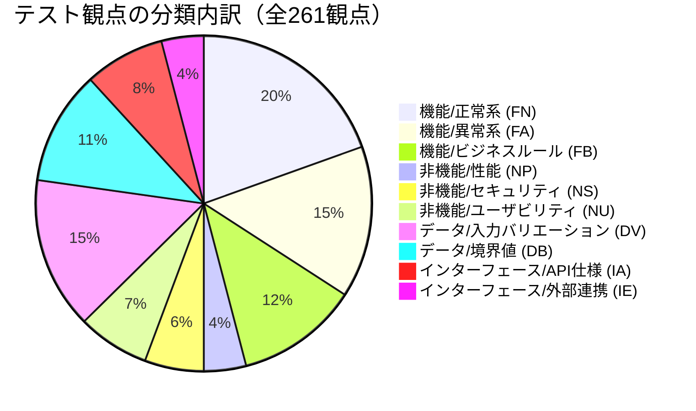

# テスト観点一覧

## 1. 機能観点 - 正常系（Happy Path）

| 観点ID | 分類 | テスト観点 | 優先度 | 自動化可否 |
|--------|------|-----------|--------|----------|
| FN-001 | 機能/正常系 | マインドマップがPC幅（768px以上）で正常に描画される | 高 | ✅ 自動 |
| FN-002 | 機能/正常系 | アコーディオンUIがモバイル幅（767px以下）で正常に描画される | 高 | ✅ 自動 |
| FN-003 | 機能/正常系 | ジャンルノードクリックでサイドパネルに動画カード一覧が表示される | 高 | ✅ 自動 |
| FN-004 | 機能/正常系 | アコーディオンのカテゴリタップで展開・折りたたみが動作する | 高 | ✅ 自動 |
| FN-005 | 機能/正常系 | アコーディオンのジャンルタップで動画カード一覧が展開される | 高 | ✅ 自動 |
| FN-006 | 機能/正常系 | 動画カードクリックでYouTubeが別タブで開く | 高 | ✅ 自動 |
| FN-007 | 機能/正常系 | 別タブのURLが `https://www.youtube.com/watch?v={videoId}` 形式である | 高 | ✅ 自動 |
| FN-008 | 機能/正常系 | サムネイル画像がYouTube CDNから正常に読み込まれる | 中 | ✅ 自動 |
| FN-009 | 機能/正常系 | 動画タイトルが正常に表示される | 高 | ✅ 自動 |
| FN-010 | 機能/正常系 | チャンネル名が正常に表示される | 高 | ✅ 自動 |
| FN-011 | 機能/正常系 | 投稿日が `YYYY年MM月DD日` 形式で表示される | 中 | ✅ 自動 |
| FN-012 | 機能/正常系 | 動画時間が `MM:SS` 形式で表示される | 中 | ✅ 自動 |
| FN-013 | 機能/正常系 | 動画時間が `HH:MM:SS` 形式（1時間超）で表示される | 中 | ✅ 自動 |
| FN-014 | 機能/正常系 | 🔥急上昇バッジがtrending動画に表示される | 高 | ✅ 自動 |
| FN-015 | 機能/正常系 | ⭐おすすめバッジがmanual動画に表示される | 高 | ✅ 自動 |
| FN-016 | 機能/正常系 | 🔥急上昇バッジがtrendingではない動画に表示されない | 高 | ✅ 自動 |
| FN-017 | 機能/正常系 | ⭐おすすめバッジがauto動画に表示されない | 高 | ✅ 自動 |
| FN-018 | 機能/正常系 | フッターに免責事項が表示される | 高 | ✅ 自動 |
| FN-019 | 機能/正常系 | フッターにYouTube利用規約リンクが表示される | 高 | ✅ 自動 |
| FN-020 | 機能/正常系 | フッター/ヘッダーに「最終更新日：YYYY年MM月DD日」が表示される | 中 | ✅ 自動 |
| FN-021 | 機能/正常系 | マインドマップのズーム操作（+/-ボタン）が動作する | 中 | 🖐 手動 |
| FN-022 | 機能/正常系 | マインドマップのパン操作（ドラッグ）が動作する | 中 | 🖐 手動 |
| FN-023 | 機能/正常系 | マインドマップのリセットボタンで表示が初期位置に戻る | 中 | ✅ 自動 |
| FN-024 | 機能/正常系 | 2カテゴリ（施主目線・専門家目線）がそれぞれ表示される | 高 | ✅ 自動 |
| FN-025 | 機能/正常系 | 12ジャンルがそれぞれのカテゴリ配下に表示される | 高 | ✅ 自動 |
| FN-026 | 機能/正常系 | `npm run batch` 実行で `data/videos.draft.json` が生成される | 高 | ✅ 自動 |
| FN-027 | 機能/正常系 | `npm run build` 実行で `docs/data/videos.json` が生成される | 高 | ✅ 自動 |
| FN-028 | 機能/正常系 | `npm run admin` 実行でlocalhost:3000が起動する | 高 | ✅ 自動 |
| FN-029 | 機能/正常系 | 管理UI：動画一覧がカテゴリ×ジャンル別に表示される | 中 | 🖐 手動 |
| FN-030 | 機能/正常系 | 管理UI：動画手動追加（YouTube URL入力）が正常に動作する | 高 | ✅ 自動 |
| FN-031 | 機能/正常系 | 管理UI：動画手動追加（videoID入力）が正常に動作する | 高 | ✅ 自動 |
| FN-032 | 機能/正常系 | 管理UI：動画手動削除が正常に動作する | 高 | ✅ 自動 |
| FN-033 | 機能/正常系 | 管理UI：動画順序変更（上ボタン）が正常に動作する | 中 | ✅ 自動 |
| FN-034 | 機能/正常系 | 管理UI：動画順序変更（下ボタン）が正常に動作する | 中 | ✅ 自動 |
| FN-035 | 機能/正常系 | 管理UI：バッチ結果プレビューが表示される | 高 | 🖐 手動 |
| FN-036 | 機能/正常系 | 管理UI：承認ボタンでdraftが本番にマージされる | 高 | ✅ 自動 |
| FN-037 | 機能/正常系 | 管理UI：差し戻しボタンでdraftが破棄される | 高 | ✅ 自動 |
| FN-038 | 機能/正常系 | 管理UI：ブロックリストにチャンネルIDを追加できる | 中 | ✅ 自動 |
| FN-039 | 機能/正常系 | 管理UI：ブロックリストにチャンネルIDを削除できる | 中 | ✅ 自動 |
| FN-040 | 機能/正常系 | 管理UI：ブロックリストに動画IDを追加できる | 中 | ✅ 自動 |
| FN-041 | 機能/正常系 | 管理UI：ブロックリストに動画IDを削除できる | 中 | ✅ 自動 |
| FN-042 | 機能/正常系 | 管理UI：カテゴリ追加が正常に動作する | 低 | ✅ 自動 |
| FN-043 | 機能/正常系 | 管理UI：ジャンル追加が正常に動作する | 低 | ✅ 自動 |
| FN-044 | 機能/正常系 | 管理UI：ジャンルの検索クエリ編集が正常に動作する | 低 | ✅ 自動 |
| FN-045 | 機能/正常系 | 死活チェックで削除済み動画が `status: "dead"` になる | 高 | ✅ 自動 |
| FN-046 | 機能/正常系 | 死活チェックで存在する動画が `status: "active"` のまま保持される | 高 | ✅ 自動 |
| FN-047 | 機能/正常系 | ビルド時に `status: "dead"` 動画が公開データから除外される | 高 | ✅ 自動 |
| FN-048 | 機能/正常系 | ビルド時に `meta.last_updated` が現在日付に更新される | 中 | ✅ 自動 |

---

## 2. 機能観点 - 異常系・境界値

| 観点ID | 分類 | テスト観点 | 優先度 | 自動化可否 |
|--------|------|-----------|--------|----------|
| FA-001 | 機能/異常系 | JSONロード失敗時にエラーメッセージとリロードボタンが表示される | 高 | ✅ 自動 |
| FA-002 | 機能/異常系 | JSONロードが5秒超過した場合にタイムアウトエラーUIが表示される | 高 | ✅ 自動 |
| FA-003 | 機能/異常系 | リロードボタンクリックでページが再読み込みされる | 高 | ✅ 自動 |
| FA-004 | 機能/異常系 | ジャンルの動画が0件の場合に「収集中」メッセージが表示される | 中 | ✅ 自動 |
| FA-005 | 機能/異常系 | サムネイルが404を返す場合にフォールバック画像が表示される | 高 | ✅ 自動 |
| FA-006 | 機能/異常系 | フォールバック画像（no-thumbnail.png）が存在しない場合の挙動 | 中 | ✅ 自動 |
| FA-007 | 機能/異常系 | YouTube APIが503を返した場合に3回リトライする | 高 | ✅ 自動 |
| FA-008 | 機能/異常系 | 3回リトライ後も失敗した場合にエラーログに記録される | 高 | ✅ 自動 |
| FA-009 | 機能/異常系 | リトライ待機時間が指数バックオフ（1s→2s→4s）である | 高 | ✅ 自動 |
| FA-010 | 機能/異常系 | videos.jsonが存在しない状態でビルドしても正常終了する | 高 | ✅ 自動 |
| FA-011 | 機能/異常系 | videos.jsonが空オブジェクトの場合に正常表示される | 中 | ✅ 自動 |
| FA-012 | 機能/異常系 | バッチ実行中にCtrl+Cで強制終了しても既存JSONが破損しない | 高 | ✅ 自動 |
| FA-013 | 機能/異常系 | 不正なvideoID（10文字）を管理UIで追加しようとするとエラーになる | 高 | ✅ 自動 |
| FA-014 | 機能/異常系 | 不正なvideoID（12文字）を管理UIで追加しようとするとエラーになる | 高 | ✅ 自動 |
| FA-015 | 機能/異常系 | 不正なvideoID（記号含む）を管理UIで追加しようとするとエラーになる | 高 | ✅ 自動 |
| FA-016 | 機能/異常系 | 登録者数0の動画に対してゼロ除算せずtrendingがスキップされる | 高 | ✅ 自動 |
| FA-017 | 機能/異常系 | 登録者数nullの動画に対してtrendingがスキップされる | 高 | ✅ 自動 |
| FA-018 | 機能/異常系 | 登録者数undefinedの動画に対してtrendingがスキップされる | 高 | ✅ 自動 |
| FA-019 | 機能/異常系 | categories.jsonにないジャンルIDがvideos.jsonに存在する場合に警告ログが出力される | 中 | ✅ 自動 |
| FA-020 | 機能/異常系 | 全動画がdeadの場合もJSONが破損しない | 高 | ✅ 自動 |
| FA-021 | 機能/異常系 | 全ジャンルで急上昇動画が0件の場合にサイレント対応しログに記録される | 中 | ✅ 自動 |
| FA-022 | 機能/異常系 | 管理UI：不正なchannelIDをブロックリストに追加した場合のエラー | 中 | ✅ 自動 |
| FA-023 | 機能/異常系 | 管理API：不正なvideoIdの追加リクエストで400が返る | 高 | ✅ 自動 |
| FA-024 | 機能/異常系 | 管理API：存在しない動画IDの削除リクエストで404が返る | 中 | ✅ 自動 |
| FA-025 | 機能/異常系 | バッチ実行時、一部クエリのAPI呼び出しが失敗しても残りが継続処理される | 高 | ✅ 自動 |
| FA-026 | 機能/異常系 | 動画タイトルが100文字超の場合にCSS 2行省略が適用される | 中 | ✅ 自動 |
| FA-027 | 機能/異常系 | マインドマップノードが画面外にはみ出した場合にズーム・パンで対応できる | 中 | 🖐 手動 |
| FA-028 | 機能/異常系 | 登録者数20001人の動画にtrendingフラグが付かない（境界値超え） | 高 | ✅ 自動 |
| FA-029 | 機能/異常系 | 登録者数20000人の動画にtrendingフラグが付く（境界値ちょうど） | 高 | ✅ 自動 |
| FA-030 | 機能/異常系 | エンゲージメント率0.29でtrendingフラグが付かない（境界値未満） | 高 | ✅ 自動 |
| FA-031 | 機能/異常系 | エンゲージメント率0.30でtrendingフラグが付く（境界値ちょうど） | 高 | ✅ 自動 |
| FA-032 | 機能/異常系 | 投稿日が364日前でtrendingフラグが付く（境界値内） | 高 | ✅ 自動 |
| FA-033 | 機能/異常系 | 投稿日が366日前でtrendingフラグが付かない（境界値超え） | 高 | ✅ 自動 |
| FA-034 | 機能/異常系 | `_tempApiData` が存在しない動画のスコアリングでエラーが発生しない | 高 | ✅ 自動 |
| FA-035 | 機能/異常系 | 8件未満のジャンルがバッチログにコンソール出力される | 中 | ✅ 自動 |
| FA-036 | 機能/異常系 | 件数不足時に代替クエリ（searchQueryAlt）で再検索される | 高 | ✅ 自動 |

---

## 3. 機能観点 - ビジネスルール検証

| 観点ID | 分類 | テスト観点 | 優先度 | 自動化可否 |
|--------|------|-----------|--------|----------|
| FB-001 | 機能/ビジネスルール | カテゴリ×ジャンル1組あたり最大8件の動画が表示される | 高 | ✅ 自動 |
| FB-002 | 機能/ビジネスルール | 人気動画が再生数多い順に上位5件選定される | 高 | ✅ 自動 |
| FB-003 | 機能/ビジネスルール | 急上昇動画が上位3件選定される | 高 | ✅ 自動 |
| FB-004 | 機能/ビジネスルール | 重複排除後に同一videoIdが複数カテゴリ×ジャンルに存在しない | 高 | ✅ 自動 |
| FB-005 | 機能/ビジネスルール | 重複動画はカテゴリ順序（order）の前のものが優先される | 高 | ✅ 自動 |
| FB-006 | 機能/ビジネスルール | 同一カテゴリ内でジャンル間重複がある場合はジャンルorder前が優先される | 高 | ✅ 自動 |
| FB-007 | 機能/ビジネスルール | manual動画もauto動画と同じ重複排除ルールが適用される | 高 | ✅ 自動 |
| FB-008 | 機能/ビジネスルール | `source: "manual"` の動画がバッチ更新時に上書き・削除されない | 高 | ✅ 自動 |
| FB-009 | 機能/ビジネスルール | `source: "manual"` の動画が承認後のマージ後も保持される | 高 | ✅ 自動 |
| FB-010 | 機能/ビジネスルール | バッチ実行後にvideos.draft.jsonが生成されvideos.jsonは変更されない | 高 | ✅ 自動 |
| FB-011 | 機能/ビジネスルール | 承認前はvideos.draft.jsonを参照しvideos.jsonは変更されない | 高 | ✅ 自動 |
| FB-012 | 機能/ビジネスルール | 件数不足時に前回videos.jsonのauto動画で補完される | 高 | ✅ 自動 |
| FB-013 | 機能/ビジネスルール | 急上昇判定：登録者数2万以下＋再生数/登録者数≥0.3＋直近1年の3条件がすべて必要 | 高 | ✅ 自動 |
| FB-014 | 機能/ビジネスルール | ブロックリスト対象チャンネルの動画がバッチ取得後に除外される | 高 | ✅ 自動 |
| FB-015 | 機能/ビジネスルール | ブロックリスト対象videoIdの動画がバッチ取得後に除外される | 高 | ✅ 自動 |
| FB-016 | 機能/ビジネスルール | 手動追加動画に `source: "manual"`, `tags: ["manual"]` が自動付与される | 高 | ✅ 自動 |
| FB-017 | 機能/ビジネスルール | バッチ検索パラメータに `regionCode: 'JP'`, `relevanceLanguage: 'ja'` が設定される | 高 | ✅ 自動 |
| FB-018 | 機能/ビジネスルール | バッチ検索パラメータに `videoDuration: 'medium'`（4〜20分）が設定される | 高 | ✅ 自動 |
| FB-019 | 機能/ビジネスルール | バッチ検索パラメータに `safeSearch: 'strict'` が設定される | 高 | ✅ 自動 |
| FB-020 | 機能/ビジネスルール | バッチ検索パラメータに `videoEmbeddable: 'true'` が設定される | 高 | ✅ 自動 |
| FB-021 | 機能/ビジネスルール | `_tempApiData`（再生数・登録者数）がvideos.jsonに保存されない | 高 | ✅ 自動 |
| FB-022 | 機能/ビジネスルール | 公開サイト（docs/）にランタイムAPIコールが存在しない | 高 | ✅ 自動 |
| FB-023 | 機能/ビジネスルール | 死活チェックログが `logs/health-YYYY-MM-DD.log` に出力される | 中 | ✅ 自動 |
| FB-024 | 機能/ビジネスルール | バッチログが `logs/batch-YYYY-MM-DD.log` に出力される | 中 | ✅ 自動 |
| FB-025 | 機能/ビジネスルール | サイト内での動画埋め込み再生が行われない（外部リンクのみ） | 高 | ✅ 自動 |
| FB-026 | 機能/ビジネスルール | 登録者数非公開の動画はtrendingスキップ後に通常動画として保持される | 高 | ✅ 自動 |
| FB-027 | 機能/ビジネスルール | 全JSONファイルの書き込みがアトミック（tmp→rename）で行われる | 高 | ✅ 自動 |
| FB-028 | 機能/ビジネスルール | ビルド時にcategories.jsonとvideos.jsonの整合性チェックが実施される | 中 | ✅ 自動 |
| FB-029 | 機能/ビジネスルール | schema_versionが "1.1" であることがビルド時に確認される | 中 | ✅ 自動 |

---

## 4. 非機能観点 - 性能・負荷

| 観点ID | 分類 | テスト観点 | 優先度 | 自動化可否 |
|--------|------|-----------|--------|----------|
| NP-001 | 非機能/性能 | 公開サイトの初回表示が3秒以内に完了する | 高 | 🔀 半自動 |
| NP-002 | 非機能/性能 | Lighthouse Performanceスコアが80点以上 | 高 | 🔀 半自動 |
| NP-003 | 非機能/性能 | JSONファイルのロードが5秒以内に完了する（正常時） | 高 | ✅ 自動 |
| NP-004 | 非機能/性能 | 月次バッチの消費APIユニットが2,740以下（無料枠内）に収まる | 高 | ✅ 自動 |
| NP-005 | 非機能/性能 | バッチ実行時の全24クエリ（2カテゴリ×12ジャンル）が正常完了する | 高 | ✅ 自動 |
| NP-006 | 非機能/性能 | D3.jsマインドマップのノード数が増加しても描画が許容範囲内で完了する | 低 | 🖐 手動 |
| NP-007 | 非機能/性能 | アコーディオン展開アニメーションが300msで完了する | 中 | 🖐 手動 |
| NP-008 | 非機能/性能 | 動画カードのスタガーアニメーション（50ms間隔）が滑らかに動作する | 中 | 🖐 手動 |
| NP-009 | 非機能/性能 | 静的JSON（docs/data/videos.json）のファイルサイズが許容範囲内 | 中 | ✅ 自動 |
| NP-010 | 非機能/性能 | 複数カテゴリ×ジャンルをすばやく切り替えてもサイドパネルが正常更新される | 中 | 🖐 手動 |

---

## 5. 非機能観点 - セキュリティ

| 観点ID | 分類 | テスト観点 | 優先度 | 自動化可否 |
|--------|------|-----------|--------|----------|
| NS-001 | 非機能/セキュリティ | docs/ 以下のJSファイルにYouTube APIキーが含まれていない | 高 | ✅ 自動 |
| NS-002 | 非機能/セキュリティ | docs/ 以下のJSファイルに `googleapis.com` へのfetchが含まれていない | 高 | ✅ 自動 |
| NS-003 | 非機能/セキュリティ | `.env` ファイルが `.gitignore` に設定されている | 高 | ✅ 自動 |
| NS-004 | 非機能/セキュリティ | Gitコミット履歴にAPIキーが含まれていない（`git grep` による検査） | 高 | ✅ 自動 |
| NS-005 | 非機能/セキュリティ | 動画タイトル表示時にXSS対策（textContent使用）が適用されている | 高 | ✅ 自動 |
| NS-006 | 非機能/セキュリティ | チャンネル名表示時にXSS対策（textContent使用）が適用されている | 高 | ✅ 自動 |
| NS-007 | 非機能/セキュリティ | 動画カード生成時に `innerHTML` への直接挿入が行われていない | 高 | ✅ 自動 |
| NS-008 | 非機能/セキュリティ | チャンネル名に`` を含む場合に無害化される | 高 | ✅ 自動 |
| DV-023 | データ/入力バリエーション | 動画タイトルが1文字の場合に正常表示される | 低 | ✅ 自動 |
| DV-024 | データ/入力バリエーション | 動画タイトルが100文字ちょうどの場合に正常表示される | 中 | ✅ 自動 |
| DV-025 | データ/入力バリエーション | 動画タイトルが101文字以上の場合に2行省略が適用される | 中 | ✅ 自動 |
| DV-026 | データ/入力バリエーション | statusが `"active"` のみ受け入れられる | 高 | ✅ 自動 |
| DV-027 | データ/入力バリエーション | statusが `"dead"` のみ受け入れられる | 高 | ✅ 自動 |
| DV-028 | データ/入力バリエーション | statusが `"unknown"` 等の想定外値で拒否される | 高 | ✅ 自動 |
| DV-029 | データ/入力バリエーション | sourceが `"auto"` のみ受け入れられる | 高 | ✅ 自動 |
| DV-030 | データ/入力バリエーション | sourceが `"manual"` のみ受け入れられる | 高 | ✅ 自動 |
| DV-031 | データ/入力バリエーション | tagsが `["trending"]` の形式で受け入れられる | 中 | ✅ 自動 |
| DV-032 | データ/入力バリエーション | tagsが `["manual"]` の形式で受け入れられる | 中 | ✅ 自動 |
| DV-033 | データ/入力バリエーション | tagsが空配列 `[]` の場合に正常処理される | 中 | ✅ 自動 |
| DV-034 | データ/入力バリエーション | orderが1以上の整数で受け入れられる | 中 | ✅ 自動 |
| DV-035 | データ/入力バリエーション | orderが0以下の場合に拒否される | 中 | ✅ 自動 |
| DV-036 | データ/入力バリエーション | orderが小数の場合に拒否される | 低 | ✅ 自動 |

---

## 8. データ観点 - データの境界値・同値分割

| 観点ID | 分類 | テスト観点 | 優先度 | 自動化可否 |
|--------|------|-----------|--------|----------|
| DB-001 | データ/境界値 | videoId：10文字（境界値-1）で拒否される | 高 | ✅ 自動 |
| DB-002 | データ/境界値 | videoId：11文字（境界値ちょうど）で受け入れられる | 高 | ✅ 自動 |
| DB-003 | データ/境界値 | videoId：12文字（境界値+1）で拒否される | 高 | ✅ 自動 |
| DB-004 | データ/境界値 | 登録者数：19999人（境界値-1）でtrending対象になりうる | 高 | ✅ 自動 |
| DB-005 | データ/境界値 | 登録者数：20000人（境界値ちょうど）でtrending対象になりうる | 高 | ✅ 自動 |
| DB-006 | データ/境界値 | 登録者数：20001人（境界値+1）でtrendingから外れる | 高 | ✅ 自動 |
| DB-007 | データ/境界値 | エンゲージメント率：0.29（境界値-0.01）でtrendingから外れる | 高 | ✅ 自動 |
| DB-008 | データ/境界値 | エンゲージメント率：0.30（境界値ちょうど）でtrending対象になりうる | 高 | ✅ 自動 |
| DB-009 | データ/境界値 | エンゲージメント率：0.31（境界値+0.01）でtrending対象になりうる | 高 | ✅ 自動 |
| DB-010 | データ/境界値 | 投稿日：364日前（境界値-1）でtrending対象になりうる | 高 | ✅ 自動 |
| DB-011 | データ/境界値 | 投稿日：365日前（境界値ちょうど）の扱いが仕様通りか確認（当日含む/含まない） | 高 | ✅ 自動 |
| DB-012 | データ/境界値 | 投稿日：366日前（境界値+1）でtrendingから外れる | 高 | ✅ 自動 |
| DB-013 | データ/境界値 | 動画件数：0件のジャンルで収集中メッセージが表示される | 高 | ✅ 自動 |
| DB-014 | データ/境界値 | 動画件数：1件のジャンルで正常表示される | 中 | ✅ 自動 |
| DB-015 | データ/境界値 | 動画件数：7件（8件-1）で件数不足アラートが出る | 高 | ✅ 自動 |
| DB-016 | データ/境界値 | 動画件数：8件（上限ちょうど）で件数不足アラートが出ない | 高 | ✅ 自動 |
| DB-017 | データ/境界値 | 動画件数：9件（上限+1）でも最大8件に切り捨てられる | 高 | ✅ 自動 |
| DB-018 | データ/境界値 | 件数不足ハイライト：赤表示は4件以下（5件未満）で発動 | 中 | 🖐 手動 |
| DB-019 | データ/境界値 | 件数不足ハイライト：黄表示は5件以上7件以下（8件未満）で発動 | 中 | 🖐 手動 |
| DB-020 | データ/境界値 | タイムアウト：4.9秒ではスピナー表示中でエラーにならない | 高 | ✅ 自動 |
| DB-021 | データ/境界値 | タイムアウト：5.0秒でエラーUIが表示される | 高 | ✅ 自動 |
| DB-022 | データ/境界値 | ズーム倍率：最小値0.3でそれ以下に縮小できない | 中 | 🖐 手動 |
| DB-023 | データ/境界値 | ズーム倍率：最大値3.0でそれ以上に拡大できない | 中 | 🖐 手動 |
| DB-024 | データ/境界値 | リトライ：1回目失敗→1秒待機、2回目失敗→2秒待機、3回目失敗→4秒待機 | 高 | ✅ 自動 |
| DB-025 | データ/境界値 | リトライ：4回目の試行が行われない（最大3回で停止する） | 高 | ✅ 自動 |
| DB-026 | データ/境界値 | ブレークポイント：767pxでアコーディオンUIが表示される | 高 | ✅ 自動 |
| DB-027 | データ/境界値 | ブレークポイント：768pxでマインドマップUIが表示される | 高 | ✅ 自動 |

---

## 9. インターフェース観点 - API仕様準拠

| 観点ID | 分類 | テスト観点 | 優先度 | 自動化可否 |
|--------|------|-----------|--------|----------|
| IA-001 | インターフェース/API仕様 | YouTube Data API v3 `search.list` エンドポイントが正しく呼び出される | 高 | ✅ 自動 |
| IA-002 | インターフェース/API仕様 | `videos.list` エンドポイントで動画詳細（duration, channelTitle）が取得される | 高 | ✅ 自動 |
| IA-003 | インターフェース/API仕様 | 死活チェックで `videos.list?id=id1,id2,...` 形式のバッチリクエストが使用される | 高 | ✅ 自動 |
| IA-004 | インターフェース/API仕様 | `search.list` のmaxResultsに10が設定されている | 中 | ✅ 自動 |
| IA-005 | インターフェース/API仕様 | `GET /api/videos` でカテゴリ一覧が取得できる（200レスポンス） | 高 | ✅ 自動 |
| IA-006 | インターフェース/API仕様 | `POST /api/videos/add` で動画が追加される（201レスポンス） | 高 | ✅ 自動 |
| IA-007 | インターフェース/API仕様 | `DELETE /api/videos/:id` で動画が削除される（200レスポンス） | 高 | ✅ 自動 |
| IA-008 | インターフェース/API仕様 | `PUT /api/videos/:id/order` で順序が変更される（200レスポンス） | 中 | ✅ 自動 |
| IA-009 | インターフェース/API仕様 | `POST /api/batch` でバッチが起動しdraftが生成される（202レスポンス） | 高 | ✅ 自動 |
| IA-010 | インターフェース/API仕様 | `POST /api/batch/approve` でdraftがマージされる（200レスポンス） | 高 | ✅ 自動 |
| IA-011 | インターフェース/API仕様 | `POST /api/batch/reject` でdraftが破棄される（200レスポンス） | 高 | ✅ 自動 |
| IA-012 | インターフェース/API仕様 | `GET /api/blocklist` でブロックリストが取得できる（200レスポンス） | 中 | ✅ 自動 |
| IA-013 | インターフェース/API仕様 | `POST /api/blocklist` でチャンネルIDが追加される（201レスポンス） | 中 | ✅ 自動 |
| IA-014 | インターフェース/API仕様 | `DELETE /api/blocklist/:id` でIDが削除される（200レスポンス） | 中 | ✅ 自動 |
| IA-015 | インターフェース/API仕様 | 不正なvideoIdの追加リクエストで400エラーが返る | 高 | ✅ 自動 |
| IA-016 | インターフェース/API仕様 | 存在しないリソースへのDELETEリクエストで404エラーが返る | 中 | ✅ 自動 |
| IA-017 | インターフェース/API仕様 | サムネイルURLが `https://img.youtube.com/vi/{videoId}/hqdefault.jpg` 形式である | 高 | ✅ 自動 |
| IA-018 | インターフェース/API仕様 | 管理APIのレスポンスがJSON形式で返る | 中 | ✅ 自動 |
| IA-019 | インターフェース/API仕様 | `docs/data/videos.json` がJSONスキーマ v1.1 に準拠している | 高 | ✅ 自動 |

---

## 10. インターフェース観点 - 外部連携

| 観点ID | 分類 | テスト観点 | 優先度 | 自動化可否 |
|--------|------|-----------|--------|----------|
| IE-001 | インターフェース/外部連携 | GitHub Pages上でサイトが正常表示される | 高 | 🖐 手動 |
| IE-002 | インターフェース/外部連携 | `docs/` ディレクトリがGitHub Pagesの配信元として機能している | 高 | 🖐 手動 |
| IE-003 | インターフェース/外部連携 | `git push` 後にGitHub Pages上のサイトが更新される | 高 | 🖐 手動 |
| IE-004 | インターフェース/外部連携 | YouTube CDN（img.youtube.com）からサムネイルが取得される | 中 | ✅ 自動 |
| IE-005 | インターフェース/外部連携 | YouTube利用規約リンクが正しいURLに遷移する | 中 | ✅ 自動 |
| IE-006 | インターフェース/外部連携 | YouTube APIのAPIキー認証が正常に機能する | 高 | 🖐 手動 |
| IE-007 | インターフェース/外部連携 | YouTube APIのAPIキーが無効な場合にエラーがログに記録される | 高 | ✅ 自動 |
| IE-008 | インターフェース/外部連携 | `fetch()` でのJSONロードがCORSエラーなく完了する（GitHub Pages） | 高 | 🖐 手動 |
| IE-009 | インターフェース/外部連携 | OGP画像URLがGitHub Pages上の実際のパスと一致している | 中 | 🖐 手動 |
| IE-010 | インターフェース/外部連携 | `docs/data/videos.json` が公開URLで正常にアクセスできる | 高 | 🖐 手動 |

---

## 観点サマリー

| 分類 | 観点数 | 自動化可 | 手動 | 半自動 |
|------|--------|---------|------|--------|
| 機能/正常系 | 48 | 44 | 4 | 0 |
| 機能/異常系 | 36 | 35 | 1 | 0 |
| 機能/ビジネスルール | 29 | 29 | 0 | 0 |
| 非機能/性能 | 10 | 5 | 4 | 1 |
| 非機能/セキュリティ | 14 | 13 | 1 | 0 |
| 非機能/ユーザビリティ | 17 | 8 | 6 | 3 |
| データ/入力バリエーション | 36 | 36 | 0 | 0 |
| データ/境界値 | 27 | 21 | 6 | 0 |
| インターフェース/API仕様 | 19 | 19 | 0 | 0 |
| インターフェース/外部連携 | 10 | 3 | 7 | 0 |
| **合計** | **246** | **213 (87%)** | **29 (12%)** | **4 (1%)** |