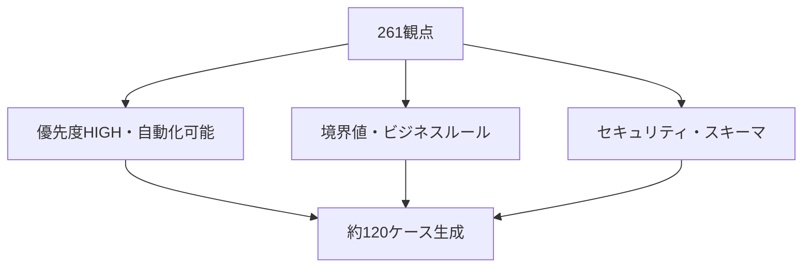
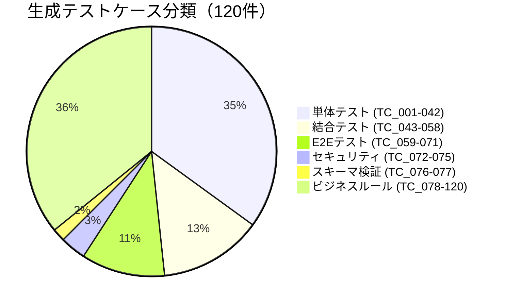
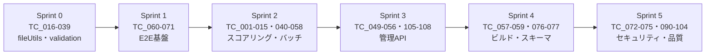

# テストケース生成

与えられた要求仕様・テスト計画・テスト観点一覧を分析し、ClaudeCodeで実行可能な具体的テストケースを生成します。

## カバレッジ戦略



---

```json
{
  "test_cases": [
    {
      "tc_id": "TC_001",
      "perspective_id": "UT-01-05 / FA-016 / DB-004",
      "purpose": "登録者数が0の動画に対してゼロ除算せずtrending判定をスキップする",
      "precondition": "src/batch/score.js が実装済みであること",
      "steps": [
        "1. isTrending() 関数に subscriberCount=0 のモックデータを渡す",
        "2. 関数の戻り値を確認する",
        "3. エラーが throw されないことを確認する"
      ],
      "input_data": {
        "_tempApiData": {
          "subscriberCount": 0,
          "viewCount": 10000,
          "publishedAt": "2024-06-01"
        }
      },
      "expected_result": "isTrending() が false を返し、ZeroDivisionError / TypeError が発生しない",
      "automation_hint": "describe('isTrending', () => { test('UT-01-05: 登録者数0はfalse（ゼロ除算ガード）', () => { const result = isTrending({ _tempApiData: { subscriberCount: 0, viewCount: 10000, publishedAt: '2024-06-01' } }); expect(result).toBe(false); }); });"
    },
    {
      "tc_id": "TC_002",
      "perspective_id": "UT-01-06 / FA-017 / FB-026",
      "purpose": "登録者数が null（非公開）の場合にtrending判定をスキップし通常動画として保持される",
      "precondition": "src/batch/score.js が実装済みであること",
      "steps": [
        "1. isTrending() に subscriberCount=null のモックデータを渡す",
        "2. 戻り値を確認する"
      ],
      "input_data": {
        "_tempApiData": {
          "subscriberCount": null,
          "viewCount": 50000,
          "publishedAt": "2024-06-01"
        }
      },
      "expected_result": "isTrending() が false を返す",
      "automation_hint": "test('UT-01-06: 登録者数nullはfalse（非公開ガード）', () => { expect(isTrending({ _tempApiData: { subscriberCount: null, viewCount: 50000, publishedAt: '2024-06-01' } })).toBe(false); });"
    },
    {
      "tc_id": "TC_003",
      "perspective_id": "UT-01-07 / FA-018",
      "purpose": "登録者数が undefined（未定義）の場合にtrending判定をスキップする",
      "precondition": "src/batch/score.js が実装済みであること",
      "steps": [
        "1. isTrending() に subscriberCount=undefined のモックデータを渡す",
        "2. 戻り値を確認する"
      ],
      "input_data": {
        "_tempApiData": {
          "subscriberCount": undefined,
          "viewCount": 50000,
          "publishedAt": "2024-06-01"
        }
      },
      "expected_result": "isTrending() が false を返す",
      "automation_hint": "test('UT-01-07: 登録者数undefinedはfalse', () => { expect(isTrending({ _tempApiData: { subscriberCount: undefined, viewCount: 50000, publishedAt: '2024-06-01' } })).toBe(false); });"
    },
    {
      "tc_id": "TC_004",
      "perspective_id": "UT-01-01 / FB-013",
      "purpose": "急上昇の3条件（登録者数2万以下・エンゲージメント率0.3以上・直近1年以内）をすべて満たす場合にtrue",
      "precondition": "src/batch/score.js が実装済みであること",
      "steps": [
        "1. 全条件を満たすモックデータで isTrending() を呼び出す",
        "2. 戻り値が true であることを確認する"
      ],
      "input_data": {
        "_tempApiData": {
          "subscriberCount": 10000,
          "viewCount": 5000,
          "publishedAt": "{{TODAY_MINUS_30_DAYS}}"
        }
      },
      "expected_result": "isTrending() が true を返す（subscriberCount=10000, viewCount=5000 → engagementRate=0.5 ≥ 0.3, 投稿日30日前）",
      "automation_hint": "const thirtyDaysAgo = new Date(); thirtyDaysAgo.setDate(thirtyDaysAgo.getDate() - 30); test('UT-01-01: 急上昇条件全て満たす', () => { expect(isTrending({ _tempApiData: { subscriberCount: 10000, viewCount: 5000, publishedAt: thirtyDaysAgo.toISOString().slice(0,10) } })).toBe(true); });"
    },
    {
      "tc_id": "TC_005",
      "perspective_id": "UT-01-02 / DB-005 / FA-029",
      "purpose": "登録者数ちょうど20000人でtrending対象になる（境界値）",
      "precondition": "src/batch/score.js が実装済みであること",
      "steps": [
        "1. subscriberCount=20000, engagementRate=0.3以上, 直近1年以内のデータで isTrending() を呼び出す",
        "2. 戻り値が true であることを確認する"
      ],
      "input_data": {
        "_tempApiData": {
          "subscriberCount": 20000,
          "viewCount": 6000,
          "publishedAt": "{{TODAY_MINUS_30_DAYS}}"
        }
      },
      "expected_result": "isTrending() が true を返す（engagementRate=0.3 ちょうど, subscriberCount=20000 ちょうど）",
      "automation_hint": "test('UT-01-02: 登録者数ちょうど20000人はtrue', () => { const d = new Date(); d.setDate(d.getDate()-30); expect(isTrending({ _tempApiData: { subscriberCount: 20000, viewCount: 6000, publishedAt: d.toISOString().slice(0,10) } })).toBe(true); });"
    },
    {
      "tc_id": "TC_006",
      "perspective_id": "UT-01-08 / DB-006 / FA-028",
      "purpose": "登録者数20001人でtrendingから外れる（境界値超え）",
      "precondition": "src/batch/score.js が実装済みであること",
      "steps": [
        "1. subscriberCount=20001 でisTrending() を呼び出す",
        "2. 戻り値が false であることを確認する"
      ],
      "input_data": {
        "_tempApiData": {
          "subscriberCount": 20001,
          "viewCount": 10000,
          "publishedAt": "{{TODAY_MINUS_30_DAYS}}"
        }
      },
      "expected_result": "isTrending() が false を返す",
      "automation_hint": "test('UT-01-08: 登録者数20001人はfalse', () => { const d = new Date(); d.setDate(d.getDate()-30); expect(isTrending({ _tempApiData: { subscriberCount: 20001, viewCount: 10000, publishedAt: d.toISOString().slice(0,10) } })).toBe(false); });"
    },
    {
      "tc_id": "TC_007",
      "perspective_id": "UT-01-09 / DB-007 / FA-030",
      "purpose": "エンゲージメント率0.29でtrendingから外れる（境界値未満）",
      "precondition": "src/batch/score.js が実装済みであること",
      "steps": [
        "1. subscriberCount=10000, viewCount=2900（rate=0.29）でisTrending()を呼び出す",
        "2. 戻り値が false であることを確認する"
      ],
      "input_data": {
        "_tempApiData": {
          "subscriberCount": 10000,
          "viewCount": 2900,
          "publishedAt": "{{TODAY_MINUS_30_DAYS}}"
        }
      },
      "expected_result": "isTrending() が false を返す（engagementRate=0.29 < 0.3）",
      "automation_hint": "test('UT-01-09: エンゲージメント率0.29はfalse', () => { const d = new Date(); d.setDate(d.getDate()-30); expect(isTrending({ _tempApiData: { subscriberCount: 10000, viewCount: 2900, publishedAt: d.toISOString().slice(0,10) } })).toBe(false); });"
    },
    {
      "tc_id": "TC_008",
      "perspective_id": "UT-01-03 / DB-008 / FA-031",
      "purpose": "エンゲージメント率ちょうど0.30でtrending対象になる（境界値）",
      "precondition": "src/batch/score.js が実装済みであること",
      "steps": [
        "1. subscriberCount=10000, viewCount=3000（rate=0.30）でisTrending()を呼び出す",
        "2. 戻り値が true であることを確認する"
      ],
      "input_data": {
        "_tempApiData": {
          "subscriberCount": 10000,
          "viewCount": 3000,
          "publishedAt": "{{TODAY_MINUS_30_DAYS}}"
        }
      },
      "expected_result": "isTrending() が true を返す（engagementRate=0.30 ちょうど）",
      "automation_hint": "test('UT-01-03: エンゲージメント率ちょうど0.3はtrue', () => { const d = new Date(); d.setDate(d.getDate()-30); expect(isTrending({ _tempApiData: { subscriberCount: 10000, viewCount: 3000, publishedAt: d.toISOString().slice(0,10) } })).toBe(true); });"
    },
    {
      "tc_id": "TC_009",
      "perspective_id": "UT-01-04 / DB-010 / FA-032",
      "purpose": "投稿日が364日前でtrending対象になる（境界値内）",
      "precondition": "src/batch/score.js が実装済みであること",
      "steps": [
        "1. 投稿日を今日から364日前にセットしてisTrending()を呼び出す",
        "2. 戻り値が true であることを確認する"
      ],
      "input_data": {
        "_tempApiData": {
          "subscriberCount": 10000,
          "viewCount": 5000,
          "publishedAt": "{{TODAY_MINUS_364_DAYS}}"
        }
      },
      "expected_result": "isTrending() が true を返す（投稿日364日前は1年以内）",
      "automation_hint": "test('UT-01-04: 投稿日364日前はtrue', () => { const d = new Date(); d.setDate(d.getDate()-364); expect(isTrending({ _tempApiData: { subscriberCount: 10000, viewCount: 5000, publishedAt: d.toISOString().slice(0,10) } })).toBe(true); });"
    },
    {
      "tc_id": "TC_010",
      "perspective_id": "UT-01-10 / DB-012 / FA-033",
      "purpose": "投稿日が366日前でtrendingから外れる（境界値超え）",
      "precondition": "src/batch/score.js が実装済みであること",
      "steps": [
        "1. 投稿日を今日から366日前にセットしてisTrending()を呼び出す",
        "2. 戻り値が false であることを確認する"
      ],
      "input_data": {
        "_tempApiData": {
          "subscriberCount": 10000,
          "viewCount": 5000,
          "publishedAt": "{{TODAY_MINUS_366_DAYS}}"
        }
      },
      "expected_result": "isTrending() が false を返す（投稿日366日前は1年超）",
      "automation_hint": "test('UT-01-10: 投稿日366日前はfalse', () => { const d = new Date(); d.setDate(d.getDate()-366); expect(isTrending({ _tempApiData: { subscriberCount: 10000, viewCount: 5000, publishedAt: d.toISOString().slice(0,10) } })).toBe(false); });"
    },
    {
      "tc_id": "TC_011",
      "perspective_id": "UT-01-11 / FA-034",
      "purpose": "_tempApiDataが存在しない動画のスコアリングでエラーが発生しない",
      "precondition": "src/batch/score.js が実装済みであること",
      "steps": [
        "1. _tempApiData フィールドを持たないオブジェクトでisTrending()を呼び出す",
        "2. エラーが throw されないことを確認する",
        "3. 戻り値が false であることを確認する"
      ],
      "input_data": {
        "videoId": "abc12345678",
        "title": "テスト動画"
      },
      "expected_result": "isTrending() が false を返し、TypeError等が発生しない",
      "automation_hint": "test('UT-01-11: _tempApiDataなしはfalse', () => { expect(() => isTrending({ videoId: 'abc12345678' })).not.toThrow(); expect(isTrending({ videoId: 'abc12345678' })).toBe(false); });"
    },
    {
      "tc_id": "TC_012",
      "perspective_id": "UT-02-01 / FB-004",
      "purpose": "重複なしデータはそのまま返す",
      "precondition": "src/batch/dedup.js が実装済みであること",
      "steps": [
        "1. 全カテゴリ×ジャンルにわたり一意のvideoIdを持つ配列を作成する",
        "2. deduplicateVideos() に渡す",
        "3. 戻り値の件数と内容が入力と同一であることを確認する"
      ],
      "input_data": {
        "categories": [
          {
            "id": "CAT-01",
            "order": 1,
            "genres": [
              {
                "id": "GNR-01",
                "order": 1,
                "videos": [
                  {"videoId": "AAAAAAAAAAA", "source": "auto"},
                  {"videoId": "BBBBBBBBBBB", "source": "auto"}
                ]
              }
            ]
          },
          {
            "id": "CAT-02",
            "order": 2,
            "genres": [
              {
                "id": "GNR-01",
                "order": 1,
                "videos": [
                  {"videoId": "CCCCCCCCCCC", "source": "auto"}
                ]
              }
            ]
          }
        ]
      },
      "expected_result": "返却データに3件すべてのvideoIdが保持される（重複なし）",
      "automation_hint": "test('UT-02-01: 重複なしはそのまま返す', () => { const result = deduplicateVideos(input); const allIds = result.categories.flatMap(c => c.genres.flatMap(g => g.videos.map(v => v.videoId))); expect(allIds).toHaveLength(3); expect(new Set(allIds).size).toBe(3); });"
    },
    {
      "tc_id": "TC_013",
      "perspective_id": "UT-02-02 / FB-005 / FB-006",
      "purpose": "CAT-01に存在するvideoIdはCAT-02から除外される（カテゴリ順序前を優先）",
      "precondition": "src/batch/dedup.js が実装済みであること",
      "steps": [
        "1. 同一videoId（AAAAAAAAAAA）をCAT-01とCAT-02両方に含むデータを作成する",
        "2. deduplicateVideos() に渡す",
        "3. CAT-01側に残り、CAT-02側から除外されていることを確認する"
      ],
      "input_data": {
        "categories": [
          {
            "id": "CAT-01",
            "order": 1,
            "genres": [
              {
                "id": "GNR-01",
                "order": 1,
                "videos": [{"videoId": "AAAAAAAAAAA", "source": "auto"}]
              }
            ]
          },
          {
            "id": "CAT-02",
            "order": 2,
            "genres": [
              {
                "id": "GNR-01",
                "order": 1,
                "videos": [{"videoId": "AAAAAAAAAAA", "source": "auto"}]
              }
            ]
          }
        ]
      },
      "expected_result": "CAT-01/GNR-01にAAAAAAAAAAA が残り、CAT-02/GNR-01からは除外される",
      "automation_hint": "test('UT-02-02: CAT-01優先でCAT-02から除外', () => { const result = deduplicateVideos(input); const cat1Videos = result.categories[0].genres[0].videos; const cat2Videos = result.categories[1].genres[0].videos; expect(cat1Videos.map(v=>v.videoId)).toContain('AAAAAAAAAAA'); expect(cat2Videos.map(v=>v.videoId)).not.toContain('AAAAAAAAAAA'); });"
    },
    {
      "tc_id": "TC_014",
      "perspective_id": "UT-02-03 / FB-007 / FB-008",
      "purpose": "manual動画が重複した場合もカテゴリ順序前を残す",
      "precondition": "src/batch/dedup.js が実装済みであること",
      "steps": [
        "1. 同一videoId（MMMMMMMMMM1）をCAT-01（manual）とCAT-02（manual）両方に含むデータを作成する",
        "2. deduplicateVideos() に渡す",
        "3. CAT-01側が保持され、CAT-02側が除外されていることを確認する"
      ],
      "input_data": {
        "categories": [
          {
            "id": "CAT-01",
            "order": 1,
            "genres": [
              {
                "id": "GNR-01",
                "order": 1,
                "videos": [{"videoId": "MMMMMMMM11A", "source": "manual", "tags": ["manual"]}]
              }
            ]
          },
          {
            "id": "CAT-02",
            "order": 2,
            "genres": [
              {
                "id": "GNR-01",
                "order": 1,
                "videos": [{"videoId": "MMMMMMMM11A", "source": "manual", "tags": ["manual"]}]
              }
            ]
          }
        ]
      },
      "expected_result": "CAT-01側にMMMMMMMMM11Aが残り、CAT-02側から除外される",
      "automation_hint": "test('UT-02-03: manual重複もカテゴリ順序前を残す', () => { const result = deduplicateVideos(input); const cat2Videos = result.categories[1].genres[0].videos; expect(cat2Videos.map(v=>v.videoId)).not.toContain('MMMMMMMM11A'); });"
    },
    {
      "tc_id": "TC_015",
      "perspective_id": "UT-02-05 / FA-020",
      "purpose": "空配列入力は空配列を返す",
      "precondition": "src/batch/dedup.js が実装済みであること",
      "steps": [
        "1. categories が空配列のデータで deduplicateVideos() を呼び出す",
        "2. 戻り値が空のカテゴリ配列であることを確認する"
      ],
      "input_data": {
        "categories": []
      },
      "expected_result": "{ categories: [] } が返される（エラーなし）",
      "automation_hint": "test('UT-02-05: 空配列入力は空配列を返す', () => { const result = deduplicateVideos({ categories: [] }); expect(result.categories).toEqual([]); });"
    },
    {
      "tc_id": "TC_016",
      "perspective_id": "UT-03-01 / FB-027",
      "purpose": "正常なデータが正しくファイルに書き込まれる",
      "precondition": "src/utils/fileUtils.js が実装済み・テスト用一時ディレクトリが存在すること",
      "steps": [
        "1. テスト用JSONデータを用意する",
        "2. writeJsonAtomic() でテスト用パスに書き込む",
        "3. ファイルを読み込んでデータが一致することを確認する"
      ],
      "input_data": {
        "filePath": "/tmp/test-output.json",
        "data": {
          "meta": {"last_updated": "2025-01-01", "schema_version": "1.1"},
          "categories": []
        }
      },
      "expected_result": "ファイルが生成され、JSON.parse した結果が入力データと一致する",
      "automation_hint": "const fs = require('fs').promises; test('UT-03-01: 正常書き込み', async () => { await writeJsonAtomic(tmpPath, data); const content = JSON.parse(await fs.readFile(tmpPath, 'utf-8')); expect(content).toEqual(data); });"
    },
    {
      "tc_id": "TC_017",
      "perspective_id": "UT-03-02 / FB-027",
      "purpose": "一時ファイル（.tmp）が書き込み後に存在しない",
      "precondition": "src/utils/fileUtils.js が実装済みであること",
      "steps": [
        "1. writeJsonAtomic() を実行する",
        "2. 実行後に {filePath}.tmp ファイルが存在しないことを確認する"
      ],
      "input_data": {
        "filePath": "/tmp/test-atomic.json",
        "data": {"key": "value"}
      },
      "expected_result": "/tmp/test-atomic.json.tmp ファイルが存在しない（リネームが完了している）",
      "automation_hint": "test('UT-03-02: .tmpファイルが書き込み後に存在しない', async () => { await writeJsonAtomic(tmpPath, data); await expect(fs.access(tmpPath + '.tmp')).rejects.toThrow(); });"
    },
    {
      "tc_id": "TC_018",
      "perspective_id": "UT-03-04",
      "purpose": "日本語文字列を含むJSONが正しく書き込まれる",
      "precondition": "src/utils/fileUtils.js が実装済みであること",
      "steps": [
        "1. 日本語文字列を含むJSONデータで writeJsonAtomic() を実行する",
        "2. 読み込んでデータが一致することを確認する"
      ],
      "input_data": {
        "filePath": "/tmp/test-japanese.json",
        "data": {
          "channelName": "注文住宅チャンネル🏠",
          "title": "間取りの後悔ポイント「もっとこうすれば良かった」"
        }
      },
      "expected_result": "日本語・絵文字を含むデータが文字化けなく読み込める",
      "automation_hint": "test('UT-03-04: 日本語含むJSONが正しく書き込まれる', async () => { await writeJsonAtomic(tmpPath, jpData); const content = JSON.parse(await fs.readFile(tmpPath, 'utf-8')); expect(content.channelName).toBe('注文住宅チャンネル🏠'); });"
    },
    {
      "tc_id": "TC_019",
      "perspective_id": "UT-03-05",
      "purpose": "書き込み先ディレクトリが存在しない場合にエラーをthrow",
      "precondition": "src/utils/fileUtils.js が実装済みであること",
      "steps": [
        "1. 存在しないディレクトリパスで writeJsonAtomic() を呼び出す",
        "2. エラーがthrowされることを確認する"
      ],
      "input_data": {
        "filePath": "/tmp/nonexistent_dir_xyz/test.json",
        "data": {"key": "value"}
      },
      "expected_result": "ENOENT等のファイルシステムエラーがthrowされる",
      "automation_hint": "test('UT-03-05: 存在しないディレクトリでエラー', async () => { await expect(writeJsonAtomic('/tmp/nonexistent_xyz/test.json', {})).rejects.toThrow(); });"
    },
    {
      "tc_id": "TC_020",
      "perspective_id": "UT-04-01 / DV-001",
      "purpose": "11文字の英数字videoIdはバリデーションを通過する",
      "precondition": "バリデーション関数 validateVideoId() が実装済みであること",
      "steps": [
        "1. 英大文字11文字のvideoIdで validateVideoId() を呼び出す",
        "2. true が返ることを確認する"
      ],
      "input_data": {
        "videoId": "ABCDEFGHIJK"
      },
      "expected_result": "validateVideoId('ABCDEFGHIJK') が true を返す",
      "automation_hint": "test('UT-04-01: 11文字英大文字はtrue', () => { expect(validateVideoId('ABCDEFGHIJK')).toBe(true); });"
    },
    {
      "tc_id": "TC_021",
      "perspective_id": "UT-04-02 / DV-004 / DV-005",
      "purpose": "ハイフン・アンダーバーを含む11文字videoIdはバリデーションを通過する",
      "precondition": "バリデーション関数 validateVideoId() が実装済みであること",
      "steps": [
        "1. ハイフンとアンダーバーを含む11文字videoIdで validateVideoId() を呼び出す",
        "2. true が返ることを確認する"
      ],
      "input_data": {
        "videoId": "abc-123_xyz"
      },
      "expected_result": "validateVideoId('abc-123_xyz') が true を返す（11文字）",
      "automation_hint": "test('UT-04-02: ハイフン・アンダーバー含む11文字はtrue', () => { expect(validateVideoId('abc-123_xyz')).toBe(true); });"
    },
    {
      "tc_id": "TC_022",
      "perspective_id": "UT-04-03 / DB-001 / FA-013",
      "purpose": "10文字のvideoIdはバリデーションで拒否される（境界値-1）",
      "precondition": "バリデーション関数 validateVideoId() が実装済みであること",
      "steps": [
        "1. 10文字のvideoIdで validateVideoId() を呼び出す",
        "2. false が返ることを確認する"
      ],
      "input_data": {
        "videoId": "ABCDEFGHIJ"
      },
      "expected_result": "validateVideoId('ABCDEFGHIJ') が false を返す（10文字は不正）",
      "automation_hint": "test('UT-04-03: 10文字はfalse', () => { expect(validateVideoId('ABCDEFGHIJ')).toBe(false); });"
    },
    {
      "tc_id": "TC_023",
      "perspective_id": "UT-04-04 / DB-003 / FA-014",
      "purpose": "12文字のvideoIdはバリデーションで拒否される（境界値+1）",
      "precondition": "バリデーション関数 validateVideoId() が実装済みであること",
      "steps": [
        "1. 12文字のvideoIdで validateVideoId() を呼び出す",
        "2. false が返ることを確認する"
      ],
      "input_data": {
        "videoId": "ABCDEFGHIJKL"
      },
      "expected_result": "validateVideoId('ABCDEFGHIJKL') が false を返す（12文字は不正）",
      "automation_hint": "test('UT-04-04: 12文字はfalse', () => { expect(validateVideoId('ABCDEFGHIJKL')).toBe(false); });"
    },
    {
      "tc_id": "TC_024",
      "perspective_id": "UT-04-05 / FA-015 / DV-006",
      "purpose": "記号を含む11文字videoIdはバリデーションで拒否される",
      "precondition": "バリデーション関数 validateVideoId() が実装済みであること",
      "steps": [
        "1. 記号（@）を含む11文字のvideoIdで validateVideoId() を呼び出す",
        "2. false が返ることを確認する"
      ],
      "input_data": {
        "videoId": "ABCDEFGHIJ@"
      },
      "expected_result": "validateVideoId('ABCDEFGHIJ@') が false を返す",
      "automation_hint": "test('UT-04-05: 記号含む11文字はfalse', () => { expect(validateVideoId('ABCDEFGHIJ@')).toBe(false); });"
    },
    {
      "tc_id": "TC_025",
      "perspective_id": "UT-04-06 / DV-008",
      "purpose": "空文字のvideoIdはバリデーションで拒否される",
      "precondition": "バリデーション関数 validateVideoId() が実装済みであること",
      "steps": [
        "1. 空文字で validateVideoId() を呼び出す",
        "2. false が返ることを確認する"
      ],
      "input_data": {
        "videoId": ""
      },
      "expected_result": "validateVideoId('') が false を返す",
      "automation_hint": "test('UT-04-06: 空文字はfalse', () => { expect(validateVideoId('')).toBe(false); });"
    },
    {
      "tc_id": "TC_026",
      "perspective_id": "UT-04-07 / DV-009",
      "purpose": "nullのvideoIdはバリデーションで拒否される",
      "precondition": "バリデーション関数 validateVideoId() が実装済みであること",
      "steps": [
        "1. null で validateVideoId() を呼び出す",
        "2. false が返り、エラーがthrowされないことを確認する"
      ],
      "input_data": {
        "videoId": null
      },
      "expected_result": "validateVideoId(null) が false を返す（エラーなし）",
      "automation_hint": "test('UT-04-07: nullはfalse', () => { expect(() => validateVideoId(null)).not.toThrow(); expect(validateVideoId(null)).toBe(false); });"
    },
    {
      "tc_id": "TC_027",
      "perspective_id": "UT-04-08 / DV-012",
      "purpose": "YYYY-MM-DD形式のpublishedAtはバリデーションを通過する",
      "precondition": "バリデーション関数 validatePublishedAt() が実装済みであること",
      "steps": [
        "1. '2024-06-15' で validatePublishedAt() を呼び出す",
        "2. true が返ることを確認する"
      ],
      "input_data": {
        "publishedAt": "2024-06-15"
      },
      "expected_result": "validatePublishedAt('2024-06-15') が true を返す",
      "automation_hint": "test('UT-04-08: YYYY-MM-DD形式はtrue', () => { expect(validatePublishedAt('2024-06-15')).toBe(true); });"
    },
    {
      "tc_id": "TC_028",
      "perspective_id": "UT-04-09 / DV-013",
      "purpose": "YYYY/MM/DD形式のpublishedAtはバリデーションで拒否される",
      "precondition": "バリデーション関数 validatePublishedAt() が実装済みであること",
      "steps": [
        "1. '2024/06/15' で validatePublishedAt() を呼び出す",
        "2. false が返ることを確認する"
      ],
      "input_data": {
        "publishedAt": "2024/06/15"
      },
      "expected_result": "validatePublishedAt('2024/06/15') が false を返す",
      "automation_hint": "test('UT-04-09: YYYY/MM/DD形式はfalse', () => { expect(validatePublishedAt('2024/06/15')).toBe(false); });"
    },
    {
      "tc_id": "TC_029",
      "perspective_id": "UT-04-10 / DV-014",
      "purpose": "存在しない日付（2024-02-30）はバリデーションで拒否される",
      "precondition": "バリデーション関数 validatePublishedAt() が実装済みであること",
      "steps": [
        "1. '2024-02-30' で validatePublishedAt() を呼び出す",
        "2. false が返ることを確認する"
      ],
      "input_data": {
        "publishedAt": "2024-02-30"
      },
      "expected_result": "validatePublishedAt('2024-02-30') が false を返す（2月30日は存在しない）",
      "automation_hint": "test('UT-04-10: 存在しない日付はfalse', () => { expect(validatePublishedAt('2024-02-30')).toBe(false); });"
    },
    {
      "tc_id": "TC_030",
      "perspective_id": "UT-04-11 / DV-015",
      "purpose": "PT15M30S形式のdurationはバリデーションを通過する",
      "precondition": "バリデーション関数 validateDuration() が実装済みであること",
      "steps": [
        "1. 'PT15M30S' で validateDuration() を呼び出す",
        "2. true が返ることを確認する"
      ],
      "input_data": {
        "duration": "PT15M30S"
      },
      "expected_result": "validateDuration('PT15M30S') が true を返す",
      "automation_hint": "test('UT-04-11: PT15M30S形式はtrue', () => { expect(validateDuration('PT15M30S')).toBe(true); });"
    },
    {
      "tc_id": "TC_031",
      "perspective_id": "UT-04-12 / DV-016",
      "purpose": "PT1H5M30S形式（時間含む）のdurationはバリデーションを通過する",
      "precondition": "バリデーション関数 validateDuration() が実装済みであること",
      "steps": [
        "1. 'PT1H5M30S' で validateDuration() を呼び出す",
        "2. true が返ることを確認する"
      ],
      "input_data": {
        "duration": "PT1H5M30S"
      },
      "expected_result": "validateDuration('PT1H5M30S') が true を返す",
      "automation_hint": "test('UT-04-12: PT1H5M30S形式はtrue', () => { expect(validateDuration('PT1H5M30S')).toBe(true); });"
    },
    {
      "tc_id": "TC_032",
      "perspective_id": "UT-04-13 / DV-017",
      "purpose": "PT30S形式（分なし）のdurationはバリデーションを通過する",
      "precondition": "バリデーション関数 validateDuration() が実装済みであること",
      "steps": [
        "1. 'PT30S' で validateDuration() を呼び出す",
        "2. true が返ることを確認する"
      ],
      "input_data": {
        "duration": "PT30S"
      },
      "expected_result": "validateDuration('PT30S') が true を返す",
      "automation_hint": "test('UT-04-13: PT30S形式はtrue', () => { expect(validateDuration('PT30S')).toBe(true); });"
    },
    {
      "tc_id": "TC_033",
      "perspective_id": "UT-04-14 / DV-019",
      "purpose": "不正な文字列durationはバリデーションで拒否される",
      "precondition": "バリデーション関数 validateDuration() が実装済みであること",
      "steps": [
        "1. '15分30秒' で validateDuration() を呼び出す",
        "2. false が返ることを確認する"
      ],
      "input_data": {
        "duration": "15分30秒"
      },
      "expected_result": "validateDuration('15分30秒') が false を返す",
      "automation_hint": "test('UT-04-14: 不正文字列はfalse', () => { expect(validateDuration('15分30秒')).toBe(false); });"
    },
    {
      "tc_id": "TC_034",
      "perspective_id": "UT-05-01 / FN-012",
      "purpose": "PT15M30S → '15:30' に正しく変換される",
      "precondition": "formatDuration() 関数が実装済みであること",
      "steps": [
        "1. 'PT15M30S' で formatDuration() を呼び出す",
        "2. 戻り値が '15:30' であることを確認する"
      ],
      "input_data": {
        "duration": "PT15M30S"
      },
      "expected_result": "formatDuration('PT15M30S') が '15:30' を返す",
      "automation_hint": "test('UT-05-01: PT15M30S→15:30', () => { expect(formatDuration('PT15M30S')).toBe('15:30'); });"
    },
    {
      "tc_id": "TC_035",
      "perspective_id": "UT-05-02 / FN-013",
      "purpose": "PT1H5M30S → '1:05:30' に正しく変換される",
      "precondition": "formatDuration() 関数が実装済みであること",
      "steps": [
        "1. 'PT1H5M30S' で formatDuration() を呼び出す",
        "2. 戻り値が '1:05:30' であることを確認する"
      ],
      "input_data": {
        "duration": "PT1H5M30S"
      },
      "expected_result": "formatDuration('PT1H5M30S') が '1:05:30' を返す（分・秒は2桁ゼロ埋め）",
      "automation_hint": "test('UT-05-02: PT1H5M30S→1:05:30', () => { expect(formatDuration('PT1H5M30S')).toBe('1:05:30'); });"
    },
    {
      "tc_id": "TC_036",
      "perspective_id": "UT-05-03",
      "purpose": "PT5M0S → '5:00' に正しく変換される",
      "precondition": "formatDuration() 関数が実装済みであること",
      "steps": [
        "1. 'PT5M0S' で formatDuration() を呼び出す",
        "2. 戻り値が '5:00' であることを確認する"
      ],
      "input_data": {
        "duration": "PT5M0S"
      },
      "expected_result": "formatDuration('PT5M0S') が '5:00' を返す",
      "automation_hint": "test('UT-05-03: PT5M0S→5:00', () => { expect(formatDuration('PT5M0S')).toBe('5:00'); });"
    },
    {
      "tc_id": "TC_037",
      "perspective_id": "UT-05-04 / DV-017",
      "purpose": "PT30S → '0:30' に正しく変換される",
      "precondition": "formatDuration() 関数が実装済みであること",
      "steps": [
        "1. 'PT30S' で formatDuration() を呼び出す",
        "2. 戻り値が '0:30' であることを確認する"
      ],
      "input_data": {
        "duration": "PT30S"
      },
      "expected_result": "formatDuration('PT30S') が '0:30' を返す",
      "automation_hint": "test('UT-05-04: PT30S→0:30', () => { expect(formatDuration('PT30S')).toBe('0:30'); });"
    },
    {
      "tc_id": "TC_038",
      "perspective_id": "UT-05-05 / DV-018",
      "purpose": "PT0S → '0:00' に正しく変換される（エッジケース）",
      "precondition": "formatDuration() 関数が実装済みであること",
      "steps": [
        "1. 'PT0S' で formatDuration() を呼び出す",
        "2. 戻り値が '0:00' であることを確認する"
      ],
      "input_data": {
        "duration": "PT0S"
      },
      "expected_result": "formatDuration('PT0S') が '0:00' を返す",
      "automation_hint": "test('UT-05-05: PT0S→0:00', () => { expect(formatDuration('PT0S')).toBe('0:00'); });"
    },
    {
      "tc_id": "TC_039",
      "perspective_id": "UT-05-06 / DV-019",
      "purpose": "不正フォーマットのdurationは '--:--' を返す",
      "precondition": "formatDuration() 関数が実装済みであること",
      "steps": [
        "1. 不正な文字列 '不正な形式' で formatDuration() を呼び出す",
        "2. 戻り値が '--:--' であることを確認する"
      ],
      "input_data": {
        "duration": "不正な形式"
      },
      "expected_result": "formatDuration('不正な形式') が '--:--' を返す（エラーをthrowしない）",
      "automation_hint": "test('UT-05-06: 不正フォーマットは--:--', () => { expect(formatDuration('不正な形式')).toBe('--:--'); });"
    },
    {
      "tc_id": "TC_040",
      "perspective_id": "UT-06-01 / FN-047",
      "purpose": "status:'dead'の動画がビルド後に除外される",
      "precondition": "src/builder/build.js の filterDeadVideos() が実装済みであること",
      "steps": [
        "1. activeとdead両方の動画を含むテストデータを作成する",
        "2. filterDeadVideos() を実行する",
        "3. dead動画が除外され、active動画のみ残ることを確認する"
      ],
      "input_data": {
        "categories": [
          {
            "id": "CAT-01",
            "genres": [
              {
                "id": "GNR-01",
                "videos": [
                  {"videoId": "ACTIVE11111", "status": "active"},
                  {"videoId": "DEAD1111111", "status": "dead"}
                ]
              }
            ]
          }
        ]
      },
      "expected_result": "ACTIVE11111 が残り DEAD1111111 が除外されている",
      "automation_hint": "test('UT-06-01: dead動画除外', () => { const result = filterDeadVideos(input); const videos = result.categories[0].genres[0].videos; expect(videos.map(v=>v.videoId)).toContain('ACTIVE11111'); expect(videos.map(v=>v.videoId)).not.toContain('DEAD1111111'); });"
    },
    {
      "tc_id": "TC_041",
      "perspective_id": "UT-06-04 / FN-048",
      "purpose": "meta.last_updatedが現在日付（YYYY-MM-DD）に更新される",
      "precondition": "src/builder/build.js の updateLastUpdated() が実装済みであること",
      "steps": [
        "1. meta.last_updated が '2020-01-01' の古いデータを用意する",
        "2. updateLastUpdated() を実行する",
        "3. meta.last_updated が今日の日付（YYYY-MM-DD形式）に更新されていることを確認する"
      ],
      "input_data": {
        "meta": {
          "last_updated": "2020-01-01",
          "schema_version": "1.1"
        }
      },
      "expected_result": "meta.last_updated が今日の日付（例: '2025-01-15'）に更新される",
      "automation_hint": "test('UT-06-04: last_updatedが今日の日付に更新', () => { const result = updateLastUpdated(data); const today = new Date().toISOString().slice(0,10); expect(result.meta.last_updated).toBe(today); });"
    },
    {
      "tc_id": "TC_042",
      "perspective_id": "UT-06-05 / FA-019",
      "purpose": "categories.jsonにないジャンルIDがvideos.jsonに存在する場合に警告ログが出力される",
      "precondition": "src/builder/build.js の checkCategoryIntegrity() が実装済みであること",
      "steps": [
        "1. videos.json にGNR-99という存在しないジャンルIDを含むデータを用意する",
        "2. categories.json にはGNR-99が存在しないデータを用意する",
        "3. checkCategoryIntegrity() を実行する",
        "4. 警告ログにGNR-99が記録されていることを確認する"
      ],
      "input_data": {
        "videosData": {
          "categories": [{"id": "CAT-01", "genres": [{"id": "GNR-99", "videos": []}]}]
        },
        "categoriesData": {
          "categories": [{"id": "CAT-01", "genres": [{"id": "GNR-01"}]}]
        }
      },
      "expected_result": "console.warn または ログに 'GNR-99' の孤立IDが含まれる警告が出力される",
      "automation_hint": "test('UT-06-05: 孤立IDで警告ログ出力', () => { const warnSpy = jest.spyOn(console, 'warn'); checkCategoryIntegrity(videosData, categoriesData); expect(warnSpy).toHaveBeenCalledWith(expect.stringContaining('GNR-99')); });"
    },
    {
      "tc_id": "TC_043",
      "perspective_id": "IT-01-01 / FN-026",
      "purpose": "バッチ実行後にvideos.draft.jsonが生成される",
      "precondition": "YouTube APIモック（nock）が設定済み・data/categories.json が存在すること",
      "steps": [
        "1. nockでYouTube search.list と videos.list APIのモックを設定する",
        "2. npm run batch（またはbatch/index.js）を実行する",
        "3. data/videos.draft.json が生成されていることを確認する"
      ],
      "input_data": {
        "mockSearchResponse": {
          "items": [
            {"id": {"videoId": "TESTVID0001"}, "snippet": {"title": "テスト動画1", "channelTitle": "テストチャンネル", "publishedAt": "2024-06-01T00:00:00Z"}},
            {"id": {"videoId": "TESTVID0002"}, "snippet": {"title": "テスト動画2", "channelTitle": "テストチャンネル2", "publishedAt": "2024-07-01T00:00:00Z"}}
          ]
        },
        "mockVideoDetailsResponse": {
          "items": [
            {"id": "TESTVID0001", "contentDetails": {"duration": "PT15M30S"}, "statistics": {"viewCount": "5000", "subscriberCount": "10000"}},
            {"id": "TESTVID0002", "contentDetails": {"duration": "PT10M00S"}, "statistics": {"viewCount": "3000", "subscriberCount": "8000"}}
          ]
        }
      },
      "expected_result": "data/videos.draft.json が生成され、JSONとして正常にパースできる",
      "automation_hint": "test('IT-01-01: バッチ実行後にdraft.jsonが生成', async () => { nock('https://www.googleapis.com').get(/youtube/).reply(200, mockSearchResponse); await runBatch(); await expect(fs.access('data/videos.draft.json')).resolves.not.toThrow(); });"
    },
    {
      "tc_id": "TC_044",
      "perspective_id": "IT-01-02",
      "purpose": "draftのJSONスキーマがvideos.jsonと一致する",
      "precondition": "バッチが正常実行済みでdata/videos.draft.jsonが存在すること",
      "steps": [
        "1. data/videos.draft.json を読み込む",
        "2. スキーマ検証（meta.last_updated, meta.schema_version, categories配列）を行う",
        "3. 各videoのフィールド（videoId, title, channelName, publishedAt, duration, tags, source, status, order）が存在することを確認する"
      ],
      "input_data": {
        "filePath": "data/videos.draft.json"
      },
      "expected_result": "すべての必須フィールドが存在し、型が仕様通りである（videoIdは11文字文字列等）",
      "automation_hint": "test('IT-01-02: draftスキーマ検証', async () => { const draft = JSON.parse(await fs.readFile('data/videos.draft.json', 'utf-8')); expect(draft.meta.schema_version).toBe('1.1'); draft.categories.forEach(cat => cat.genres.forEach(g => g.videos.forEach(v => { expect(v.videoId).toMatch(/^[a-zA-Z0-9_-]{11}$/); expect(['active','dead']).toContain(v.status); expect(['auto','manual']).toContain(v.source); }))); });"
    },
    {
      "tc_id": "TC_045",
      "perspective_id": "IT-01-03 / FB-010",
      "purpose": "manual動画がdraftに混入しない（バッチ出力はautoのみ）",
      "precondition": "data/videos.json にmanual動画が存在すること・バッチ実行用モックが設定済みであること",
      "steps": [
        "1. data/videos.json にmanual動画（source:'manual'）を1件設定する",
        "2. バッチを実行してdraftを生成する",
        "3. draft内にsource:'manual'の動画が含まれていないことを確認する"
      ],
      "input_data": {
        "existingManualVideo": {
          "videoId": "MANUAL11111",
          "source": "manual",
          "tags": ["manual"],
          "status": "active"
        }
      },
      "expected_result": "data/videos.draft.json 内に source:'manual' の動画が含まれない",
      "automation_hint": "test('IT-01-03: manual動画がdraftに混入しない', async () => { await runBatch(); const draft = JSON.parse(await fs.readFile('data/videos.draft.json','utf-8')); const allVideos = draft.categories.flatMap(c=>c.genres.flatMap(g=>g.videos)); expect(allVideos.some(v=>v.source==='manual')).toBe(false); });"
    },
    {
      "tc_id": "TC_046",
      "perspective_id": "IT-01-04 / FB-014 / FB-015",
      "purpose": "ブロックリスト対象動画がdraftから除外される",
      "precondition": "data/categories.json のglobalSettings.blockedVideoIds に対象IDが設定されていること",
      "steps": [
        "1. blockedVideoIds に 'BLOCKED1111' を設定する",
        "2. YouTube APIモックが 'BLOCKED1111' を含む結果を返すように設定する",
        "3. バッチを実行する",
        "4. draftに 'BLOCKED1111' が含まれないことを確認する"
      ],
      "input_data": {
        "blockedVideoIds": ["BLOCKED1111"],
        "mockApiResponse": {
          "items": [
            {"id": {"videoId": "BLOCKED1111"}, "snippet": {"title": "ブロック動画", "channelTitle": "テスト"}},
            {"id": {"videoId": "NORMAL11111"}, "snippet": {"title": "正常動画", "channelTitle": "テスト2"}}
          ]
        }
      },
      "expected_result": "draftに'BLOCKED1111'が存在せず、'NORMAL11111'は存在する",
      "automation_hint": "test('IT-01-04: ブロックリスト動画がdraftから除外', async () => { await runBatch(); const draft = JSON.parse(await fs.readFile('data/videos.draft.json','utf-8')); const allIds = draft.categories.flatMap(c=>c.genres.flatMap(g=>g.videos.map(v=>v.videoId))); expect(allIds).not.toContain('BLOCKED1111'); expect(allIds).toContain('NORMAL11111'); });"
    },
    {
      "tc_id": "TC_047",
      "perspective_id": "IT-01-07 / FA-007 / FA-009",
      "purpose": "APIが503を返した場合に3回リトライし、指数バックオフ（1s→2s→4s）が適用される",
      "precondition": "nockによるAPIモック設定済み・jest.useFakeTimers()使用",
      "steps": [
        "1. nockで503エラーを3回連続して返すモックを設定する",
        "2. jest.useFakeTimers() でタイマーを制御する",
        "3. fetch関数を呼び出す",
        "4. リトライ回数が3回であることを確認する",
        "5. 各リトライの待機時間が1000ms, 2000ms, 4000ms であることを確認する"
      ],
      "input_data": {
        "mockResponses": [
          {"status": 503, "delay": 0},
          {"status": 503, "delay": 0},
          {"status": 503, "delay": 0}
        ],
        "expectedRetryDelays": [1000, 2000, 4000]
      },
      "expected_result": "3回のリトライが実行され、待機時間が指数バックオフ（1s, 2s, 4s）である",
      "automation_hint": "test('IT-01-07/08: 503で3回リトライ・指数バックオフ', async () => { const delays = []; jest.useFakeTimers(); nock('https://www.googleapis.com').get(/.*/).times(3).reply(503); // setTimeoutのspy等でdelay記録 // ... expect(delays).toEqual([1000, 2000, 4000]); jest.useRealTimers(); });"
    },
    {
      "tc_id": "TC_048",
      "perspective_id": "IT-01-08 / DB-025 / FA-008",
      "purpose": "3回リトライ後も失敗した場合に4回目の試行が行われない",
      "precondition": "nockによるAPIモック設定済み",
      "steps": [
        "1. nockで503エラーを4回以上返すモックを設定する",
        "2. fetchWithRetry()を呼び出す",
        "3. 実際のAPI呼び出し回数を確認する（最大3回）",
        "4. エラーがthrowされることを確認する"
      ],
      "input_data": {
        "maxRetries": 3,
        "mockResponses": [503, 503, 503, 503]
      },
      "expected_result": "API呼び出しは最大3回（初回+リトライ2回）で停止し、エラーがthrowされる",
      "automation_hint": "test('IT-01-08: 3回リトライ後4回目試行なし', async () => { let callCount = 0; nock('https://www.googleapis.com').get(/.*/).times(4).reply(503).on('request', ()=>callCount++); await expect(fetchWithRetry(url)).rejects.toThrow(); expect(callCount).toBeLessThanOrEqual(3); });"
    },
    {
      "tc_id": "TC_049",
      "perspective_id": "IT-02-02 / FB-008 / FB-009",
      "purpose": "マージ後もmanual動画が保持される",
      "precondition": "data/videos.json にmanual動画が存在・data/videos.draft.json が生成済みであること",
      "steps": [
        "1. data/videos.json に manual動画（MANUAL11111）を設定する",
        "2. data/videos.draft.json に manual動画を含まないauto動画のみのデータを設定する",
        "3. 承認（マージ）APIを実行する",
        "4. マージ後のdata/videos.json に MANUAL11111 が存在することを確認する"
      ],
      "input_data": {
        "currentVideosJson": {
          "categories": [
            {
              "id": "CAT-01",
              "genres": [
                {
                  "id": "GNR-01",
                  "videos": [
                    {"videoId": "MANUAL11111", "source": "manual", "tags": ["manual"], "status": "active", "order": 1}
                  ]
                }
              ]
            }
          ]
        },
        "draftVideosJson": {
          "categories": [
            {
              "id": "CAT-01",
              "genres": [
                {
                  "id": "GNR-01",
                  "videos": [
                    {"videoId": "AUTO111AAAA", "source": "auto", "tags": [], "status": "active", "order": 1}
                  ]
                }
              ]
            }
          ]
        }
      },
      "expected_result": "マージ後のvideos.json に MANUAL11111（source:manual）が保持されている",
      "automation_hint": "test('IT-02-02: マージ後manual動画保持', async () => { await setupTestFiles(currentVideos, draftVideos); await mergeApprove(); const merged = JSON.parse(await fs.readFile('data/videos.json','utf-8')); const allIds = merged.categories.flatMap(c=>c.genres.flatMap(g=>g.videos.map(v=>v.videoId))); expect(allIds).toContain('MANUAL11111'); });"
    },
    {
      "tc_id": "TC_050",
      "perspective_id": "IT-02-04",
      "purpose": "dead動画のstatusがマージ後も保持される",
      "precondition": "data/videos.json に dead動画が存在・マージ処理が実装済みであること",
      "steps": [
        "1. data/videos.json に status:'dead' の動画（DEADXXXXXX）を設定する",
        "2. draft にその動画が含まれない状態でマージを実行する",
        "3. マージ後のvideos.json で DEADXXXXXX の status が 'dead' のままであることを確認する"
      ],
      "input_data": {
        "deadVideo": {
          "videoId": "DEADXXXXXX1",
          "source": "auto",
          "status": "dead",
          "order": 1
        }
      },
      "expected_result": "DEADXXXXXX1 の status が 'dead' のままマージ後も保持される",
      "automation_hint": "test('IT-02-04: dead動画statusがマージ後保持', async () => { await mergeApprove(); const merged = JSON.parse(await fs.readFile('data/videos.json','utf-8')); const deadVideo = merged.categories.flatMap(c=>c.genres.flatMap(g=>g.videos)).find(v=>v.videoId==='DEADXXXXXX1'); expect(deadVideo?.status).toBe('dead'); });"
    },
    {
      "tc_id": "TC_051",
      "perspective_id": "IT-03-01 / FN-045",
      "purpose": "存在しない動画IDにstatus:'dead'が付与される",
      "precondition": "src/batch/health.js が実装済み・YouTube videos.list APIモックが設定済みであること",
      "steps": [
        "1. data/videos.json に 'DEADVIDEOXX' を active状態で設定する",
        "2. YouTube APIモックが 'DEADVIDEOXX' を返さないように設定する（削除済み扱い）",
        "3. healthCheck() を実行する",
        "4. data/videos.json の 'DEADVIDEOXX' が status:'dead' になっていることを確認する"
      ],
      "input_data": {
        "existingVideos": [
          {"videoId": "DEADVIDEOXX1", "status": "active"},
          {"videoId": "ALIVE1111111", "status": "active"}
        ],
        "mockApiResponse": {
          "items": [{"id": "ALIVE1111111"}]
        }
      },
      "expected_result": "DEADVIDEOXX1 が status:'dead' に更新され、ALIVE1111111 は 'active' のまま",
      "automation_hint": "test('IT-03-01: 存在しない動画にdead付与', async () => { nock('https://www.googleapis.com').get(/videos.list.*DEADVIDEOXX1.*ALIVE1111111/).reply(200, mockApiResponse); await healthCheck(); const videos = JSON.parse(await fs.readFile('data/videos.json','utf-8')); const dead = allVideos(videos).find(v=>v.videoId==='DEADVIDEOXX1'); expect(dead.status).toBe('dead'); });"
    },
    {
      "tc_id": "TC_052",
      "perspective_id": "IT-03-03 / FB-023",
      "purpose": "死活チェックログが logs/health-YYYY-MM-DD.log に生成される",
      "precondition": "src/batch/health.js が実装済み・logs/ ディレクトリが存在すること",
      "steps": [
        "1. healthCheck() を実行する",
        "2. logs/ ディレクトリに今日の日付のhealth-*.log ファイルが存在することを確認する"
      ],
      "input_data": {
        "today": "{{TODAY_YYYY_MM_DD}}"
      },
      "expected_result": "logs/health-YYYY-MM-DD.log（今日の日付）が生成されている",
      "automation_hint": "test('IT-03-03: health-YYYY-MM-DD.logが生成', async () => { await healthCheck(); const today = new Date().toISOString().slice(0,10); await expect(fs.access(`logs/health-${today}.log`)).resolves.not.toThrow(); });"
    },
    {
      "tc_id": "TC_053",
      "perspective_id": "IT-04-05 / IA-015 / FA-023",
      "purpose": "不正なvideoIdの追加リクエストで400エラーが返る",
      "precondition": "管理サーバー（src/admin/server.js）が起動しsupetestでアクセス可能であること",
      "steps": [
        "1. 10文字のvideoId（不正）でPOST /api/videos/add リクエストを送信する",
        "2. レスポンスのステータスコードが400であることを確認する",
        "3. エラーメッセージが含まれていることを確認する"
      ],
      "input_data": {
        "requestBody": {
          "videoId": "TOOSHORT10",
          "categoryId": "CAT-01",
          "genreId": "GNR-01"
        }
      },
      "expected_result": "HTTP 400 レスポンスが返り、エラーメッセージに不正なvideoIdに関する内容が含まれる",
      "automation_hint": "const request = require('supertest'); test('IT-04-05: 不正videoId追加で400', async () => { const res = await request(app).post('/api/videos/add').send({ videoId: 'TOOSHORT10', categoryId: 'CAT-01', genreId: 'GNR-01' }); expect(res.status).toBe(400); expect(res.body.error).toBeDefined(); });"
    },
    {
      "tc_id": "TC_054",
      "perspective_id": "IT-04-01 / IA-005 / FN-028",
      "purpose": "GET /api/videos でカテゴリ一覧が取得できる（200レスポンス）",
      "precondition": "管理サーバーが起動・data/videos.json が存在すること",
      "steps": [
        "1. GET /api/videos にリクエストを送信する",
        "2. ステータスコードが200であることを確認する",
        "3. レスポンスにcategories配列が含まれていることを確認する"
      ],
      "input_data": {
        "requestMethod": "GET",
        "endpoint": "/api/videos"
      },
      "expected_result": "HTTP 200 レスポンスが返り、{ categories: [...] } 形式のJSONが返る",
      "automation_hint": "test('IT-04-01: GET /api/videos で200', async () => { const res = await request(app).get('/api/videos'); expect(res.status).toBe(200); expect(res.body.categories).toBeDefined(); expect(Array.isArray(res.body.categories)).toBe(true); });"
    },
    {
      "tc_id": "TC_055",
      "perspective_id": "IT-04-07 / IA-010 / FB-009",
      "purpose": "POST /api/batch/approve でdraftがマージされる（200レスポンス）",
      "precondition": "data/videos.draft.json が存在・管理サーバーが起動していること",
      "steps": [
        "1. POST /api/batch/approve にリクエストを送信する",
        "2. ステータスコードが200であることを確認する",
        "3. data/videos.json の内容がdraftの内容（auto動画部分）に更新されていることを確認する"
      ],
      "input_data": {
        "requestMethod": "POST",
        "endpoint": "/api/batch/approve"
      },
      "expected_result": "HTTP 200 レスポンスが返り、data/videos.json が更新されている",
      "automation_hint": "test('IT-04-07: POST /api/batch/approve で200', async () => { await setupDraftFile(draftContent); const res = await request(app).post('/api/batch/approve'); expect(res.status).toBe(200); const merged = JSON.parse(await fs.readFile('data/videos.json','utf-8')); expect(merged).toBeDefined(); });"
    },
    {
      "tc_id": "TC_056",
      "perspective_id": "IT-04-08 / IA-011 / FN-037",
      "purpose": "POST /api/batch/reject でdraftが破棄される（200レスポンス）",
      "precondition": "data/videos.draft.json が存在・管理サーバーが起動していること",
      "steps": [
        "1. POST /api/batch/reject にリクエストを送信する",
        "2. ステータスコードが200であることを確認する",
        "3. data/videos.draft.json が削除または空になっていることを確認する"
      ],
      "input_data": {
        "requestMethod": "POST",
        "endpoint": "/api/batch/reject"
      },
      "expected_result": "HTTP 200 レスポンスが返り、data/videos.draft.json が削除または無効化される",
      "automation_hint": "test('IT-04-08: POST /api/batch/reject で200', async () => { await fs.writeFile('data/videos.draft.json', JSON.stringify(draftContent)); const res = await request(app).post('/api/batch/reject'); expect(res.status).toBe(200); await expect(fs.access('data/videos.draft.json')).rejects.toThrow(); });"
    },
    {
      "tc_id": "TC_057",
      "perspective_id": "IT-05-01 / FN-027",
      "purpose": "ビルド後にdocs/data/videos.jsonが生成される",
      "precondition": "data/videos.json が存在・src/builder/build.js が実装済みであること",
      "steps": [
        "1. data/videos.json にテストデータを設定する",
        "2. npm run build（またはbuild.js）を実行する",
        "3. docs/data/videos.json が生成されていることを確認する"
      ],
      "input_data": {
        "sourceFile": "data/videos.json",
        "outputFile": "docs/data/videos.json"
      },
      "expected_result": "docs/data/videos.json が生成され、JSONとして正常にパースできる",
      "automation_hint": "test('IT-05-01: ビルドでdocs/data/videos.jsonが生成', async () => { await runBuild(); await expect(fs.access('docs/data/videos.json')).resolves.not.toThrow(); const content = JSON.parse(await fs.readFile('docs/data/videos.json','utf-8')); expect(content.categories).toBeDefined(); });"
    },
    {
      "tc_id": "TC_058",
      "perspective_id": "IT-05-02 / FN-047 / UT-06-01",
      "purpose": "dead動画がdocs/data/videos.jsonから除外されている",
      "precondition": "data/videos.json にactive・dead両方の動画が存在すること",
      "steps": [
        "1. data/videos.json にstatus:'dead'の動画（DEAD1111111）とstatus:'active'の動画（ACTIVEAAAAA）を設定する",
        "2. ビルドを実行する",
        "3. docs/data/videos.json を読み込んでDEAD1111111 が存在しないことを確認する"
      ],
      "input_data": {
        "videos": [
          {"videoId": "DEAD1111111", "status": "dead"},
          {"videoId": "ACTIVEAAAAA", "status": "active"}
        ]
      },
      "expected_result": "docs/data/videos.json にDEAD1111111が存在せず、ACTIVEAAAAAは存在する",
      "automation_hint": "test('IT-05-02: ビルドでdead動画除外', async () => { await runBuild(); const pub = JSON.parse(await fs.readFile('docs/data/videos.json','utf-8')); const allIds = pub.categories.flatMap(c=>c.genres.flatMap(g=>g.videos.map(v=>v.videoId))); expect(allIds).not.toContain('DEAD1111111'); expect(allIds).toContain('ACTIVEAAAAA'); });"
    },
    {
      "tc_id": "TC_059",
      "perspective_id": "IT-05-04 / FA-010 / E-05",
      "purpose": "videos.jsonが存在しない場合も正常ビルドされる",
      "precondition": "data/videos.json が存在しないこと（削除またはリネーム済み）",
      "steps": [
        "1. data/videos.json を一時的にリネームする",
        "2. ビルドを実行する",
        "3. エラーなく完了し、空の構造でdocs/data/videos.jsonが生成されることを確認する"
      ],
      "input_data": {
        "sourceFile": "data/videos.json（存在しない）"
      },
      "expected_result": "ビルドが正常終了し、docs/data/videos.json が空カテゴリ構造で生成される",
      "automation_hint": "test('IT-05-04: videos.json不在でも正常ビルド', async () => { await fs.rename('data/videos.json', 'data/videos.json.bak'); await expect(runBuild()).resolves.not.toThrow(); const pub = JSON.parse(await fs.readFile('docs/data/videos.json','utf-8')); expect(pub.categories).toBeDefined(); });"
    },
    {
      "tc_id": "TC_060",
      "perspective_id": "E2E-01-01 / NP-001 / FN-001",
      "purpose": "ページが正常に読み込まれる（3秒以内）",
      "precondition": "Playwrightインストール済み・静的サーバー（localhost:8080）が起動していること",
      "steps": [
        "1. Playwrightで page.goto('http://localhost:8080') を実行する",
        "2. パフォーマンスタイミングを記録する",
        "3. DOMContentLoadedイベントが3000ms以内に発生することを確認する"
      ],
      "input_data": {
        "url": "http://localhost:8080",
        "timeout": 3000
      },
      "expected_result": "DOMContentLoaded が3秒以内に完了し、ページが表示される",
      "automation_hint": "test('E2E-01-01: ページ3秒以内読み込み', async () => { const start = Date.now(); await page.goto('http://localhost:8080', { waitUntil: 'domcontentloaded' }); expect(Date.now() - start).toBeLessThan(3000); });"
    },
    {
      "tc_id": "TC_061",
      "perspective_id": "E2E-01-03 / FA-001 / FN-011",
      "purpose": "JSONロード失敗時にエラーメッセージとリロードボタンが表示される",
      "precondition": "Playwrightインストール済み・ネットワーク制御可能な環境",
      "steps": [
        "1. page.route() でdocs/data/videos.json へのリクエストを500エラーに差し替える",
        "2. ページを読み込む",
        "3. エラーメッセージ（'データの読み込みに失敗しました。ページを再読み込みしてください。'）が表示されていることを確認する",
        "4. リロードボタンが表示されていることを確認する"
      ],
      "input_data": {
        "mockRoute": "**/data/videos.json",
        "mockStatus": 500
      },
      "expected_result": "エラーメッセージとリロードボタンが画面に表示される",
      "automation_hint": "test('E2E-01-03: JSONロード失敗でエラーUI表示', async () => { await page.route('**/data/videos.json', r => r.fulfill({ status: 500 })); await page.goto('http://localhost:8080'); await expect(page.locator('text=データの読み込みに失敗しました')).toBeVisible(); await expect(page.locator('[data-testid=reload-btn]')).toBeVisible(); });"
    },
    {
      "tc_id": "TC_062",
      "perspective_id": "E2E-01-04 / FA-002 / DB-021",
      "purpose": "JSONロードが5秒超過した場合にタイムアウトエラーUIが表示される",
      "precondition": "Playwrightインストール済み・ネットワーク遅延モック可能な環境",
      "steps": [
        "1. page.route() でdocs/data/videos.json のレスポンスを5秒以上遅延させる",
        "2. ページを読み込む",
        "3. 5秒後にエラーUIが表示されていることを確認する"
      ],
      "input_data": {
        "mockRoute": "**/data/videos.json",
        "mockDelay": 6000
      },
      "expected_result": "5秒後にタイムアウトエラーメッセージが表示される",
      "automation_hint": "test('E2E-01-04: 5秒タイムアウトでエラーUI', async () => { await page.route('**/data/videos.json', async r => { await new Promise(resolve => setTimeout(resolve, 6000)); r.fulfill({ status: 200, body: JSON.stringify(validData) }); }); await page.goto('http://localhost:8080'); await page.waitForTimeout(5500); await expect(page.locator('[data-testid=error-message]')).toBeVisible(); });"
    },
    {
      "tc_id": "TC_063",
      "perspective_id": "E2E-02-01 / FN-006 / FB-025",
      "purpose": "動画カードクリックで別タブのYouTubeが開く",
      "precondition": "Playwrightインストール済み・有効な動画データがロードされていること",
      "steps": [
        "1. ページを読み込み動画カードが表示されるまで待機する",
        "2. 最初の動画カードをクリックする",
        "3. 新しいタブが開いたことを確認する",
        "4. 新しいタブのURLが youtube.com/watch?v= 形式であることを確認する"
      ],
      "input_data": {
        "testVideoId": "TESTVID0001",
        "expectedUrl": "https://www.youtube.com/watch?v=TESTVID0001"
      },
      "expected_result": "別タブが開き、URL が 'https://www.youtube.com/watch?v=TESTVID0001' になっている",
      "automation_hint": "test('E2E-02-01: 動画カードクリックで別タブ', async () => { const [newPage] = await Promise.all([context.waitForEvent('page'), page.locator('[data-video-id=TESTVID0001]').click()]); expect(newPage.url()).toContain('youtube.com/watch?v=TESTVID0001'); });"
    },
    {
      "tc_id": "TC_064",
      "perspective_id": "E2E-02-03 / FA-005 / FR-05",
      "purpose": "存在しないサムネイルでフォールバック画像が表示される",
      "precondition": "Playwrightインストール済み・/images/no-thumbnail.png が存在すること",
      "steps": [
        "1. 存在しないvideoIdのサムネイルURLを含む動画カードをレンダリングする",
        "2. img要素のonerrorイベントを確認する",
        "3. フォールバック画像（/images/no-thumbnail.png）が表示されていることを確認する"
      ],
      "input_data": {
        "thumbnailUrl": "https://img.youtube.com/vi/NONEXISTENT1/hqdefault.jpg"
      },
      "expected_result": "サムネイルが404になった際に /images/no-thumbnail.png が表示される",
      "automation_hint": "test('E2E-02-03: サムネイル404でフォールバック表示', async () => { await page.route('https://img.youtube.com/**', r => r.fulfill({ status: 404 })); await page.goto('http://localhost:8080'); const img = page.locator('.video-card img').first(); await expect(img).toHaveAttribute('src', /no-thumbnail/); });"
    },
    {
      "tc_id": "TC_065",
      "perspective_id": "E2E-02-04 / FN-014 / FN-016",
      "purpose": "trendingタグ付き動画に🔥急上昇バッジが表示され、非trendingには表示されない",
      "precondition": "テストデータにtrending動画とnon-trending動画が両方含まれていること",
      "steps": [
        "1. tags:['trending'] の動画カードに🔥バッジが表示されていることを確認する",
        "2. tags:[] の動画カードに🔥バッジが表示されていないことを確認する"
      ],
      "input_data": {
        "trendingVideo": {"videoId": "TRENDING111", "tags": ["trending"]},
        "normalVideo": {"videoId": "NORMALVIDEO", "tags": []}
      },
      "expected_result": "TRENDING111のカードには'🔥急上昇'バッジが表示され、NORMALVIDEOには表示されない",
      "automation_hint": "test('E2E-02-04/05: trendingバッジ表示制御', async () => { await expect(page.locator('[data-video-id=TRENDING111] .badge-trending')).toBeVisible(); await expect(page.locator('[data-video-id=NORMALVIDEO] .badge-trending')).not.toBeVisible(); });"
    },
    {
      "tc_id": "TC_066",
      "perspective_id": "E2E-03-01 / FN-001 / DB-027",
      "purpose": "1280pxではD3マインドマップが表示される",
      "precondition": "Playwrightインストール済み・D3.jsが読み込まれていること",
      "steps": [
        "1. ビューポートを1280x800 に設定する",
        "2. ページを読み込む",
        "3. D3.jsのSVG要素（マインドマップ）が表示されていることを確認する",
        "4. アコーディオンが非表示であることを確認する"
      ],
      "input_data": {
        "viewport": {"width": 1280, "height": 800}
      },
      "expected_result": "SVG要素（D3マインドマップ）が表示され、アコーディオンが非表示になっている",
      "automation_hint": "test('E2E-03-01: 1280pxでマインドマップ表示', async () => { await page.setViewportSize({ width: 1280, height: 800 }); await page.goto('http://localhost:8080'); await expect(page.locator('#mindmap svg')).toBeVisible(); await expect(page.locator('#accordion')).not.toBeVisible(); });"
    },
    {
      "tc_id": "TC_067",
      "perspective_id": "E2E-03-02 / FN-002 / DB-026",
      "purpose": "767pxではアコーディオンUIが表示される",
      "precondition": "Playwrightインストール済みであること",
      "steps": [
        "1. ビューポートを767x812 に設定する",
        "2. ページを読み込む",
        "3. アコーディオンUI（#accordion）が表示されていることを確認する",
        "4. D3マインドマップが非表示であることを確認する"
      ],
      "input_data": {
        "viewport": {"width": 767, "height": 812}
      },
      "expected_result": "アコーディオンUIが表示され、D3マインドマップが非表示になっている",
      "automation_hint": "test('E2E-03-02: 767pxでアコーディオン表示', async () => { await page.setViewportSize({ width: 767, height: 812 }); await page.goto('http://localhost:8080'); await expect(page.locator('#accordion')).toBeVisible(); await expect(page.locator('#mindmap svg')).not.toBeVisible(); });"
    },
    {
      "tc_id": "TC_068",
      "perspective_id": "E2E-03-03 / DB-026 / DB-027",
      "purpose": "768px境界でUIが正しく切り替わる（768pxはPC表示）",
      "precondition": "Playwrightインストール済みであること",
      "steps": [
        "1. ビューポートを768x900 に設定する",
        "2. ページを読み込む",
        "3. D3マインドマップが表示されアコーディオンが非表示であることを確認する"
      ],
      "input_data": {
        "viewport": {"width": 768, "height": 900}
      },
      "expected_result": "768px幅でPC用マインドマップが表示される（768px以上はPC表示）",
      "automation_hint": "test('E2E-03-03: 768px境界でPC表示', async () => { await page.setViewportSize({ width: 768, height: 900 }); await page.goto('http://localhost:8080'); await expect(page.locator('#mindmap svg')).toBeVisible(); await expect(page.locator('#accordion')).not.toBeVisible(); });"
    },
    {
      "tc_id": "TC_069",
      "perspective_id": "E2E-04-01 / NU-002",
      "purpose": "全サムネイル画像にalt属性が設定されている",
      "precondition": "Playwrightインストール済み・動画データがロードされていること",
      "steps": [
        "1. ページを読み込み全動画カードが表示されるまで待機する",
        "2. ページ内の全img要素を取得する",
        "3. 全imgにalt属性が設定されており、'{title}のサムネイル'形式であることを確認する"
      ],
      "input_data": {
        "altPattern": "のサムネイル"
      },
      "expected_result": "全サムネイルimg要素にalt属性が存在し、空でない",
      "automation_hint": "test('E2E-04-01: サムネイルにalt属性設定', async () => { await page.goto('http://localhost:8080'); const imgs = await page.locator('.video-card img').all(); for (const img of imgs) { const alt = await img.getAttribute('alt'); expect(alt).toBeTruthy(); expect(alt).toContain('のサムネイル'); } });"
    },
    {
      "tc_id": "TC_070",
      "perspective_id": "E2E-04-02 / NU-003",
      "purpose": "Tabキーで動画カードを順番に移動できる",
      "precondition": "Playwrightインストール済み・動画カードにfocusable属性が設定されていること",
      "steps": [
        "1. ページを読み込む",
        "2. Tabキーを複数回押す",
        "3. フォーカスが動画カードに移動することを確認する"
      ],
      "input_data": {
        "keyPress": "Tab",
        "repeatCount": 3
      },
      "expected_result": "Tabキーで動画カードにフォーカスが移動し、フォーカスリングが表示される",
      "automation_hint": "test('E2E-04-02: Tabキーで動画カード移動', async () => { await page.goto('http://localhost:8080'); await page.keyboard.press('Tab'); await page.keyboard.press('Tab'); const focused = await page.evaluate(() => document.activeElement?.className); expect(focused).toContain('video-card'); });"
    },
    {
      "tc_id": "TC_071",
      "perspective_id": "E2E-04-03 / NU-006",
      "purpose": "axeによるアクセシビリティ違反が0件",
      "precondition": "Playwright + axe-playwright インストール済みであること",
      "steps": [
        "1. ページを読み込む",
        "2. axe を実行してアクセシビリティ違反を検出する",
        "3. 違反件数が0件であることを確認する"
      ],
      "input_data": {
        "url": "http://localhost:8080",
        "wcagLevel": "AA"
      },
      "expected_result": "axeによるWCAG AA基準の違反が0件",
      "automation_hint": "const { checkA11y } = require('axe-playwright'); test('E2E-04-03: axe違反0件', async () => { await page.goto('http://localhost:8080'); await checkA11y(page, null, { detailedReport: true, detailedReportOptions: { html: true } }); });"
    },
    {
      "tc_id": "TC_072",
      "perspective_id": "NS-001 / NS-002 / SEC-01",
      "purpose": "docs/ 以下のJSファイルにAPIキーと googleapis.com へのfetchが含まれていない",
      "precondition": "docs/ ディレクトリが存在すること",
      "steps": [
        "1. docs/ 以下の全 .js ファイルを読み込む",
        "2. 各ファイル内容を検査し 'YOUTUBE_API_KEY', 'AIza', 'googleapis.com' の文字列が含まれないことを確認する"
      ],
      "input_data": {
        "searchDir": "docs/",
        "forbiddenPatterns": ["YOUTUBE_API_KEY", "AIza", "googleapis.com", "youtube.v3"]
      },
      "expected_result": "docs/ 以下の全JSファイルに禁止パターンが含まれない",
      "automation_hint": "const glob = require('glob'); test('SEC-01: docs/にAPIキーなし', () => { const files = glob.sync('docs/**/*.js'); const forbiddenPatterns = ['YOUTUBE_API_KEY', 'AIza', 'googleapis.com']; files.forEach(file => { const content = require('fs').readFileSync(file, 'utf-8'); forbiddenPatterns.forEach(pattern => { expect(content).not.toContain(pattern); }); }); });"
    },
    {
      "tc_id": "TC_073",
      "perspective_id": "NS-003 / SEC-02",
      "purpose": ".envファイルが.gitignoreに設定されている",
      "precondition": ".gitignore が存在すること",
      "steps": [
        "1. .gitignore ファイルを読み込む",
        "2. '.env' が記載されていることを確認する"
      ],
      "input_data": {
        "gitignoreFile": ".gitignore",
        "requiredEntries": [".env", "node_modules"]
      },
      "expected_result": ".gitignore に '.env' が含まれている",
      "automation_hint": "test('SEC-02: .envが.gitignoreに含まれる', () => { const gitignore = require('fs').readFileSync('.gitignore', 'utf-8'); expect(gitignore).toMatch(/^\\.env$/m); });"
    },
    {
      "tc_id": "TC_074",
      "perspective_id": "NS-005 / NS-006 / NS-007 / DV-022",
      "purpose": "チャンネル名に<script>タグを含む入力が無害化されて表示される（XSS対策）",
      "precondition": "公開サイトのアプリ（docs/app.js）が実装済みであること",
      "steps": [
        "1. channelName に '<script>alert(\"XSS\")</script>' を含むテストデータを用意する",
        "2. 動画カードをレンダリングする",
        "3. scriptタグが実行されないことを確認する",
        "4. textContent として文字列が表示されていることを確認する"
      ],
      "input_data": {
        "channelName": "<script>alert('XSS')</script>",
        "title": "テスト動画"
      },
      "expected_result": "スクリプトが実行されず、'<script>alert...' がテキストとして表示される（もしくはエスケープ表示）",
      "automation_hint": "test('NS-008: XSSインジェクションが無害化', async () => { const xssData = { ...testData, channelName: '<script>alert(1)</script>' }; await page.goto('http://localhost:8080'); let alertFired = false; page.on('dialog', () => { alertFired = true; }); // データを動的に注入してレンダリング await page.waitForTimeout(500); expect(alertFired).toBe(false); });"
    },
    {
      "tc_id": "TC_075",
      "perspective_id": "NS-011 / NS-012 / FB-021 / SEC-03",
      "purpose": "videos.jsonに再生数（viewCount）・登録者数（subscriberCount）フィールドが保存されていない",
      "precondition": "バッチが実行されdata/videos.json が更新済みであること",
      "steps": [
        "1. data/videos.json の全動画データを解析する",
        "2. 各動画オブジェクトにviewCountフィールドが存在しないことを確認する",
        "3. 各動画オブジェクトにsubscriberCountフィールドが存在しないことを確認する"
      ],
      "input_data": {
        "filePath": "data/videos.json",
        "forbiddenFields": ["viewCount", "subscriberCount", "_tempApiData"]
      },
      "expected_result": "全動画オブジェクトに viewCount, subscriberCount, _tempApiData フィールドが存在しない",
      "automation_hint": "test('SEC-03: videos.jsonに再生数・登録者数なし', () => { const videos = JSON.parse(fs.readFileSync('data/videos.json','utf-8')); const allVideos = videos.categories.flatMap(c=>c.genres.flatMap(g=>g.videos)); allVideos.forEach(v => { expect(v).not.toHaveProperty('viewCount'); expect(v).not.toHaveProperty('subscriberCount'); expect(v).not.toHaveProperty('_tempApiData'); }); });"
    },
    {
      "tc_id": "TC_076",
      "perspective_id": "SCHEMA-01 / SCHEMA-02 / IA-019",
      "purpose": "docs/data/videos.jsonが正しいスキーマ（v1.1）に準拠している",
      "precondition": "ビルドが実行されdocs/data/videos.jsonが存在すること",
      "steps": [
        "1. docs/data/videos.json を読み込む",
        "2. meta.schema_version が '1.1' であることを確認する",
        "3. 全videoIdが /^[a-zA-Z0-9_-]{11}$/ の正規表現に一致することを確認する",
        "4. 全publishedAt が YYYY-MM-DD 形式であることを確認する",
        "5. 全duration が ISO 8601 形式（PT...）であることを確認する",
        "6. 全status が 'active' または 'dead' のみであることを確認する",
        "7. 全source が 'auto' または 'manual' のみであることを確認する"
      ],
      "input_data": {
        "filePath": "docs/data/videos.json",
        "schemaVersion": "1.1"
      },
      "expected_result": "全フィールドがスキーマ定義に準拠している",
      "automation_hint": "test('SCHEMA-01: docs/data/videos.jsonスキーマ準拠', () => { const data = JSON.parse(fs.readFileSync('docs/data/videos.json','utf-8')); expect(data.meta.schema_version).toBe('1.1'); const allVideos = data.categories.flatMap(c=>c.genres.flatMap(g=>g.videos)); allVideos.forEach(v => { expect(v.videoId).toMatch(/^[a-zA-Z0-9_-]{11}$/); expect(v.publishedAt).toMatch(/^\\d{4}-\\d{2}-\\d{2}$/); expect(v.duration).toMatch(/^PT/); expect(['active','dead']).toContain(v.status); expect(['auto','manual']).toContain(v.source); }); });"
    },
    {
      "tc_id": "TC_077",
      "perspective_id": "FB-022 / NS-002",
      "purpose": "公開サイト（docs/）にランタイムAPIコールが存在しない",
      "precondition": "docs/ ディレクトリが存在すること",
      "steps": [
        "1. docs/ 以下の全JSファイルを検索する",
        "2. 'googleapis.com' へのfetch/XHR呼び出しがないことを確認する"
      ],
      "input_data": {
        "searchDir": "docs/",
        "forbiddenApiCalls": ["googleapis.com/youtube", "youtube/v3/search", "youtube/v3/videos"]
      },
      "expected_result": "docs/ 以下に googleapis.com への動的呼び出しが含まれない",
      "automation_hint": "test('FB-022: 公開サイトにランタイムAPIコールなし', () => { const files = glob.sync('docs/**/*.js'); files.forEach(file => { const content = fs.readFileSync(file, 'utf-8'); expect(content).not.toContain('googleapis.com/youtube'); expect(content).not.toContain('youtube/v3/search'); }); });"
    },
    {
      "tc_id": "TC_078",
      "perspective_id": "FB-013 / DB-011",
      "purpose": "投稿日ちょうど365日前のtrending判定が仕様通り（境界値の境界動作確認）",
      "precondition": "src/batch/score.js が実装済みであること",
      "steps": [
        "1. 投稿日をちょうど365日前に設定してisTrending()を呼び出す",
        "2. 戻り値を記録する",
        "3. 仕様書の「直近1年以内」の定義（含む/含まない）と一致していることを確認する"
      ],
      "input_data": {
        "_tempApiData": {
          "subscriberCount": 10000,
          "viewCount": 5000,
          "publishedAt": "{{TODAY_MINUS_365_DAYS}}"
        }
      },
      "expected_result": "仕様書定義（'投稿日直近1年以内'）に従い、365日前が含まれる場合はtrue、含まれない場合はfalse。結果は実装と一致する",
      "automation_hint": "test('DB-011: 365日前の境界動作確認', () => { const d = new Date(); d.setFullYear(d.getFullYear()-1); const result = isTrending({ _tempApiData: { subscriberCount: 10000, viewCount: 5000, publishedAt: d.toISOString().slice(0,10) } }); // 仕様の定義に合わせてtrueかfalseを期待値に設定 expect(typeof result).toBe('boolean'); // 実装後に期待値を確定させること });"
    },
    {
      "tc_id": "TC_079",
      "perspective_id": "FB-001 / DB-016 / DB-017",
      "purpose": "カテゴリ×ジャンル1組あたり最大8件の動画が表示される",
      "precondition": "バッチ処理と表示ロジックが実装済みであること",
      "steps": [
        "1. 10件の動画を含むデータを用意する",
        "2. 表示処理を実行する（またはビルド後の公開データを確認する）",
        "3. 表示される動画が最大8件であることを確認する"
      ],
      "input_data": {
        "videos": [
          {"videoId": "VID00000001", "order": 1},
          {"videoId": "VID00000002", "order": 2},
          {"videoId": "VID00000003", "order": 3},
          {"videoId": "VID00000004", "order": 4},
          {"videoId": "VID00000005", "order": 5},
          {"videoId": "VID00000006", "order": 6},
          {"videoId": "VID00000007", "order": 7},
          {"videoId": "VID00000008", "order": 8},
          {"videoId": "VID00000009", "order": 9},
          {"videoId": "VID00000010", "order": 10}
        ]
      },
      "expected_result": "表示される動画が最大8件に制限される",
      "automation_hint": "test('FB-001: 最大8件表示制限', async () => { await page.goto('http://localhost:8080'); // ジャンルノードをクリック await page.locator('.genre-node').first().click(); const cards = await page.locator('.video-card').count(); expect(cards).toBeLessThanOrEqual(8); });"
    },
    {
      "tc_id": "TC_080",
      "perspective_id": "FB-016 / FN-030 / FN-031",
      "purpose": "手動追加動画にsource:'manual', tags:['manual']が自動付与される",
      "precondition": "管理サーバーが起動していること・YouTube APIモックが設定済みであること",
      "steps": [
        "1. POST /api/videos/add にvideoIdとカテゴリ・ジャンル情報を含むリクエストを送信する",
        "2. data/videos.json を読み込む",
        "3. 追加された動画のsource が 'manual' であることを確認する",
        "4. 追加された動画のtags に 'manual' が含まれていることを確認する"
      ],
      "input_data": {
        "requestBody": {
          "videoId": "MANUALADDED",
          "categoryId": "CAT-01",
          "genreId": "GNR-01"
        }
      },
      "expected_result": "追加動画の source:'manual', tags:['manual'] が自動付与される",
      "automation_hint": "test('FB-016: 手動追加動画にmanualタグ自動付与', async () => { await request(app).post('/api/videos/add').send({ videoId: 'MANUALADDED', categoryId: 'CAT-01', genreId: 'GNR-01' }); const data = JSON.parse(fs.readFileSync('data/videos.json','utf-8')); const video = data.categories.flatMap(c=>c.genres.flatMap(g=>g.videos)).find(v=>v.videoId==='MANUALADDED'); expect(video.source).toBe('manual'); expect(video.tags).toContain('manual'); });"
    },
    {
      "tc_id": "TC_081",
      "perspective_id": "FB-017 / FB-018 / FB-019 / FB-020",
      "purpose": "バッチ検索パラメータに必須パラメータが設定される",
      "precondition": "src/batch/fetch.js が実装済み・YouTube APIモックが設定済みであること",
      "steps": [
        "1. YouTube APIへのリクエストをインターセプトする",
        "2. バッチを実行する",
        "3. 送信されたリクエストのクエリパラメータを確認する"
      ],
      "input_data": {
        "expectedParams": {
          "regionCode": "JP",
          "relevanceLanguage": "ja",
          "videoDuration": "medium",
          "safeSearch": "strict",
          "videoEmbeddable": "true",
          "type": "video"
        }
      },
      "expected_result": "search.list リクエストに regionCode=JP, relevanceLanguage=ja, videoDuration=medium, safeSearch=strict, videoEmbeddable=true が含まれる",
      "automation_hint": "test('FB-017-020: バッチ検索パラメータ検証', async () => { let capturedParams = {}; nock('https://www.googleapis.com').get(/search.list/).reply(function(uri) { capturedParams = new URLSearchParams(uri.split('?')[1]); return [200, mockSearchResponse]; }); await runBatch(); expect(capturedParams.get('regionCode')).toBe('JP'); expect(capturedParams.get('relevanceLanguage')).toBe('ja'); expect(capturedParams.get('videoDuration')).toBe('medium'); expect(capturedParams.get('safeSearch')).toBe('strict'); });"
    },
    {
      "tc_id": "TC_082",
      "perspective_id": "FA-012 / E-04 / UT-03-03",
      "purpose": "バッチ実行中に強制終了しても既存JSONが破損しない",
      "precondition": "アトミック書き込みが実装済みであること",
      "steps": [
        "1. data/videos.json に有効なデータを設定する",
        "2. writeJsonAtomic()の処理途中（tmpファイル書き込み後、rename前）でプロセスを強制終了するシミュレーションを行う",
        "3. data/videos.json を読み込んでJSONが有効であることを確認する"
      ],
      "input_data": {
        "originalData": {"meta": {"last_updated": "2025-01-01"}, "categories": []},
        "abortAt": "afterTmpWrite"
      },
      "expected_result": "data/videos.json が元の有効なJSONのままである（破損していない）",
      "automation_hint": "test('FA-012: 強制終了でJSONが破損しない', async () => { const original = JSON.stringify(originalData); await fs.writeFile('data/videos.json', original); // tmp書き込み後にrenameを中断するモック const mockWrite = jest.spyOn(fs, 'rename').mockRejectedValue(new Error('Interrupted')); await expect(writeJsonAtomic('data/videos.json', newData)).rejects.toThrow(); const current = await fs.readFile('data/videos.json','utf-8'); expect(JSON.parse(current)).toEqual(originalData); mockWrite.mockRestore(); });"
    },
    {
      "tc_id": "TC_083",
      "perspective_id": "FA-025",
      "purpose": "バッチ実行時、一部クエリのAPI呼び出しが失敗しても残りが継続処理される",
      "precondition": "src/batch/index.js が実装済み・一部クエリのみ失敗するモックが設定されていること",
      "steps": [
        "1. 最初のクエリ（GNR-01）は503エラー、残りは正常レスポンスを返すようにモックを設定する",
        "2. バッチを実行する",
        "3. GNR-01以外のジャンルのデータがdraftに含まれていることを確認する"
      ],
      "input_data": {
        "mockFirstQueryStatus": 503,
        "mockOtherQueriesStatus": 200
      },
      "expected_result": "GNR-01はスキップされエラーログに記録されるが、他のジャンルのデータはdraftに含まれる",
      "automation_hint": "test('FA-025: 一部クエリ失敗でも残り継続', async () => { let callCount = 0; nock('https://www.googleapis.com').get(/search.list/).reply(function() { callCount++; return callCount === 1 ? [503] : [200, mockSearchResponse]; }).persist(); await runBatch(); const draft = JSON.parse(await fs.readFile('data/videos.draft.json','utf-8')); expect(callCount).toBeGreaterThan(1); // 最初以外のクエリが実行されている });"
    },
    {
      "tc_id": "TC_084",
      "perspective_id": "FA-036 / FB-012",
      "purpose": "件数不足時に代替クエリ（searchQueryAlt）で再検索される",
      "precondition": "data/categories.json に searchQueryAlt が設定されていること",
      "steps": [
        "1. メインクエリで3件しか返らないようにモックを設定する",
        "2. searchQueryAlt では10件返るようにモックを設定する",
        "3. バッチを実行する",
        "4. searchQueryAlt のクエリでAPIが呼び出されたことを確認する"
      ],
      "input_data": {
        "mainQueryResults": 3,
        "altQueryResults": 10,
        "threshold": 8
      },
      "expected_result": "件数不足（8件未満）の場合にsearchQueryAltで再検索が実行される",
      "automation_hint": "test('FA-036: 件数不足で代替クエリ実行', async () => { const calledQueries = []; nock('https://www.googleapis.com').get(/search.list/).reply(function(uri) { calledQueries.push(uri); return calledQueries.length === 1 ? [200, shortResponse] : [200, fullResponse]; }).persist(); await runBatch(); const altQuery = '注文住宅 間取り 失敗 後悔'; // categories.jsonのsearchQueryAlt expect(calledQueries.some(q => q.includes(encodeURIComponent(altQuery)))).toBe(true); });"
    },
    {
      "tc_id": "TC_085",
      "perspective_id": "FA-035 / DB-015",
      "purpose": "8件未満のジャンルがバッチログにコンソール出力される",
      "precondition": "src/batch/index.js が実装済みであること",
      "steps": [
        "1. 7件以下の動画を返すモックを設定する",
        "2. console.log または logger をスパイする",
        "3. バッチを実行する",
        "4. 件数不足に関するメッセージがログに出力されていることを確認する"
      ],
      "input_data": {
        "videosReturned": 7,
        "threshold": 8,
        "genreId": "GNR-01"
      },
      "expected_result": "件数不足（7件 < 8件）のジャンルID（GNR-01）がログに出力される",
      "automation_hint": "test('FA-035: 8件未満ジャンルがログ出力', async () => { const consoleSpy = jest.spyOn(console, 'log'); await runBatch(); const logMessages = consoleSpy.mock.calls.map(args => args.join(' ')); expect(logMessages.some(m => m.includes('GNR-01') && (m.includes('不足') || m.includes('insufficient')))).toBe(true); consoleSpy.mockRestore(); });"
    },
    {
      "tc_id": "TC_086",
      "perspective_id": "DV-010",
      "purpose": "YouTube URLからvideoIdが正しく抽出される（watch?v=形式）",
      "precondition": "URLパーサー関数 extractVideoId() が実装済みであること",
      "steps": [
        "1. 'https://www.youtube.com/watch?v=abc12345678' を extractVideoId() に渡す",
        "2. 'abc12345678' が返ることを確認する"
      ],
      "input_data": {
        "url": "https://www.youtube.com/watch?v=abc12345678"
      },
      "expected_result": "extractVideoId() が 'abc12345678' を返す",
      "automation_hint": "test('DV-010: watch?v=URLからvideoId抽出', () => { expect(extractVideoId('https://www.youtube.com/watch?v=abc12345678')).toBe('abc12345678'); });"
    },
    {
      "tc_id": "TC_087",
      "perspective_id": "DV-011",
      "purpose": "YouTube短縮URL（youtu.be/）からvideoIdが正しく抽出される",
      "precondition": "URLパーサー関数 extractVideoId() が実装済みであること",
      "steps": [
        "1. 'https://youtu.be/abc12345678' を extractVideoId() に渡す",
        "2. 'abc12345678' が返ることを確認する"
      ],
      "input_data": {
        "url": "https://youtu.be/abc12345678"
      },
      "expected_result": "extractVideoId() が 'abc12345678' を返す",
      "automation_hint": "test('DV-011: youtu.be短縮URLからvideoId抽出', () => { expect(extractVideoId('https://youtu.be/abc12345678')).toBe('abc12345678'); });"
    },
    {
      "tc_id": "TC_088",
      "perspective_id": "DV-020 / DV-021",
      "purpose": "チャンネル名に絵文字・特殊文字を含む場合に正常表示される",
      "precondition": "動画カードレンダリング関数が実装済みであること",
      "steps": [
        "1. channelName に '🏠注文住宅＆リフォームチャンネル<br>' を含むデータを設定する",
        "2. 動画カードをレンダリングする",
        "3. カード内のチャンネル名表示要素の textContent を確認する"
      ],
      "input_data": {
        "channelName": "🏠注文住宅＆リフォームチャンネル<br>"
      },
      "expected_result": "チャンネル名が '<br>' タグを実行せずテキストとして表示される",
      "automation_hint": "test('DV-020/021: 絵文字・特殊文字含む表示', async () => { const card = renderVideoCard({ channelName: '🏠チャンネル<br>' }); expect(card.querySelector('.channel-name').textContent).toContain('🏠チャンネル<br>'); expect(card.querySelector('.channel-name').innerHTML).not.toContain('<br>'); });"
    },
    {
      "tc_id": "TC_089",
      "perspective_id": "DV-026 / DV-027 / DV-028",
      "purpose": "statusフィールドは'active'と'dead'のみ受け入れられ、想定外値は拒否される",
      "precondition": "スキーマバリデーション関数が実装済みであること",
      "steps": [
        "1. status:'active' でバリデーションが通過することを確認する",
        "2. status:'dead' でバリデーションが通過することを確認する",
        "3. status:'unknown' でバリデーションが失敗することを確認する"
      ],
      "input_data": {
        "validStatuses": ["active", "dead"],
        "invalidStatuses": ["unknown", "inactive", "pending", ""]
      },
      "expected_result": "'active', 'dead' は true を返し、それ以外は false を返す",
      "automation_hint": "describe('statusバリデーション', () => { test.each([['active', true], ['dead', true], ['unknown', false], ['', false]])('status %s は %s', (status, expected) => { expect(validateStatus(status)).toBe(expected); }); });"
    },
    {
      "tc_id": "TC_090",
      "perspective_id": "NP-004 / NP-005",
      "purpose": "月次バッチの消費APIユニットが2,740以下に収まる",
      "precondition": "バッチロジックが実装済みであること・APIユニット計算ロジックが実装済みであること",
      "steps": [
        "1. バッチ実行時のAPI呼び出し回数をカウントする",
        "2. search.list 呼び出し回数 × 100 を計算する",
        "3. videos.list 呼び出し回数 × 1 を計算する",
        "4. 合計ユニット数が2,740以下であることを確認する"
      ],
      "input_data": {
        "categories": 2,
        "genres": 12,
        "expectedSearchCalls": 24,
        "maxSearchUnit": 2400,
        "maxVideoDetailUnit": 240,
        "maxHealthCheckUnit": 100
      },
      "expected_result": "合計ユニット数が2,740以下（search: 2,400 + videos: 240 + health: 100）",
      "automation_hint": "test('NP-004: APIユニット2740以下', async () => { let searchCalls = 0; let videoCalls = 0; nock('https://www.googleapis.com').get(/search.list/).reply(200, mockResponse).on('request', ()=>searchCalls++).persist(); nock('https://www.googleapis.com').get(/videos.list/).reply(200, mockVideoResponse).on('request', ()=>videoCalls++).persist(); await runBatch(); const totalUnits = (searchCalls * 100) + videoCalls; expect(totalUnits).toBeLessThanOrEqual(2740); });"
    },
    {
      "tc_id": "TC_091",
      "perspective_id": "NU-015 / NU-016",
      "purpose": "SEOメタタグ（title, description, OGP, Twitter Card）が正しく設定されている",
      "precondition": "docs/index.html が実装済みであること",
      "steps": [
        "1. docs/index.html を読み込む",
        "2. <title> タグの内容を確認する",
        "3. meta name='description' の content を確認する",
        "4. og:title, og:description, og:type, og:image の meta タグを確認する",
        "5. twitter:card の meta タグを確認する"
      ],
      "input_data": {
        "filePath": "docs/index.html",
        "expectedTitle": "注文住宅YouTube動画マップ",
        "expectedTwitterCard": "summary_large_image"
      },
      "expected_result": "title, description, og:title, og:description, og:type, og:image, twitter:card が全て設定されている",
      "automation_hint": "const jsdom = require('jsdom'); test('NU-015/016: SEOメタタグ確認', () => { const html = fs.readFileSync('docs/index.html','utf-8'); const dom = new jsdom.JSDOM(html); const doc = dom.window.document; expect(doc.title).toContain('注文住宅YouTube動画マップ'); expect(doc.querySelector('meta[name=description]')?.getAttribute('content')).toBeTruthy(); expect(doc.querySelector('meta[property=\"og:title\"]')?.getAttribute('content')).toBeTruthy(); expect(doc.querySelector('meta[name=\"twitter:card\"]')?.getAttribute('content')).toBe('summary_large_image'); });"
    },
    {
      "tc_id": "TC_092",
      "perspective_id": "NU-013 / FA-026",
      "purpose": "動画タイトルが2行を超えた場合に ... で省略されて表示される",
      "precondition": "Playwrightインストール済み・CSSが実装済みであること",
      "steps": [
        "1. 長いタイトル（200文字）を持つ動画カードを表示する",
        "2. タイトル要素の clientHeight と scrollHeight を確認する",
        "3. CSS -webkit-line-clamp: 2 が適用されていることを確認する"
      ],
      "input_data": {
        "longTitle": "これはとても長い動画タイトルです。注文住宅の間取りについて詳しく説明している動画で、施主目線での体験談を赤裸々に語っています。失敗や後悔も含めて正直に話してくれているとても参考になる動画です。ぜひご覧ください。",
        "maxLines": 2
      },
      "expected_result": "タイトルが2行に切り詰められ、'...' で省略される",
      "automation_hint": "test('NU-013: 長タイトルが2行省略', async () => { // カードをレンダリング await page.goto('http://localhost:8080'); const titleEl = page.locator('.video-card .title').first(); const overflow = await titleEl.evaluate(el => getComputedStyle(el).webkitLineClamp); expect(overflow).toBe('2'); });"
    },
    {
      "tc_id": "TC_093",
      "perspective_id": "IA-003 / FN-045",
      "purpose": "死活チェックで videos.list?id=id1,id2,... 形式のバッチリクエストが使用される",
      "precondition": "src/batch/health.js が実装済み・APIモックが設定済みであること",
      "steps": [
        "1. data/videos.json に複数の動画を設定する",
        "2. APIリクエストをインターセプトする",
        "3. healthCheck() を実行する",
        "4. videos.list の呼び出し時に id パラメータが複数IDのカンマ区切りになっていることを確認する"
      ],
      "input_data": {
        "videos": [
          {"videoId": "VID0000AAA1"},
          {"videoId": "VID0000BBB2"},
          {"videoId": "VID0000CCC3"}
        ]
      },
      "expected_result": "videos.list?id=VID0000AAA1,VID0000BBB2,VID0000CCC3 の形式でリクエストされる",
      "automation_hint": "test('IA-003: 死活チェックでバッチリクエスト', async () => { let capturedUri = ''; nock('https://www.googleapis.com').get(/videos.list/).reply(function(uri) { capturedUri = uri; return [200, mockResponse]; }); await healthCheck(); expect(capturedUri).toContain('VID0000AAA1'); expect(capturedUri).toContain('VID0000BBB2'); expect(capturedUri).toContain('VID0000CCC3'); });"
    },
    {
      "tc_id": "TC_094",
      "perspective_id": "FN-018 / FN-019 / FN-020",
      "purpose": "フッターに免責事項・YouTube利用規約リンク・最終更新日が表示される",
      "precondition": "Playwrightインストール済み・docs/index.html が実装済みであること",
      "steps": [
        "1. ページを読み込む",
        "2. フッター要素を取得する",
        "3. 免責事項テキストが含まれていることを確認する",
        "4. YouTube利用規約リンクが存在することを確認する",
        "5. 最終更新日（YYYY年MM月DD日形式）が表示されていることを確認する"
      ],
      "input_data": {
        "expectedDisclaimer": "本サイトはGoogleおよびYouTubeとは無関係",
        "expectedDatePattern": "\\d{4}年\\d{2}月\\d{2}日"
      },
      "expected_result": "フッターに免責事項文字列・YouTube利用規約リンク・最終更新日が表示されている",
      "automation_hint": "test('FN-018-020: フッター表示確認', async () => { await page.goto('http://localhost:8080'); const footer = page.locator('footer'); await expect(footer).toContainText('本サイトはGoogleおよびYouTubeとは無関係'); await expect(page.locator('footer a[href*=\"youtube.com/t/terms\"]')).toBeVisible(); await expect(footer).toContainText(/\\d{4}年\\d{2}月\\d{2}日/); });"
    },
    {
      "tc_id": "TC_095",
      "perspective_id": "FB-027 / IT-02-05",
      "purpose": "マージはアトミック書き込みで実行される",
      "precondition": "マージ処理が実装済み・アトミック書き込みユーティリティが実装済みであること",
      "steps": [
        "1. writeJsonAtomic をスパイする",
        "2. マージAPI（POST /api/batch/approve）を呼び出す",
        "3. writeJsonAtomic が data/videos.json に対して呼び出されたことを確認する"
      ],
      "input_data": {
        "endpoint": "POST /api/batch/approve"
      },
      "expected_result": "マージ時に writeJsonAtomic() が data/videos.json を対象として呼び出される",
      "automation_hint": "test('IT-02-05: マージがアトミック書き込みで実行', async () => { const atomicSpy = jest.spyOn(fileUtils, 'writeJsonAtomic'); await request(app).post('/api/batch/approve'); expect(atomicSpy).toHaveBeenCalledWith(expect.stringContaining('videos.json'), expect.anything()); atomicSpy.mockRestore(); });"
    },
    {
      "tc_id": "TC_096",
      "perspective_id": "FN-011 / FN-024 / FN-025",
      "purpose": "2カテゴリ・12ジャンルが正しく表示される",
      "precondition": "Playwrightインストール済み・全カテゴリ・ジャンルのデータがロードされていること",
      "steps": [
        "1. ページを読み込む",
        "2. PC幅（1280px）で全カテゴリノードを数える",
        "3. 全ジャンルノード数を確認する"
      ],
      "input_data": {
        "expectedCategories": 2,
        "expectedGenres": 12,
        "viewport": {"width": 1280, "height": 800}
      },
      "expected_result": "カテゴリノードが2個、各カテゴリのジャンルノードが合計24個（12×2）表示される",
      "automation_hint": "test('FN-024/025: 2カテゴリ×12ジャンル表示', async () => { await page.setViewportSize({ width: 1280, height: 800 }); await page.goto('http://localhost:8080'); const categories = await page.locator('.category-node').count(); expect(categories).toBe(2); const genres = await page.locator('.genre-node').count(); expect(genres).toBe(24); // 2カテゴリ × 12ジャンル });"
    },
    {
      "tc_id": "TC_097",
      "perspective_id": "DB-020",
      "purpose": "JSONロード4.9秒時点ではスピナー表示中でエラーが出ない",
      "precondition": "Playwrightインストール済み・ローディングスピナーが実装済みであること",
      "steps": [
        "1. JSONロードに5秒かかるようにネットワーク遅延を設定する",
        "2. ページ読み込み後4.9秒時点でスピナーが表示されていることを確認する",
        "3. エラーUIが表示されていないことを確認する"
      ],
      "input_data": {
        "mockDelay": 5000,
        "checkAt": 4900
      },
      "expected_result": "4.9秒時点でスピナーが表示されておりエラーUIは表示されていない",
      "automation_hint": "test('DB-020: 4.9秒でスピナー表示・エラーなし', async () => { let resolveResponse; await page.route('**/data/videos.json', async r => { await new Promise(res => { resolveResponse = res; }); r.fulfill({ status: 200, body: JSON.stringify(validData) }); }); await page.goto('http://localhost:8080'); await page.waitForTimeout(4900); await expect(page.locator('[data-testid=loading-spinner]')).toBeVisible(); await expect(page.locator('[data-testid=error-message]')).not.toBeVisible(); resolveResponse(); });"
    },
    {
      "tc_id": "TC_098",
      "perspective_id": "NU-017 / FA-002",
      "purpose": "JSONロード中にローディングスピナーが表示される",
      "precondition": "Playwrightインストール済み・スピナーが実装済みであること",
      "steps": [
        "1. JSONの返却を遅延させる（2秒）",
        "2. ページ読み込み後1秒時点でスピナーが表示されていることを確認する"
      ],
      "input_data": {
        "mockDelay": 2000
      },
      "expected_result": "JSONロード中にローディングスピナーが表示される",
      "automation_hint": "test('NU-017: JSONロード中にスピナー表示', async () => { await page.route('**/data/videos.json', async r => { await new Promise(resolve => setTimeout(resolve, 2000)); r.fulfill({ status: 200, body: JSON.stringify(validData) }); }); await page.goto('http://localhost:8080'); await page.waitForTimeout(500); await expect(page.locator('[data-testid=loading-spinner]')).toBeVisible(); });"
    },
    {
      "tc_id": "TC_099",
      "perspective_id": "FA-004 / DB-013",
      "purpose": "ジャンルの動画が0件の場合に「収集中」メッセージが表示される",
      "precondition": "Playwrightインストール済み・空ジャンルのデータが存在すること",
      "steps": [
        "1. videos が空配列のジャンルデータを含むJSONをロードする",
        "2. そのジャンルノードをクリック（またはアコーディオンを展開）する",
        "3. 「このジャンルは現在収集中です。しばらくお待ちください。」メッセージが表示されることを確認する"
      ],
      "input_data": {
        "emptyGenre": {
          "id": "GNR-01",
          "name": "間取り",
          "videos": []
        }
      },
      "expected_result": "'このジャンルは現在収集中です。しばらくお待ちください。' が表示される",
      "automation_hint": "test('FA-004: 動画0件で収集中メッセージ', async () => { await page.route('**/data/videos.json', r => r.fulfill({ status: 200, body: JSON.stringify(emptyGenreData) })); await page.goto('http://localhost:8080'); await page.locator('.genre-node').first().click(); await expect(page.locator('text=このジャンルは現在収集中')).toBeVisible(); });"
    },
    {
      "tc_id": "TC_100",
      "perspective_id": "NS-010",
      "purpose": "管理APIがlocalhost以外からアクセスできない",
      "precondition": "管理サーバー（src/admin/server.js）が起動していること・外部アクセス制限が実装済みであること",
      "steps": [
        "1. 外部IPアドレス（0.0.0.0）または異なるoriginからのAPIリクエストを送信する",
        "2. レスポンスを確認する"
      ],
      "input_data": {
        "requestOrigin": "https://external-attacker.example.com",
        "endpoint": "/api/videos"
      },
      "expected_result": "外部からのアクセスが拒否される（接続拒否またはHTTP 403）",
      "automation_hint": "test('NS-010: 管理APIがlocalhost限定', async () => { // supertest経由ではなく、直接HTTP接続を試みる const http = require('http'); const req = http.request({ hostname: '0.0.0.0', port: 3000, path: '/api/videos', method: 'GET', headers: { 'Origin': 'https://external-attacker.example.com' } }, res => { expect([403, 401]).toContain(res.statusCode); }); req.on('error', () => {}); // 接続拒否も可 req.end(); });"
    },
    {
      "tc_id": "TC_101",
      "perspective_id": "FN-004 / FN-005",
      "purpose": "アコーディオンのカテゴリ・ジャンルタップで展開・折りたたみが動作する",
      "precondition": "Playwrightインストール済み・モバイルビューポート（767px）で動作すること",
      "steps": [
        "1. ビューポートを767x812に設定する",
        "2. 最初のカテゴリヘッダーをクリックする",
        "3. ジャンルリストが表示されることを確認する",
        "4. 同じカテゴリヘッダーを再クリックする",
        "5. ジャンルリストが非表示になることを確認する"
      ],
      "input_data": {
        "viewport": {"width": 767, "height": 812},
        "categoryIndex": 0
      },
      "expected_result": "クリックで展開・再クリックで折りたたみが機能する",
      "automation_hint": "test('FN-004: アコーディオン展開・折りたたみ', async () => { await page.setViewportSize({ width: 767, height: 812 }); await page.goto('http://localhost:8080'); const categoryBtn = page.locator('.accordion-category-btn').first(); await categoryBtn.click(); await expect(page.locator('.accordion-genre-list').first()).toBeVisible(); await categoryBtn.click(); await expect(page.locator('.accordion-genre-list').first()).not.toBeVisible(); });"
    },
    {
      "tc_id": "TC_102",
      "perspective_id": "FN-003",
      "purpose": "ジャンルノードクリックでサイドパネルに動画カード一覧が表示される",
      "precondition": "Playwrightインストール済み・PC幅（1280px）・動画データがロードされていること",
      "steps": [
        "1. ビューポートを1280x800に設定する",
        "2. ページを読み込む",
        "3. D3.jsのジャンルノードをクリックする",
        "4. サイドパネルに動画カードが表示されることを確認する"
      ],
      "input_data": {
        "viewport": {"width": 1280, "height": 800},
        "targetGenre": "間取り"
      },
      "expected_result": "サイドパネルが表示され、間取りジャンルの動画カード一覧が表示される",
      "automation_hint": "test('FN-003: ジャンルクリックでサイドパネル表示', async () => { await page.setViewportSize({ width: 1280, height: 800 }); await page.goto('http://localhost:8080'); await page.locator('.genre-node').filter({ hasText: '間取り' }).first().click(); await expect(page.locator('#side-panel')).toBeVisible(); await expect(page.locator('#side-panel .video-card')).toHaveCount({ minimum: 1 }); });"
    },
    {
      "tc_id": "TC_103",
      "perspective_id": "FN-015 / FN-017",
      "purpose": "⭐おすすめバッジがmanual動画にのみ表示される",
      "precondition": "テストデータにmanualとauto両方の動画が含まれていること",
      "steps": [
        "1. tags:['manual'] の動画カードに⭐バッジが表示されていることを確認する",
        "2. tags:[] のauto動画カードに⭐バッジが表示されていないことを確認する"
      ],
      "input_data": {
        "manualVideo": {"videoId": "MANUALBADGE", "tags": ["manual"], "source": "manual"},
        "autoVideo": {"videoId": "AUTOVID1111", "tags": [], "source": "auto"}
      },
      "expected_result": "MANUALBADGEに⭐管理者おすすめバッジが表示され、AUTOVID1111には表示されない",
      "automation_hint": "test('FN-015/017: manualバッジ表示制御', async () => { await expect(page.locator('[data-video-id=MANUALBADGE] .badge-manual')).toBeVisible(); await expect(page.locator('[data-video-id=AUTOVID1111] .badge-manual')).not.toBeVisible(); });"
    },
    {
      "tc_id": "TC_104",
      "perspective_id": "FB-010 / FB-011",
      "purpose": "バッチ実行後にvideos.draft.jsonが生成されvideos.jsonは変更されない",
      "precondition": "バッチが実装済み・data/videos.json が既存であること",
      "steps": [
        "1. data/videos.json の内容をハッシュ化して記録する",
        "2. バッチを実行する",
        "3. data/videos.draft.json が生成されていることを確認する",
        "4. data/videos.json のハッシュが変わっていないことを確認する"
      ],
      "input_data": {
        "originalVideosJson": "既存のvideos.json内容"
      },
      "expected_result": "draftが生成されたが、videos.jsonは変更されていない",
      "automation_hint": "test('FB-010: バッチ後draftのみ更新', async () => { const originalContent = await fs.readFile('data/videos.json','utf-8'); await runBatch(); await expect(fs.access('data/videos.draft.json')).resolves.not.toThrow(); const afterContent = await fs.readFile('data/videos.json','utf-8'); expect(afterContent).toBe(originalContent); });"
    },
    {
      "tc_id": "TC_105",
      "perspective_id": "IT-04-09 / IA-012",
      "purpose": "GET /api/blocklist でブロックリストが取得できる（200レスポンス）",
      "precondition": "管理サーバーが起動・data/categories.json にblocklist設定が存在すること",
      "steps": [
        "1. GET /api/blocklist にリクエストを送信する",
        "2. ステータスコードが200であることを確認する",
        "3. レスポンスに blockedChannelIds と blockedVideoIds が含まれていることを確認する"
      ],
      "input_data": {
        "requestMethod": "GET",
        "endpoint": "/api/blocklist"
      },
      "expected_result": "HTTP 200 が返り、{ blockedChannelIds: [], blockedVideoIds: [] } 形式のJSONが返る",
      "automation_hint": "test('IT-04-09: GET /api/blocklist で200', async () => { const res = await request(app).get('/api/blocklist'); expect(res.status).toBe(200); expect(res.body.blockedChannelIds).toBeDefined(); expect(res.body.blockedVideoIds).toBeDefined(); });"
    },
    {
      "tc_id": "TC_106",
      "perspective_id": "IT-04-10 / IA-013 / FN-038",
      "purpose": "POST /api/blocklist でチャンネルIDが追加される（201レスポンス）",
      "precondition": "管理サーバーが起動していること",
      "steps": [
        "1. POST /api/blocklist に channelId を含むリクエストを送信する",
        "2. ステータスコードが201であることを確認する",
        "3. data/categories.json の blockedChannelIds に追加されていることを確認する"
      ],
      "input_data": {
        "requestBody": {
          "type": "channel",
          "id": "UCxxxxxxxxxxx"
        }
      },
      "expected_result": "HTTP 201 が返り、UCxxxxxxxxxxx が blockedChannelIds に追加される",
      "automation_hint": "test('IT-04-10: POST /api/blocklist でチャンネルID追加', async () => { const res = await request(app).post('/api/blocklist').send({ type: 'channel', id: 'UCxxxxxxxxxxx' }); expect(res.status).toBe(201); const cats = JSON.parse(fs.readFileSync('data/categories.json','utf-8')); expect(cats.globalSettings.blockedChannelIds).toContain('UCxxxxxxxxxxx'); });"
    },
    {
      "tc_id": "TC_107",
      "perspective_id": "IA-016 / FA-024",
      "purpose": "存在しない動画IDの削除リクエストで404エラーが返る",
      "precondition": "管理サーバーが起動していること・対象videoIdが存在しないこと",
      "steps": [
        "1. DELETE /api/videos/NONEXIST111 にリクエストを送信する",
        "2. ステータスコードが404であることを確認する"
      ],
      "input_data": {
        "requestMethod": "DELETE",
        "endpoint": "/api/videos/NONEXIST111"
      },
      "expected_result": "HTTP 404 が返る",
      "automation_hint": "test('IA-016: 存在しないvideoId削除で404', async () => { const res = await request(app).delete('/api/videos/NONEXIST111'); expect(res.status).toBe(404); });"
    },
    {
      "tc_id": "TC_108",
      "perspective_id": "FB-024 / IT-01-05",
      "purpose": "バッチログが logs/batch-YYYY-MM-DD.log に出力される",
      "precondition": "バッチが実行済み・logs/ ディレクトリが存在すること",
      "steps": [
        "1. バッチを実行する",
        "2. logs/ ディレクトリに今日の日付のbatch-*.log ファイルが生成されていることを確認する",
        "3. ログファイルの内容に実行情報が含まれていることを確認する"
      ],
      "input_data": {
        "expectedLogPath": "logs/batch-{{TODAY_YYYY_MM_DD}}.log"
      },
      "expected_result": "logs/batch-YYYY-MM-DD.log が生成されログ内容が存在する",
      "automation_hint": "test('FB-024: バッチログ生成', async () => { await runBatch(); const today = new Date().toISOString().slice(0,10); const logPath = `logs/batch-${today}.log`; await expect(fs.access(logPath)).resolves.not.toThrow(); const content = await fs.readFile(logPath, 'utf-8'); expect(content.length).toBeGreaterThan(0); });"
    },
    {
      "tc_id": "TC_109",
      "perspective_id": "DV-034 / DV-035 / DV-036",
      "purpose": "orderフィールドの境界値バリデーション（1以上の整数のみ）",
      "precondition": "orderバリデーション関数が実装済みであること",
      "steps": [
        "1. order=1 で true が返ることを確認する",
        "2. order=0 で false が返ることを確認する",
        "3. order=-1 で false が返ることを確認する",
        "4. order=1.5（小数）で false が返ることを確認する"
      ],
      "input_data": {
        "validOrders": [1, 2, 10],
        "invalidOrders": [0, -1, 1.5, -0.1]
      },
      "expected_result": "1以上の整数のみ true、それ以外は false",
      "automation_hint": "describe('orderバリデーション', () => { test.each([[1, true], [2, true], [10, true], [0, false], [-1, false], [1.5, false]])('order %i は %s', (order, expected) => { expect(validateOrder(order)).toBe(expected); }); });"
    },
    {
      "tc_id": "TC_110",
      "perspective_id": "IA-017 / NS-013",
      "purpose": "サムネイルURLが img.youtube.com/vi/{videoId}/hqdefault.jpg 形式であること",
      "precondition": "バッチが実行済みでdata/videos.json が存在すること",
      "steps": [
        "1. data/videos.json の全動画の thumbnailUrl を検査する",
        "2. 全URLが 'https://img.youtube.com/vi/{11文字videoId}/hqdefault.jpg' 形式であることを確認する"
      ],
      "input_data": {
        "filePath": "data/videos.json",
        "expectedUrlPattern": "https://img.youtube.com/vi/[a-zA-Z0-9_-]{11}/hqdefault.jpg"
      },
      "expected_result": "全thumbnailUrlが想定パターンに一致する",
      "automation_hint": "test('IA-017: サムネイルURLフォーマット確認', () => { const data = JSON.parse(fs.readFileSync('data/videos.json','utf-8')); const allVideos = data.categories.flatMap(c=>c.genres.flatMap(g=>g.videos)); allVideos.forEach(v => { expect(v.thumbnailUrl).toMatch(/^https:\\/\\/img\\.youtube\\.com\\/vi\\/[a-zA-Z0-9_-]{11}\\/hqdefault\\.jpg$/); }); });"
    },
    {
      "tc_id": "TC_111",
      "perspective_id": "DB-015 / DB-016",
      "purpose": "動画件数7件で件数不足アラートが出て、8件では出ない",
      "precondition": "バッチと件数チェックが実装済みであること",
      "steps": [
        "1. 7件の動画を含むジャンルデータでバッチを実行する",
        "2. ログに件数不足の通知が含まれることを確認する",
        "3. 8件の動画を含むジャンルデータでバッチを実行する",
        "4. 件数不足の通知が出ないことを確認する"
      ],
      "input_data": {
        "underThreshold": 7,
        "atThreshold": 8
      },
      "expected_result": "7件ではログに不足通知が出て、8件では不足通知が出ない",
      "automation_hint": "test('DB-015/016: 7件で不足アラート・8件でアラートなし', async () => { const consoleSpy = jest.spyOn(console, 'log'); // 7件テスト await runBatchWithMock(7); expect(consoleSpy.mock.calls.flat().join(' ')).toMatch(/不足|insufficient|under/i); consoleSpy.mockClear(); // 8件テスト await runBatchWithMock(8); expect(consoleSpy.mock.calls.flat().join(' ')).not.toMatch(/不足|insufficient|under/i); });"
    },
    {
      "tc_id": "TC_112",
      "perspective_id": "FN-047 / UT-06-02",
      "purpose": "status:'active'の動画はビルド後も保持される",
      "precondition": "src/builder/build.js が実装済みであること",
      "steps": [
        "1. status:'active' の動画のみを含むデータを用意する",
        "2. filterDeadVideos() を実行する",
        "3. 全動画が保持されていることを確認する"
      ],
      "input_data": {
        "categories": [
          {
            "id": "CAT-01",
            "genres": [
              {
                "id": "GNR-01",
                "videos": [
                  {"videoId": "ACTIVE11111", "status": "active"},
                  {"videoId": "ACTIVE22222", "status": "active"}
                ]
              }
            ]
          }
        ]
      },
      "expected_result": "ACTIVE11111 と ACTIVE22222 の両方が保持される",
      "automation_hint": "test('UT-06-02: active動画は保持', () => { const result = filterDeadVideos(input); const videos = result.categories[0].genres[0].videos; expect(videos).toHaveLength(2); expect(videos.map(v=>v.videoId)).toContain('ACTIVE11111'); expect(videos.map(v=>v.videoId)).toContain('ACTIVE22222'); });"
    },
    {
      "tc_id": "TC_113",
      "perspective_id": "UT-06-03",
      "purpose": "全動画がdeadの場合は空配列のジャンルになる（ビルドが正常終了）",
      "precondition": "src/builder/build.js が実装済みであること",
      "steps": [
        "1. 全動画が status:'dead' のデータを用意する",
        "2. filterDeadVideos() を実行する",
        "3. エラーなく実行され、ジャンルの videos が空配列になることを確認する"
      ],
      "input_data": {
        "categories": [
          {
            "id": "CAT-01",
            "genres": [
              {
                "id": "GNR-01",
                "videos": [
                  {"videoId": "DEAD1111111", "status": "dead"},
                  {"videoId": "DEAD2222222", "status": "dead"}
                ]
              }
            ]
          }
        ]
      },
      "expected_result": "genres[0].videos が [] になり、エラーが発生しない",
      "automation_hint": "test('UT-06-03: 全動画deadで空配列ジャンル', () => { expect(() => filterDeadVideos(input)).not.toThrow(); const result = filterDeadVideos(input); expect(result.categories[0].genres[0].videos).toEqual([]); });"
    },
    {
      "tc_id": "TC_114",
      "perspective_id": "UT-06-06",
      "purpose": "categories.jsonとvideos.jsonの整合性が取れている場合は警告なし",
      "precondition": "checkCategoryIntegrity() が実装済みであること",
      "steps": [
        "1. categories.json と videos.json が同一のジャンルIDを持つテストデータを用意する",
        "2. checkCategoryIntegrity() を実行する",
        "3. console.warn が呼ばれないことを確認する"
      ],
      "input_data": {
        "videosData": {
          "categories": [{"id": "CAT-01", "genres": [{"id": "GNR-01", "videos": []}]}]
        },
        "categoriesData": {
          "categories": [{"id": "CAT-01", "genres": [{"id": "GNR-01"}]}]
        }
      },
      "expected_result": "console.warn が呼ばれない（警告なし）",
      "automation_hint": "test('UT-06-06: 整合性OK時は警告なし', () => { const warnSpy = jest.spyOn(console, 'warn'); checkCategoryIntegrity(videosData, categoriesData); expect(warnSpy).not.toHaveBeenCalled(); warnSpy.mockRestore(); });"
    },
    {
      "tc_id": "TC_115",
      "perspective_id": "FA-021 / E-06",
      "purpose": "全ジャンルで急上昇動画が0件の場合にサイレント対応しログに記録される",
      "precondition": "バッチが実装済みであること",
      "steps": [
        "1. 全動画が急上昇条件を満たさない（trending=false）モックデータを用意する",
        "2. バッチを実行する",
        "3. エラーなく完了し、ログに '急上昇動画なし' に相当するメッセージが記録されることを確認する"
      ],
      "input_data": {
        "mockVideos": [
          {
            "subscriberCount": 100000,
            "viewCount": 1000,
            "publishedAt": "{{TODAY_MINUS_30_DAYS}}"
          }
        ]
      },
      "expected_result": "バッチが正常完了し、ログに急上昇動画なしの記録が存在する",
      "automation_hint": "test('FA-021: 急上昇0件でサイレント対応', async () => { const consoleSpy = jest.spyOn(console, 'log'); // 全動画がtrending条件を満たさないモック await runBatch(); expect(() => runBatch()).not.toThrow(); const logMessages = consoleSpy.mock.calls.flat().join(' '); expect(logMessages).toMatch(/急上昇.*なし|no.*trending/i); consoleSpy.mockRestore(); });"
    },
    {
      "tc_id": "TC_116",
      "perspective_id": "IT-05-06 / FB-027",
      "purpose": "docs/data/videos.jsonがアトミック書き込みで生成される",
      "precondition": "ビルド処理が実装済み・writeJsonAtomic が実装済みであること",
      "steps": [
        "1. writeJsonAtomic をスパイする",
        "2. ビルドを実行する",
        "3. writeJsonAtomic が docs/data/videos.json を対象に呼び出されたことを確認する"
      ],
      "input_data": {
        "expectedOutputPath": "docs/data/videos.json"
      },
      "expected_result": "writeJsonAtomic() が docs/data/videos.json を対象として呼び出される",
      "automation_hint": "test('IT-05-06: ビルドがアトミック書き込みで実行', async () => { const atomicSpy = jest.spyOn(fileUtils, 'writeJsonAtomic'); await runBuild(); expect(atomicSpy).toHaveBeenCalledWith(expect.stringContaining('docs/data/videos.json'), expect.anything()); atomicSpy.mockRestore(); });"
    },
    {
      "tc_id": "TC_117",
      "perspective_id": "IA-004 / FB-001",
      "purpose": "バッチ検索時のmaxResultsに10が設定されている",
      "precondition": "src/batch/fetch.js が実装済み・APIモックが設定済みであること",
      "steps": [
        "1. YouTube APIへのリクエストをインターセプトする",
        "2. バッチを実行する",
        "3. search.list リクエストの maxResults パラメータが 10 であることを確認する"
      ],
      "input_data": {
        "expectedMaxResults": 10
      },
      "expected_result": "search.list リクエストに maxResults=10 が含まれる",
      "automation_hint": "test('IA-004: maxResults=10が設定', async () => { let capturedUri = ''; nock('https://www.googleapis.com').get(/search.list/).reply(function(uri) { capturedUri = uri; return [200, mockSearchResponse]; }); await runBatch(); const params = new URLSearchParams(capturedUri.split('?')[1]); expect(params.get('maxResults')).toBe('10'); });"
    },
    {
      "tc_id": "TC_118",
      "perspective_id": "IE-005",
      "purpose": "YouTube利用規約リンクが正しいURLに遷移する",
      "precondition": "Playwrightインストール済み・docs/index.html にリンクが存在すること",
      "steps": [
        "1. ページを読み込む",
        "2. YouTube利用規約リンクの href 属性を確認する"
      ],
      "input_data": {
        "expectedHrefPattern": "youtube.com/t/terms"
      },
      "expected_result": "リンクのhrefが 'https://www.youtube.com/t/terms' を含む",
      "automation_hint": "test('IE-005: YouTube利用規約リンク確認', async () => { await page.goto('http://localhost:8080'); const link = page.locator('footer a').filter({ hasText: /YouTube利用規約/ }); await expect(link).toHaveAttribute('href', /youtube\\.com\\/t\\/terms/); });"
    },
    {
      "tc_id": "TC_119",
      "perspective_id": "FB-025",
      "purpose": "サイト内での動画埋め込み再生が行われない（iframeが存在しない）",
      "precondition": "docs/index.html と docs/app.js が実装済みであること",
      "steps": [
        "1. docs/ 以下の全HTMLファイルを検索する",
        "2. youtube.com/embed を含むiframe要素が存在しないことを確認する"
      ],
      "input_data": {
        "forbiddenPattern": "youtube.com/embed",
        "searchDir": "docs/"
      },
      "expected_result": "docs/ 以下に youtube.com/embed を参照するiframeが含まれない",
      "automation_hint": "test('FB-025: 動画埋め込み再生なし', () => { const html = fs.readFileSync('docs/index.html','utf-8'); expect(html).not.toContain('youtube.com/embed'); expect(html).not.toContain('<iframe'); });"
    },
    {
      "tc_id": "TC_120",
      "perspective_id": "UT-02-04",
      "purpose": "同一カテゴリ内のジャンル間重複はジャンルorder前を残す",
      "precondition": "src/batch/dedup.js が実装済みであること",
      "steps": [
        "1. CAT-01内のGNR-01（order:1）とGNR-02（order:2）に同一videoIdを設定する",
        "2. deduplicateVideos() を実行する",
        "3. GNR-01（order:1）にvideoIdが残り、GNR-02（order:2）から除外されることを確認する"
      ],
      "input_data": {
        "categories": [
          {
            "id": "CAT-01",
            "order": 1,
            "genres": [
              {
                "id": "GNR-01",
                "order": 1,
                "videos": [{"videoId": "DUPVID11111", "source": "auto"}]
              },
              {
                "id": "GNR-02",
                "order": 2,
                "videos": [{"videoId": "DUPVID11111", "source": "auto"}]
              }
            ]
          }
        ]
      },
      "expected_result": "GNR-01にDUPVID11111が残り、GNR-02から除外される",
      "automation_hint": "test('UT-02-04: 同一カテゴリジャンル間重複はorder前を残す', () => { const result = deduplicateVideos(input); const gnr01Videos = result.categories[0].genres[0].videos; const gnr02Videos = result.categories[0].genres[1].videos; expect(gnr01Videos.map(v=>v.videoId)).toContain('DUPVID11111'); expect(gnr02Videos.map(v=>v.videoId)).not.toContain('DUPVID11111'); });"
    }
  ]
}
```

---

## テストケース構造サマリー



## 補足：実行順序の推奨

