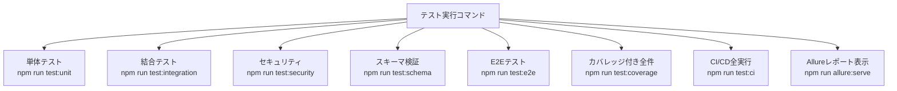

# テストスクリプト生成（TypeScript + Jest + Allure Report）

## 生成ファイル構成

```mermaid
flowchart TD
    ROOT["プロジェクトルート"]
    ROOT --> TESTS["tests/"]
    ROOT --> SCRIPTS["scripts/"]
    ROOT --> CONFIG["設定ファイル群"]

    TESTS --> UNIT["unit/"]
    TESTS --> INTG["integration/"]
    TESTS --> E2E["e2e/"]
    TESTS --> SEC["security/"]
    TESTS --> SCHEMA["schema/"]
    TESTS --> MOCKS["mocks/"]
    TESTS --> DATA["data/ (テストデータJSON)"]
    TESTS --> HELPERS["helpers/"]

    UNIT --> U1["score.test.ts"]
    UNIT --> U2["dedup.test.ts"]
    UNIT --> U3["fileUtils.test.ts"]
    UNIT --> U4["validation.test.ts"]
    UNIT --> U5["formatDuration.test.ts"]
    UNIT --> U6["build.test.ts"]

    INTG --> I1["batch.test.ts"]
    INTG --> I2["merge.test.ts"]
    INTG --> I3["health.test.ts"]
    INTG --> I4["admin-api.test.ts"]
    INTG --> I5["build-flow.test.ts"]

    E2E --> E1["public-site.spec.ts"]
    E2E --> E2e["video-card.spec.ts"]
    E2E --> E3["responsive.spec.ts"]
    E2E --> E4["accessibility.spec.ts"]

    SEC --> S1["secrets.test.ts"]
    SCHEMA --> SC1["videos-schema.test.ts"]

    DATA --> D1["score-test-data.json"]
    DATA --> D2["dedup-test-data.json"]
    DATA --> D3["validation-test-data.json"]
    DATA --> D4["youtube-mock-responses.json"]

    HELPERS --> H1["test-utils.ts"]
    HELPERS --> H2["retry.ts"]
    HELPERS --> H3["allure-reporter.ts"]
    HELPERS --> H4["screenshot.ts"]

    SCRIPTS --> SC2["run-tests.sh"]
    SCRIPTS --> SC3["automation-rate-report.ts"]

    CONFIG --> C1["jest.config.ts"]
    CONFIG --> C2["playwright.config.ts"]
    CONFIG --> C3["jest.setup.ts"]
    CONFIG --> C4["tsconfig.test.json"]
```



---

## 設定ファイル群

### `jest.config.ts`

```typescript
/**
 * Jest設定ファイル
 * 単体テスト・結合テスト・セキュリティテスト・スキーマテストを対象とする
 * Allureレポーター・カバレッジ・タイムアウト設定を含む
 */
import type { Config } from 'jest';

const config: Config = {
  preset: 'ts-jest',
  testEnvironment: 'node',
  rootDir: '.',
  testMatch: [
    '<rootDir>/tests/unit/**/*.test.ts',
    '<rootDir>/tests/integration/**/*.test.ts',
    '<rootDir>/tests/security/**/*.test.ts',
    '<rootDir>/tests/schema/**/*.test.ts',
  ],
  moduleFileExtensions: ['ts', 'tsx', 'js', 'jsx', 'json'],
  transform: {
    '^.+\\.tsx?$': ['ts-jest', {
      tsconfig: '<rootDir>/tsconfig.test.json',
    }],
  },
  collectCoverageFrom: [
    'src/**/*.ts',
    'src/**/*.js',
    '!src/admin/public/**',
    '!src/**/*.d.ts',
  ],
  coverageThresholds: {
    global: {
      branches: 80,
      functions: 85,
      lines: 85,
      statements: 85,
    },
  },
  coverageReporters: ['text', 'lcov', 'html', 'json'],
  coverageDirectory: '<rootDir>/coverage',
  setupFilesAfterFramework: ['<rootDir>/tests/jest.setup.ts'],
  testTimeout: 15000,
  reporters: [
    'default',
    [
      'jest-junit',
      {
        outputDirectory: '<rootDir>/test-results',
        outputName: 'junit.xml',
        classNameTemplate: '{classname}',
        titleTemplate: '{title}',
        ancestorSeparator: ' › ',
        usePathForSuiteName: true,
      },
    ],
    [
      'jest-allure2-reporter',
      {
        resultsDir: '<rootDir>/allure-results',
      },
    ],
  ],
  globalSetup: '<rootDir>/tests/global-setup.ts',
  globalTeardown: '<rootDir>/tests/global-teardown.ts',
};

export default config;
```

### `playwright.config.ts`

```typescript
/**
 * Playwright E2Eテスト設定ファイル
 * PC・モバイルビューポート対応・スクリーンショット・動画録画設定を含む
 */
import { defineConfig, devices } from '@playwright/test';

export default defineConfig({
  testDir: './tests/e2e',
  timeout: 30000,
  expect: { timeout: 5000 },
  fullyParallel: false,
  forbidOnly: !!process.env.CI,
  retries: process.env.CI ? 2 : 0,
  workers: process.env.CI ? 1 : undefined,

  reporter: [
    ['html', { outputFolder: 'playwright-report', open: 'never' }],
    ['junit', { outputFile: 'test-results/playwright-junit.xml' }],
    ['allure-playwright', { resultsDir: 'allure-results' }],
    ['line'],
  ],

  use: {
    baseURL: process.env.BASE_URL ?? 'http://localhost:8080',
    screenshot: 'only-on-failure',
    video: 'retain-on-failure',
    trace: 'on-first-retry',
    actionTimeout: 10000,
    navigationTimeout: 15000,
  },

  projects: [
    {
      name: 'chromium-desktop',
      use: {
        ...devices['Desktop Chrome'],
        viewport: { width: 1280, height: 800 },
      },
    },
    {
      name: 'chromium-mobile',
      use: {
        ...devices['iPhone 14'],
        viewport: { width: 390, height: 844 },
      },
    },
    {
      name: 'chromium-tablet-boundary',
      use: {
        browserName: 'chromium',
        viewport: { width: 768, height: 900 },
      },
    },
  ],

  webServer: {
    command: 'npx serve docs -p 8080',
    port: 8080,
    reuseExistingServer: !process.env.CI,
    timeout: 30000,
  },

  outputDir: 'test-results/playwright',
});
```

### `tsconfig.test.json`

```json
{
  "extends": "./tsconfig.json",
  "compilerOptions": {
    "target": "ES2020",
    "module": "commonjs",
    "lib": ["ES2020"],
    "strict": true,
    "esModuleInterop": true,
    "resolveJsonModule": true,
    "outDir": "./dist-test",
    "rootDir": ".",
    "baseUrl": ".",
    "paths": {
      "@/src/*": ["src/*"],
      "@/tests/*": ["tests/*"]
    },
    "types": [
      "jest",
      "node",
      "@playwright/test"
    ]
  },
  "include": [
    "src/**/*",
    "tests/**/*"
  ],
  "exclude": [
    "node_modules",
    "dist",
    "docs"
  ]
}
```

### `tests/jest.setup.ts`

```typescript
/**
 * Jestグローバルセットアップファイル
 * - nockによるHTTPモックの有効化
 * - Allureレポーター初期化
 * - グローバルエラーハンドラー設定
 * - テスト間の状態リセット
 */
import nock from 'nock';
import * as fs from 'fs';
import * as path from 'path';

// nockのグローバル設定: テスト外の実HTTP通信を禁止
beforeAll(() => {
  nock.disableNetConnect();
  // localhost は許可（supertest用）
  nock.enableNetConnect('127.0.0.1');
  nock.enableNetConnect('localhost');
});

afterAll(() => {
  nock.enableNetConnect();
  nock.cleanAll();
});

afterEach(() => {
  // 各テスト後にnockの未消費モックをクリア
  nock.cleanAll();

  // テスト用一時ファイルのクリーンアップ
  const tmpFiles = [
    '/tmp/test-output.json',
    '/tmp/test-atomic.json',
    '/tmp/test-japanese.json',
    '/tmp/test-atomic.json.tmp',
  ];
  tmpFiles.forEach(file => {
    try { fs.unlinkSync(file); } catch { /* 存在しない場合は無視 */ }
  });
});

// Jestタイムアウトのグローバル設定
jest.setTimeout(15000);

// コンソール出力を抑制（テスト中の冗長ログを非表示）
const originalConsoleError = console.error;
beforeEach(() => {
  // エラー以外のコンソールをモック（必要に応じてコメントアウト）
  // jest.spyOn(console, 'log').mockImplementation(() => {});
  // jest.spyOn(console, 'info').mockImplementation(() => {});
});
afterEach(() => {
  jest.restoreAllMocks();
});
```

### `tests/global-setup.ts`

```typescript
/**
 * Jestグローバルセットアップ（全テスト開始前に1回実行）
 * - テスト結果ディレクトリの作成
 * - Allure結果ディレクトリの初期化
 * - テスト用データディレクトリの確認
 */
import * as fs from 'fs';
import * as path from 'path';

export default async function globalSetup(): Promise<void> {
  const dirs = [
    'test-results',
    'allure-results',
    'coverage',
    'tests/data',
    'logs',
  ];

  for (const dir of dirs) {
    if (!fs.existsSync(dir)) {
      fs.mkdirSync(dir, { recursive: true });
      console.log(`[global-setup] Created directory: ${dir}`);
    }
  }

  // バックアップ: data/videos.json が存在する場合は保存
  const videosJsonPath = 'data/videos.json';
  if (fs.existsSync(videosJsonPath)) {
    fs.copyFileSync(videosJsonPath, `${videosJsonPath}.test-backup`);
    console.log('[global-setup] Backed up data/videos.json');
  }

  console.log('[global-setup] Test environment initialized.');
}
```

### `tests/global-teardown.ts`

```typescript
/**
 * Jestグローバルティアダウン（全テスト終了後に1回実行）
 * - テスト用ファイルのクリーンアップ
 * - バックアップファイルのリストア
 */
import * as fs from 'fs';

export default async function globalTeardown(): Promise<void> {
  // バックアップからリストア
  const videosJsonPath = 'data/videos.json';
  const backupPath = `${videosJsonPath}.test-backup`;
  if (fs.existsSync(backupPath)) {
    fs.copyFileSync(backupPath, videosJsonPath);
    fs.unlinkSync(backupPath);
    console.log('[global-teardown] Restored data/videos.json from backup');
  }

  // draftファイルのクリーンアップ
  const draftPath = 'data/videos.draft.json';
  if (fs.existsSync(draftPath)) {
    try { fs.unlinkSync(draftPath); } catch { /* 無視 */ }
  }

  console.log('[global-teardown] Test environment cleaned up.');
}
```

---

## ヘルパーモジュール

### `tests/helpers/retry.ts`

```typescript
/**
 * テスト実行リトライユーティリティ
 *
 * @description
 * CI/CD環境での不安定なテスト（flaky test）に対応するため、
 * 指定回数までリトライを行うラッパー関数を提供する。
 * 各リトライ間には指数バックオフを適用する。
 */

export interface RetryOptions {
  /** 最大リトライ回数（デフォルト: 3） */
  maxRetries?: number;
  /** 初回待機時間ms（デフォルト: 1000） */
  initialDelayMs?: number;
  /** バックオフ係数（デフォルト: 2） */
  backoffFactor?: number;
  /** リトライ対象とするエラークラス（未指定の場合は全エラー） */
  retryableErrors?: Array<new (...args: unknown[]) => Error>;
}

/**
 * 指数バックオフ付きリトライでテスト関数を実行する
 *
 * @param fn - 実行するテスト関数（非同期可）
 * @param options - リトライオプション
 * @returns テスト関数の戻り値
 * @throws 最大リトライ回数を超えた場合に最後のエラーをthrow
 *
 * @example
 * await withRetry(async () => {
 *   const result = await fetchWithRetry(url);
 *   expect(result.status).toBe(200);
 * }, { maxRetries: 3, initialDelayMs: 500 });
 */
export async function withRetry<T>(
  fn: () => Promise<T> | T,
  options: RetryOptions = {}
): Promise<T> {
  const {
    maxRetries = 3,
    initialDelayMs = 1000,
    backoffFactor = 2,
    retryableErrors,
  } = options;

  let lastError: Error = new Error('Unknown error');

  for (let attempt = 1; attempt <= maxRetries; attempt++) {
    try {
      return await fn();
    } catch (error) {
      lastError = error instanceof Error ? error : new Error(String(error));

      // リトライ対象エラーチェック
      if (retryableErrors && retryableErrors.length > 0) {
        const isRetryable = retryableErrors.some(
          ErrClass => lastError instanceof ErrClass
        );
        if (!isRetryable) {
          throw lastError;
        }
      }

      if (attempt === maxRetries) {
        console.error(
          `[retry] All ${maxRetries} attempts failed. Last error:`,
          lastError.message
        );
        throw lastError;
      }

      const delayMs = initialDelayMs * Math.pow(backoffFactor, attempt - 1);
      console.warn(
        `[retry] Attempt ${attempt}/${maxRetries} failed: ${lastError.message}. ` +
        `Retrying in ${delayMs}ms...`
      );
      await sleep(delayMs);
    }
  }

  throw lastError;
}

/**
 * 指定ミリ秒間スリープする
 *
 * @param ms - スリープ時間（ミリ秒）
 */
export function sleep(ms: number): Promise<void> {
  return new Promise(resolve => setTimeout(resolve, ms));
}
```

### `tests/helpers/test-utils.ts`

```typescript
/**
 * テスト共通ユーティリティ
 *
 * @description
 * テストデータの読み込み・一時ファイル操作・日付生成など
 * 複数のテストファイルで使用する共通処理を提供する。
 */
import * as fs from 'fs';
import * as path from 'path';

/** テストデータのルートディレクトリ */
const TEST_DATA_DIR = path.resolve(__dirname, '../data');

/**
 * テストデータJSONファイルを読み込む
 *
 * @param filename - tests/data/ 以下のファイル名（例: 'score-test-data.json'）
 * @returns パース済みのJSONオブジェクト
 * @throws ファイルが存在しない場合またはJSONパースエラーの場合にthrow
 */
export function loadTestData<T = unknown>(filename: string): T {
  const filePath = path.join(TEST_DATA_DIR, filename);
  if (!fs.existsSync(filePath)) {
    throw new Error(`Test data file not found: ${filePath}`);
  }
  const raw = fs.readFileSync(filePath, 'utf-8');
  try {
    return JSON.parse(raw) as T;
  } catch (err) {
    throw new Error(`Failed to parse test data JSON: ${filePath}\n${String(err)}`);
  }
}

/**
 * 今日から指定日数前の日付文字列を生成する（YYYY-MM-DD形式）
 *
 * @param daysAgo - 何日前か（正の整数）
 * @returns YYYY-MM-DD形式の日付文字列
 */
export function daysAgoStr(daysAgo: number): string {
  const d = new Date();
  d.setDate(d.getDate() - daysAgo);
  return d.toISOString().slice(0, 10);
}

/**
 * 今日から指定年数前の日付文字列を生成する（YYYY-MM-DD形式）
 *
 * @param yearsAgo - 何年前か（正の整数）
 * @returns YYYY-MM-DD形式の日付文字列
 */
export function yearsAgoStr(yearsAgo: number): string {
  const d = new Date();
  d.setFullYear(d.getFullYear() - yearsAgo);
  return d.toISOString().slice(0, 10);
}

/**
 * テスト用一時ファイルパスを生成する
 *
 * @param suffix - ファイル名サフィックス（例: 'videos.json'）
 * @returns /tmp/jest-test-{suffix} 形式のパス
 */
export function tmpFilePath(suffix: string): string {
  return `/tmp/jest-test-${suffix}`;
}

/**
 * テスト用に data/videos.json に内容を書き込む
 *
 * @param data - 書き込むJSONオブジェクト
 */
export function writeTestVideosJson(data: unknown): void {
  const dir = path.resolve('data');
  if (!fs.existsSync(dir)) fs.mkdirSync(dir, { recursive: true });
  fs.writeFileSync(
    path.join(dir, 'videos.json'),
    JSON.stringify(data, null, 2),
    'utf-8'
  );
}

/**
 * テスト用に data/videos.draft.json に内容を書き込む
 *
 * @param data - 書き込むJSONオブジェクト
 */
export function writeTestDraftJson(data: unknown): void {
  const dir = path.resolve('data');
  if (!fs.existsSync(dir)) fs.mkdirSync(dir, { recursive: true });
  fs.writeFileSync(
    path.join(dir, 'videos.draft.json'),
    JSON.stringify(data, null, 2),
    'utf-8'
  );
}

/**
 * JSONファイルを読み込んでパースする
 *
 * @param filePath - ファイルパス
 * @returns パース済みのJSONオブジェクト
 */
export function readJsonFile<T = unknown>(filePath: string): T {
  const raw = fs.readFileSync(path.resolve(filePath), 'utf-8');
  return JSON.parse(raw) as T;
}

/**
 * 全カテゴリ・ジャンルから動画一覧をフラットに取得する
 *
 * @param data - videos.json 形式のデータ
 * @returns 全動画オブジェクトの配列
 */
export function getAllVideos(data: {
  categories: Array<{
    genres: Array<{
      videos: unknown[];
    }>;
  }>;
}): unknown[] {
  return data.categories.flatMap(c =>
    c.genres.flatMap(g => g.videos)
  );
}
```

### `tests/helpers/screenshot.ts`

```typescript
/**
 * テスト失敗時のスクリーンショット・ログ取得ユーティリティ（Jest用）
 *
 * @description
 * Playwright以外のテスト（Jestによる結合テスト等）で
 * 失敗時のコンテキスト情報（ファイル状態・ログ内容）を
 * test-results/ ディレクトリに保存する。
 */
import * as fs from 'fs';
import * as path from 'path';

const ARTIFACTS_DIR = path.resolve('test-results', 'artifacts');

/**
 * テスト失敗時のコンテキスト情報をファイルに保存する
 *
 * @param testName - テスト名（ファイル名に使用）
 * @param context - 保存するコンテキスト情報のオブジェクト
 */
export function saveTestArtifact(
  testName: string,
  context: Record<string, unknown>
): void {
  if (!fs.existsSync(ARTIFACTS_DIR)) {
    fs.mkdirSync(ARTIFACTS_DIR, { recursive: true });
  }

  const safeName = testName.replace(/[^a-zA-Z0-9_-]/g, '_').slice(0, 100);
  const timestamp = new Date().toISOString().replace(/[:.]/g, '-');
  const filePath = path.join(ARTIFACTS_DIR, `${safeName}_${timestamp}.json`);

  const artifact = {
    testName,
    timestamp: new Date().toISOString(),
    context,
    // テスト実行時のファイルシステム状態を記録
    fileSnapshots: captureFileSnapshots(),
  };

  fs.writeFileSync(filePath, JSON.stringify(artifact, null, 2), 'utf-8');
  console.error(`[artifact] Saved test artifact: ${filePath}`);
}

/**
 * テスト関連ファイルの現在のスナップショットを取得する
 *
 * @returns ファイルパスと内容のマッピング
 */
function captureFileSnapshots(): Record<string, string | null> {
  const targetFiles = [
    'data/videos.json',
    'data/videos.draft.json',
    'data/categories.json',
  ];

  const snapshots: Record<string, string | null> = {};
  for (const filePath of targetFiles) {
    try {
      snapshots[filePath] = fs.existsSync(filePath)
        ? fs.readFileSync(filePath, 'utf-8').slice(0, 2000) // 先頭2000文字
        : null;
    } catch {
      snapshots[filePath] = '[READ_ERROR]';
    }
  }
  return snapshots;
}

/**
 * 直近のログファイル内容を取得する
 *
 * @param logPattern - ログファイルパターン（例: 'batch'）
 * @returns ログ内容（取得失敗時はnull）
 */
export function getLatestLogContent(logPattern: string): string | null {
  const logsDir = 'logs';
  if (!fs.existsSync(logsDir)) return null;

  const files = fs.readdirSync(logsDir)
    .filter(f => f.includes(logPattern) && f.endsWith('.log'))
    .sort()
    .reverse();

  if (files.length === 0) return null;
  try {
    return fs.readFileSync(path.join(logsDir, files[0]), 'utf-8');
  } catch {
    return null;
  }
}
```

---

## テストデータJSON

### `tests/data/score-test-data.json`

```json
{
  "validTrendingCases": [
    {
      "description": "UT-01-01: 急上昇条件を全て満たす",
      "input": {
        "_tempApiData": {
          "subscriberCount": 10000,
          "viewCount": 5000,
          "publishedAt": "__TODAY_MINUS_30_DAYS__"
        }
      },
      "expected": true
    },
    {
      "description": "UT-01-02: 登録者数ちょうど20000人（境界値）",
      "input": {
        "_tempApiData": {
          "subscriberCount": 20000,
          "viewCount": 6000,
          "publishedAt": "__TODAY_MINUS_30_DAYS__"
        }
      },
      "expected": true
    },
    {
      "description": "UT-01-03: エンゲージメント率ちょうど0.30（境界値）",
      "input": {
        "_tempApiData": {
          "subscriberCount": 10000,
          "viewCount": 3000,
          "publishedAt": "__TODAY_MINUS_30_DAYS__"
        }
      },
      "expected": true
    },
    {
      "description": "UT-01-04: 投稿日364日前（境界値内）",
      "input": {
        "_tempApiData": {
          "subscriberCount": 10000,
          "viewCount": 5000,
          "publishedAt": "__TODAY_MINUS_364_DAYS__"
        }
      },
      "expected": true
    }
  ],
  "invalidTrendingCases": [
    {
      "description": "UT-01-05: 登録者数0（ゼロ除算ガード）",
      "input": {
        "_tempApiData": {
          "subscriberCount": 0,
          "viewCount": 10000,
          "publishedAt": "__TODAY_MINUS_30_DAYS__"
        }
      },
      "expected": false
    },
    {
      "description": "UT-01-06: 登録者数null（非公開）",
      "input": {
        "_tempApiData": {
          "subscriberCount": null,
          "viewCount": 50000,
          "publishedAt": "__TODAY_MINUS_30_DAYS__"
        }
      },
      "expected": false
    },
    {
      "description": "UT-01-07: 登録者数undefined",
      "input": {
        "_tempApiData": {
          "viewCount": 50000,
          "publishedAt": "__TODAY_MINUS_30_DAYS__"
        }
      },
      "expected": false
    },
    {
      "description": "UT-01-08: 登録者数20001人（境界値超え）",
      "input": {
        "_tempApiData": {
          "subscriberCount": 20001,
          "viewCount": 10000,
          "publishedAt": "__TODAY_MINUS_30_DAYS__"
        }
      },
      "expected": false
    },
    {
      "description": "UT-01-09: エンゲージメント率0.29（境界値未満）",
      "input": {
        "_tempApiData": {
          "subscriberCount": 10000,
          "viewCount": 2900,
          "publishedAt": "__TODAY_MINUS_30_DAYS__"
        }
      },
      "expected": false
    },
    {
      "description": "UT-01-10: 投稿日366日前（境界値超え）",
      "input": {
        "_tempApiData": {
          "subscriberCount": 10000,
          "viewCount": 5000,
          "publishedAt": "__TODAY_MINUS_366_DAYS__"
        }
      },
      "expected": false
    },
    {
      "description": "UT-01-11: _tempApiDataが存在しない",
      "input": {
        "videoId": "abc12345678",
        "title": "テスト動画"
      },
      "expected": false
    }
  ],
  "boundaryCase": {
    "description": "DB-011: 投稿日ちょうど365日前（境界動作確認）",
    "input": {
      "_tempApiData": {
        "subscriberCount": 10000,
        "viewCount": 5000,
        "publishedAt": "__TODAY_MINUS_365_DAYS__"
      }
    },
    "note": "実装定義に依存: 含む=true / 含まない=false"
  }
}
```

### `tests/data/validation-test-data.json`

```json
{
  "videoId": {
    "valid": [
      { "id": "ABCDEFGHIJK", "description": "英大文字11文字" },
      { "id": "abc12345678", "description": "英小文字+数字11文字" },
      { "id": "abc-123_xyz", "description": "ハイフン・アンダーバー含む11文字" },
      { "id": "A1B2C3D4E5F", "description": "英数字混在11文字" }
    ],
    "invalid": [
      { "id": "ABCDEFGHIJ", "description": "10文字（短すぎ）" },
      { "id": "ABCDEFGHIJKL", "description": "12文字（長すぎ）" },
      { "id": "ABCDEFGHIJ@", "description": "記号(@)を含む11文字" },
      { "id": "", "description": "空文字" },
      { "id": null, "description": "null" },
      { "id": "日本語テスト!", "description": "日本語を含む文字列" }
    ]
  },
  "publishedAt": {
    "valid": [
      { "date": "2024-06-15", "description": "正常なYYYY-MM-DD" },
      { "date": "2000-01-01", "description": "2000年1月1日" },
      { "date": "2024-02-29", "description": "うるう年2月29日" }
    ],
    "invalid": [
      { "date": "2024/06/15", "description": "YYYY/MM/DD形式（スラッシュ区切り）" },
      { "date": "2024-02-30", "description": "存在しない日付（2月30日）" },
      { "date": "24-06-15", "description": "年が2桁" },
      { "date": "2024-13-01", "description": "存在しない月（13月）" },
      { "date": "", "description": "空文字" }
    ]
  },
  "duration": {
    "valid": [
      { "value": "PT15M30S", "description": "15分30秒" },
      { "value": "PT1H5M30S", "description": "1時間5分30秒" },
      { "value": "PT30S", "description": "30秒（分なし）" },
      { "value": "PT5M", "description": "5分（秒なし）" },
      { "value": "PT0S", "description": "0秒" }
    ],
    "invalid": [
      { "value": "15分30秒", "description": "日本語形式" },
      { "value": "15:30", "description": "コロン区切り形式" },
      { "value": "", "description": "空文字" },
      { "value": "P15M30S", "description": "Tが欠落" }
    ]
  },
  "status": {
    "valid": ["active", "dead"],
    "invalid": ["unknown", "inactive", "pending", "", "Active", "DEAD"]
  },
  "order": {
    "valid": [1, 2, 10, 100],
    "invalid": [0, -1, 1.5, -0.1, null]
  }
}
```

### `tests/data/dedup-test-data.json`

```json
{
  "noDuplicate": {
    "categories": [
      {
        "id": "CAT-01", "order": 1,
        "genres": [
          {
            "id": "GNR-01", "order": 1,
            "videos": [
              {"videoId": "AAAAAAAAAAA", "source": "auto"},
              {"videoId": "BBBBBBBBBBB", "source": "auto"}
            ]
          }
        ]
      },
      {
        "id": "CAT-02", "order": 2,
        "genres": [
          {
            "id": "GNR-01", "order": 1,
            "videos": [{"videoId": "CCCCCCCCCCC", "source": "auto"}]
          }
        ]
      }
    ]
  },
  "crossCategoryDuplicate": {
    "categories": [
      {
        "id": "CAT-01", "order": 1,
        "genres": [
          {
            "id": "GNR-01", "order": 1,
            "videos": [{"videoId": "AAAAAAAAAAA", "source": "auto"}]
          }
        ]
      },
      {
        "id": "CAT-02", "order": 2,
        "genres": [
          {
            "id": "GNR-01", "order": 1,
            "videos": [{"videoId": "AAAAAAAAAAA", "source": "auto"}]
          }
        ]
      }
    ]
  },
  "manualDuplicate": {
    "categories": [
      {
        "id": "CAT-01", "order": 1,
        "genres": [
          {
            "id": "GNR-01", "order": 1,
            "videos": [{"videoId": "MMMMMMMM11A", "source": "manual", "tags": ["manual"]}]
          }
        ]
      },
      {
        "id": "CAT-02", "order": 2,
        "genres": [
          {
            "id": "GNR-01", "order": 1,
            "videos": [{"videoId": "MMMMMMMM11A", "source": "manual", "tags": ["manual"]}]
          }
        ]
      }
    ]
  },
  "sameGenreDuplicate": {
    "categories": [
      {
        "id": "CAT-01", "order": 1,
        "genres": [
          {
            "id": "GNR-01", "order": 1,
            "videos": [{"videoId": "DUPVID11111", "source": "auto"}]
          },
          {
            "id": "GNR-02", "order": 2,
            "videos": [{"videoId": "DUPVID11111", "source": "auto"}]
          }
        ]
      }
    ]
  },
  "empty": {
    "categories": []
  }
}
```

### `tests/data/youtube-mock-responses.json`

```json
{
  "searchListSuccess": {
    "kind": "youtube#searchListResponse",
    "etag": "test-etag-001",
    "nextPageToken": null,
    "regionCode": "JP",
    "pageInfo": {"totalResults": 2, "resultsPerPage": 10},
    "items": [
      {
        "kind": "youtube#searchResult",
        "etag": "test-etag-item-001",
        "id": {"kind": "youtube#video", "videoId": "TESTVID0001"},
        "snippet": {
          "publishedAt": "2024-06-01T00:00:00Z",
          "channelId": "UCtest0000001",
          "title": "テスト動画1：注文住宅の間取り",
          "description": "テスト説明文1",
          "channelTitle": "テストチャンネル"
        }
      },
      {
        "kind": "youtube#searchResult",
        "etag": "test-etag-item-002",
        "id": {"kind": "youtube#video", "videoId": "TESTVID0002"},
        "snippet": {
          "publishedAt": "2024-07-01T00:00:00Z",
          "channelId": "UCtest0000002",
          "title": "テスト動画2：外壁選びのポイント",
          "description": "テスト説明文2",
          "channelTitle": "テストチャンネル2"
        }
      }
    ]
  },
  "videoDetailsSuccess": {
    "kind": "youtube#videoListResponse",
    "etag": "test-etag-videos",
    "pageInfo": {"totalResults": 2, "resultsPerPage": 50},
    "items": [
      {
        "kind": "youtube#video",
        "id": "TESTVID0001",
        "contentDetails": {"duration": "PT15M30S"},
        "statistics": {"viewCount": "5000", "likeCount": "150"}
      },
      {
        "kind": "youtube#video",
        "id": "TESTVID0002",
        "contentDetails": {"duration": "PT10M00S"},
        "statistics": {"viewCount": "3000", "likeCount": "90"}
      }
    ]
  },
  "channelDetailsSuccess": {
    "kind": "youtube#channelListResponse",
    "items": [
      {
        "kind": "youtube#channel",
        "id": "UCtest0000001",
        "statistics": {"subscriberCount": "10000", "videoCount": "50"}
      },
      {
        "kind": "youtube#channel",
        "id": "UCtest0000002",
        "statistics": {"subscriberCount": "8000", "videoCount": "30"}
      }
    ]
  },
  "searchListEmpty": {
    "kind": "youtube#searchListResponse",
    "pageInfo": {"totalResults": 0, "resultsPerPage": 10},
    "items": []
  },
  "searchListShort": {
    "kind": "youtube#searchListResponse",
    "pageInfo": {"totalResults": 3, "resultsPerPage": 10},
    "items": [
      {
        "id": {"kind": "youtube#video", "videoId": "SHORTVID001"},
        "snippet": {
          "publishedAt": "2024-06-01T00:00:00Z",
          "channelId": "UCtest0000001",
          "title": "件数不足テスト動画1",
          "channelTitle": "テストチャンネル"
        }
      }
    ]
  },
  "error503": {
    "error": {
      "code": 503,
      "message": "Service Unavailable",
      "errors": [{"message": "Service Unavailable", "domain": "youtube.quota", "reason": "serviceUnavailable"}]
    }
  },
  "error429": {
    "error": {
      "code": 429,
      "message": "Too Many Requests",
      "errors": [{"message": "Too Many Requests", "domain": "youtube.quota", "reason": "rateLimitExceeded"}]
    }
  }
}
```

---

## 単体テスト

### `tests/unit/score.test.ts`

```typescript
/**
 * score.js スコアリングロジック 単体テスト
 *
 * @description
 * TC_001〜TC_011 および TC_078 のテストケースを実装する。
 * isTrending() 関数のゼロ除算ガード・境界値・エッジケースを網羅する。
 *
 * @requires src/batch/score.js が実装済みであること
 */
import { isTrending } from '../../src/batch/score';
import { loadTestData, daysAgoStr, yearsAgoStr } from '../helpers/test-utils';
import { withRetry } from '../helpers/retry';
import { saveTestArtifact } from '../helpers/screenshot';

// @allure.feature: スコアリングロジック
// @allure.story: isTrending関数

/** テストデータの型定義 */
interface ScoreTestCase {
  description: string;
  input: {
    _tempApiData?: {
      subscriberCount?: number | null;
      viewCount?: number;
      publishedAt?: string;
    };
    videoId?: string;
    title?: string;
  };
  expected: boolean;
}

interface ScoreTestData {
  validTrendingCases: ScoreTestCase[];
  invalidTrendingCases: ScoreTestCase[];
  boundaryCase: ScoreTestCase & { note: string };
}

/** テストデータを読み込み、日付プレースホルダーを実際の日付に置換する */
function resolveTestData(data: ScoreTestData): ScoreTestData {
  const replacements: Record<string, string> = {
    '__TODAY_MINUS_30_DAYS__': daysAgoStr(30),
    '__TODAY_MINUS_364_DAYS__': daysAgoStr(364),
    '__TODAY_MINUS_365_DAYS__': yearsAgoStr(1),
    '__TODAY_MINUS_366_DAYS__': daysAgoStr(366),
  };

  const raw = JSON.stringify(data);
  const resolved = Object.entries(replacements).reduce(
    (str, [placeholder, value]) => str.replaceAll(placeholder, value),
    raw
  );
  return JSON.parse(resolved) as ScoreTestData;
}

describe('isTrending()', () => {
  let testData: ScoreTestData;

  beforeAll(() => {
    const rawData = loadTestData<ScoreTestData>('score-test-data.json');
    testData = resolveTestData(rawData);
  });

  // ─────────────────────────────────────────
  // 正常系: trueを返すケース
  // ─────────────────────────────────────────
  describe('急上昇条件を満たすケース（true）', () => {
    /**
     * TC_004: 全条件を満たす場合にtrueを返す
     */
    test('UT-01-01: 急上昇条件を全て満たす動画はtrue', async () => {
      await withRetry(async () => {
        const tc = testData.validTrendingCases.find(c => c.description.includes('UT-01-01'));
        if (!tc) throw new Error('Test case UT-01-01 not found in test data');

        const result = isTrending(tc.input);
        expect(result).toBe(true);
      });
    });

    /**
     * TC_005: 登録者数ちょうど20000人は対象になる（境界値 <=）
     */
    test('UT-01-02: 登録者数ちょうど20000人はtrue（境界値）', async () => {
      await withRetry(async () => {
        const tc = testData.validTrendingCases.find(c => c.description.includes('UT-01-02'));
        if (!tc) throw new Error('Test case UT-01-02 not found');

        const result = isTrending(tc.input);
        expect(result).toBe(true);
      });
    });

    /**
     * TC_008: エンゲージメント率ちょうど0.30は対象になる（境界値 >=）
     */
    test('UT-01-03: エンゲージメント率ちょうど0.30はtrue（境界値）', async () => {
      await withRetry(async () => {
        const tc = testData.validTrendingCases.find(c => c.description.includes('UT-01-03'));
        if (!tc) throw new Error('Test case UT-01-03 not found');

        // engagementRate = 3000 / 10000 = 0.30 ちょうど
        const result = isTrending(tc.input);
        expect(result).toBe(true);
      });
    });

    /**
     * TC_009: 投稿日364日前は1年以内として対象になる
     */
    test('UT-01-04: 投稿日364日前はtrue（境界値内）', async () => {
      await withRetry(async () => {
        const tc = testData.validTrendingCases.find(c => c.description.includes('UT-01-04'));
        if (!tc) throw new Error('Test case UT-01-04 not found');

        const result = isTrending(tc.input);
        expect(result).toBe(true);
      });
    });
  });

  // ─────────────────────────────────────────
  // 異常系・エッジケース: falseを返すケース
  // ─────────────────────────────────────────
  describe('急上昇条件を満たさないケース（false）', () => {
    /**
     * TC_001: 登録者数0でゼロ除算が発生しないことを確認
     */
    test('UT-01-05: 登録者数0はfalse（ゼロ除算ガード）', async () => {
      await withRetry(async () => {
        const tc = testData.invalidTrendingCases.find(c => c.description.includes('UT-01-05'));
        if (!tc) throw new Error('Test case UT-01-05 not found');

        // エラーが発生しないこと（ゼロ除算ガード）
        expect(() => isTrending(tc.input)).not.toThrow();
        const result = isTrending(tc.input);
        expect(result).toBe(false);
      });
    });

    /**
     * TC_002: 登録者数nullは非公開として除外
     */
    test('UT-01-06: 登録者数nullはfalse（非公開ガード）', async () => {
      await withRetry(async () => {
        const tc = testData.invalidTrendingCases.find(c => c.description.includes('UT-01-06'));
        if (!tc) throw new Error('Test case UT-01-06 not found');

        expect(() => isTrending(tc.input)).not.toThrow();
        expect(isTrending(tc.input)).toBe(false);
      });
    });

    /**
     * TC_003: 登録者数undefinedはnullと同様に除外
     */
    test('UT-01-07: 登録者数undefinedはfalse', async () => {
      await withRetry(async () => {
        const input = {
          _tempApiData: {
            viewCount: 50000,
            publishedAt: daysAgoStr(30),
          },
        };
        expect(() => isTrending(input)).not.toThrow();
        expect(isTrending(input)).toBe(false);
      });
    });

    /**
     * TC_006: 登録者数20001人は閾値超えのため除外
     */
    test('UT-01-08: 登録者数20001人はfalse（境界値超え）', async () => {
      await withRetry(async () => {
        const tc = testData.invalidTrendingCases.find(c => c.description.includes('UT-01-08'));
        if (!tc) throw new Error('Test case UT-01-08 not found');

        expect(isTrending(tc.input)).toBe(false);
      });
    });

    /**
     * TC_007: エンゲージメント率0.29は閾値未満のため除外
     */
    test('UT-01-09: エンゲージメント率0.29はfalse（境界値未満）', async () => {
      await withRetry(async () => {
        const tc = testData.invalidTrendingCases.find(c => c.description.includes('UT-01-09'));
        if (!tc) throw new Error('Test case UT-01-09 not found');

        // engagementRate = 2900 / 10000 = 0.29 < 0.30
        expect(isTrending(tc.input)).toBe(false);
      });
    });

    /**
     * TC_010: 投稿日366日前は1年超のため除外
     */
    test('UT-01-10: 投稿日366日前はfalse（境界値超え）', async () => {
      await withRetry(async () => {
        const tc = testData.invalidTrendingCases.find(c => c.description.includes('UT-01-10'));
        if (!tc) throw new Error('Test case UT-01-10 not found');

        expect(isTrending(tc.input)).toBe(false);
      });
    });

    /**
     * TC_011: _tempApiDataが存在しない場合はfalseかつエラーなし
     */
    test('UT-01-11: _tempApiDataが存在しない場合はfalse', async () => {
      await withRetry(async () => {
        const input = { videoId: 'abc12345678', title: 'テスト動画' };
        expect(() => isTrending(input)).not.toThrow();
        expect(isTrending(input)).toBe(false);
      });
    });
  });

  // ─────────────────────────────────────────
  // 境界動作確認: 実装依存のケース
  // ─────────────────────────────────────────
  describe('境界動作確認', () => {
    /**
     * TC_078: 投稿日ちょうど365日前の挙動は実装定義に依存
     * 仕様書の「直近1年以内」の定義を確認する
     */
    test('DB-011: 投稿日ちょうど365日前の境界動作確認（boolean型であること）', async () => {
      await withRetry(async () => {
        const input = {
          _tempApiData: {
            subscriberCount: 10000,
            viewCount: 5000,
            publishedAt: yearsAgoStr(1),
          },
        };
        const result = isTrending(input);
        // 実装後に期待値を確定させること: 含む場合はtrue, 含まない場合はfalse
        expect(typeof result).toBe('boolean');
        // TODO: 仕様確定後に下記を有効化
        // expect(result).toBe(true); // or false
      });
    });
  });
});
```

### `tests/unit/validation.test.ts`

```typescript
/**
 * バリデーション関数 単体テスト
 *
 * @description
 * TC_020〜TC_033 および TC_089, TC_109 のテストケースを実装する。
 * validateVideoId / validatePublishedAt / validateDuration /
 * validateStatus / validateOrder の境界値・エッジケースを網羅する。
 *
 * @requires src/utils/validation.js が実装済みであること
 */
import {
  validateVideoId,
  validatePublishedAt,
  validateDuration,
  validateStatus,
  validateOrder,
} from '../../src/utils/validation';
import { loadTestData } from '../helpers/test-utils';
import { withRetry } from '../helpers/retry';

interface ValidationTestData {
  videoId: {
    valid: Array<{ id: string; description: string }>;
    invalid: Array<{ id: string | null; description: string }>;
  };
  publishedAt: {
    valid: Array<{ date: string; description: string }>;
    invalid: Array<{ date: string; description: string }>;
  };
  duration: {
    valid: Array<{ value: string; description: string }>;
    invalid: Array<{ value: string; description: string }>;
  };
  status: { valid: string[]; invalid: string[] };
  order: { valid: number[]; invalid: Array<number | null> };
}

describe('validateVideoId()', () => {
  let testData: ValidationTestData;

  beforeAll(() => {
    testData = loadTestData<ValidationTestData>('validation-test-data.json');
  });

  /**
   * TC_020: 11文字の英数字は有効
   */
  test('UT-04-01: 11文字の英大文字はtrue', async () => {
    await withRetry(() => {
      expect(validateVideoId('ABCDEFGHIJK')).toBe(true);
    });
  });

  /**
   * TC_021: ハイフン・アンダーバーを含む11文字は有効
   */
  test('UT-04-02: ハイフン・アンダーバー含む11文字はtrue', async () => {
    await withRetry(() => {
      expect(validateVideoId('abc-123_xyz')).toBe(true);
    });
  });

  /**
   * TC_022: 10文字は無効（境界値-1）
   */
  test('UT-04-03: 10文字はfalse（短すぎ）', async () => {
    await withRetry(() => {
      expect(validateVideoId('ABCDEFGHIJ')).toBe(false);
    });
  });

  /**
   * TC_023: 12文字は無効（境界値+1）
   */
  test('UT-04-04: 12文字はfalse（長すぎ）', async () => {
    await withRetry(() => {
      expect(validateVideoId('ABCDEFGHIJKL')).toBe(false);
    });
  });

  /**
   * TC_024: 記号を含む11文字は無効
   */
  test('UT-04-05: 記号(@)を含む11文字はfalse', async () => {
    await withRetry(() => {
      expect(validateVideoId('ABCDEFGHIJ@')).toBe(false);
    });
  });

  /**
   * TC_025: 空文字は無効
   */
  test('UT-04-06: 空文字はfalse', async () => {
    await withRetry(() => {
      expect(validateVideoId('')).toBe(false);
    });
  });

  /**
   * TC_026: nullは無効かつエラーなし
   */
  test('UT-04-07: nullはfalse（エラーなし）', async () => {
    await withRetry(() => {
      // eslint-disable-next-line @typescript-eslint/no-explicit-any
      expect(() => validateVideoId(null as any)).not.toThrow();
      // eslint-disable-next-line @typescript-eslint/no-explicit-any
      expect(validateVideoId(null as any)).toBe(false);
    });
  });

  /**
   * テストデータJSONの有効ケースを全て検証
   */
  test('テストデータ: 有効なvideoId一覧がすべてtrue', async () => {
    await withRetry(() => {
      for (const tc of testData.videoId.valid) {
        expect(validateVideoId(tc.id)).toBe(true);
      }
    });
  });

  /**
   * テストデータJSONの無効ケースを全て検証
   */
  test('テストデータ: 無効なvideoId一覧がすべてfalse', async () => {
    await withRetry(() => {
      for (const tc of testData.videoId.invalid) {
        // eslint-disable-next-line @typescript-eslint/no-explicit-any
        expect(validateVideoId(tc.id as any)).toBe(false);
      }
    });
  });
});

describe('validatePublishedAt()', () => {
  let testData: ValidationTestData;

  beforeAll(() => {
    testData = loadTestData<ValidationTestData>('validation-test-data.json');
  });

  /**
   * TC_027: YYYY-MM-DD形式は有効
   */
  test('UT-04-08: YYYY-MM-DD形式はtrue', async () => {
    await withRetry(() => {
      expect(validatePublishedAt('2024-06-15')).toBe(true);
    });
  });

  /**
   * TC_028: YYYY/MM/DD形式は無効
   */
  test('UT-04-09: YYYY/MM/DD形式はfalse', async () => {
    await withRetry(() => {
      expect(validatePublishedAt('2024/06/15')).toBe(false);
    });
  });

  /**
   * TC_029: 存在しない日付は無効
   */
  test('UT-04-10: 存在しない日付（2024-02-30）はfalse', async () => {
    await withRetry(() => {
      expect(validatePublishedAt('2024-02-30')).toBe(false);
    });
  });

  test('テストデータ: 有効なpublishedAt一覧がすべてtrue', async () => {
    await withRetry(() => {
      for (const tc of testData.publishedAt.valid) {
        expect(validatePublishedAt(tc.date)).toBe(true);
      }
    });
  });

  test('テストデータ: 無効なpublishedAt一覧がすべてfalse', async () => {
    await withRetry(() => {
      for (const tc of testData.publishedAt.invalid) {
        expect(validatePublishedAt(tc.date)).toBe(false);
      }
    });
  });
});

describe('validateDuration()', () => {
  /**
   * TC_030〜033: ISO 8601形式の各パターン
   */
  test.each([
    ['PT15M30S', true, 'UT-04-11: PT15M30S形式'],
    ['PT1H5M30S', true, 'UT-04-12: PT1H5M30S形式（時間含む）'],
    ['PT30S', true, 'UT-04-13: PT30S形式（分なし）'],
    ['15分30秒', false, 'UT-04-14: 不正な文字列'],
    ['PT0S', true, 'エッジケース: PT0S'],
    ['PT5M', true, 'エッジケース: PT5M（秒なし）'],
    ['P15M30S', false, 'エッジケース: Tが欠落'],
    ['', false, 'エッジケース: 空文字'],
  ])('%s は %s (%s)', async (value, expected, description) => {
    await withRetry(() => {
      expect(validateDuration(value)).toBe(expected);
    });
  });
});

describe('validateStatus()', () => {
  /**
   * TC_089: status は 'active' と 'dead' のみ有効
   */
  test.each([
    ['active', true],
    ['dead', true],
    ['unknown', false],
    ['inactive', false],
    ['pending', false],
    ['', false],
    ['Active', false],
    ['DEAD', false],
  ])('status "%s" は %s', async (status, expected) => {
    await withRetry(() => {
      expect(validateStatus(status)).toBe(expected);
    });
  });
});

describe('validateOrder()', () => {
  /**
   * TC_109: order は1以上の整数のみ有効
   */
  test.each([
    [1, true],
    [2, true],
    [10, true],
    [100, true],
    [0, false],
    [-1, false],
    [1.5, false],
    [-0.1, false],
  ])('order %d は %s', async (order, expected) => {
    await withRetry(() => {
      // eslint-disable-next-line @typescript-eslint/no-explicit-any
      expect(validateOrder(order as any)).toBe(expected);
    });
  });

  test('order null はfalse', async () => {
    await withRetry(() => {
      // eslint-disable-next-line @typescript-eslint/no-explicit-any
      expect(() => validateOrder(null as any)).not.toThrow();
      // eslint-disable-next-line @typescript-eslint/no-explicit-any
      expect(validateOrder(null as any)).toBe(false);
    });
  });
});
```

### `tests/unit/formatDuration.test.ts`

```typescript
/**
 * formatDuration() 表示変換関数 単体テスト
 *
 * @description
 * TC_034〜TC_039 のテストケースを実装する。
 * ISO 8601 duration 文字列から表示用文字列への変換ロジックを検証する。
 *
 * @requires src/utils/formatDuration.js が実装済みであること
 */
import { formatDuration } from '../../src/utils/formatDuration';
import { withRetry } from '../helpers/retry';

describe('formatDuration()', () => {
  /**
   * TC_034〜039: 各パターンの変換を検証
   */
  test.each([
    ['PT15M30S', '15:30', 'TC_034: 15分30秒'],
    ['PT1H5M30S', '1:05:30', 'TC_035: 1時間5分30秒（2桁ゼロ埋め）'],
    ['PT5M0S', '5:00', 'TC_036: 5分0秒'],
    ['PT30S', '0:30', 'TC_037: 30秒（分なし）'],
    ['PT0S', '0:00', 'TC_038: 0秒（エッジケース）'],
    ['不正な形式', '--:--', 'TC_039: 不正フォーマットはfallback'],
    ['', '--:--', 'エッジケース: 空文字'],
    ['PT1H0M0S', '1:00:00', 'エッジケース: 1時間ちょうど'],
    ['PT59M59S', '59:59', 'エッジケース: 59分59秒'],
  ])('%s → "%s" (%s)', async (input, expected, _description) => {
    await withRetry(() => {
      const result = formatDuration(input);
      expect(result).toBe(expected);
    });
  });

  /**
   * 不正フォーマットでエラーが発生しないことを確認
   */
  test('TC_039補足: 不正フォーマットでもエラーをthrowしない', async () => {
    await withRetry(() => {
      const invalidInputs = ['不正な形式', 'abc', '15:30', '', 'P'];
      for (const input of invalidInputs) {
        expect(() => formatDuration(input)).not.toThrow();
      }
    });
  });
});
```

### `tests/unit/fileUtils.test.ts`

```typescript
/**
 * fileUtils.js アトミック書き込み 単体テスト
 *
 * @description
 * TC_016〜TC_019 および TC_082 のテストケースを実装する。
 * writeJsonAtomic() のアトミック書き込み動作・エラーハンドリングを検証する。
 *
 * @requires src/utils/fileUtils.js が実装済みであること
 */
import { writeJsonAtomic } from '../../src/utils/fileUtils';
import * as fs from 'fs/promises';
import * as fsSync from 'fs';
import * as path from 'path';
import { withRetry } from '../helpers/retry';
import { tmpFilePath } from '../helpers/test-utils';

/** テスト用パス定数 */
const TMP_OUTPUT = tmpFilePath('fileUtils-output.json');
const TMP_ATOMIC = tmpFilePath('fileUtils-atomic.json');
const TMP_JAPANESE = tmpFilePath('fileUtils-japanese.json');

/** テスト後にファイルをクリーンアップする共通処理 */
async function cleanupFile(filePath: string): Promise<void> {
  for (const p of [filePath, `${filePath}.tmp`]) {
    try { await fs.unlink(p); } catch { /* 存在しない場合は無視 */ }
  }
}

beforeEach(async () => {
  await cleanupFile(TMP_OUTPUT);
  await cleanupFile(TMP_ATOMIC);
  await cleanupFile(TMP_JAPANESE);
});

afterEach(async () => {
  await cleanupFile(TMP_OUTPUT);
  await cleanupFile(TMP_ATOMIC);
  await cleanupFile(TMP_JAPANESE);
});

describe('writeJsonAtomic()', () => {
  /**
   * TC_016: 正常なデータが正しくファイルに書き込まれる
   */
  test('UT-03-01: 正常なデータが正しくファイルに書き込まれる', async () => {
    await withRetry(async () => {
      const data = {
        meta: { last_updated: '2025-01-01', schema_version: '1.1' },
        categories: [],
      };

      await writeJsonAtomic(TMP_OUTPUT, data);

      const raw = await fs.readFile(TMP_OUTPUT, 'utf-8');
      const result = JSON.parse(raw);
      expect(result).toEqual(data);
    });
  });

  /**
   * TC_017: 一時ファイル（.tmp）が書き込み後に存在しない
   */
  test('UT-03-02: .tmpファイルが書き込み後に存在しない', async () => {
    await withRetry(async () => {
      await writeJsonAtomic(TMP_ATOMIC, { key: 'value' });

      await expect(fs.access(`${TMP_ATOMIC}.tmp`)).rejects.toThrow();
    });
  });

  /**
   * TC_082: バッチ実行中断後も既存JSONが破損しない
   * rename をモックして中断をシミュレートする
   */
  test('UT-03-03: 書き込み中断後に元ファイルが破損していない', async () => {
    await withRetry(async () => {
      const originalData = {
        meta: { last_updated: '2025-01-01' },
        categories: [] as unknown[],
      };
      await fs.writeFile(TMP_OUTPUT, JSON.stringify(originalData), 'utf-8');

      // fs.rename をモックして中断をシミュレート
      const fsMock = await import('fs/promises');
      const renameSpy = jest.spyOn(fsMock, 'rename')
        .mockRejectedValueOnce(new Error('SIGINT: Interrupted'));

      try {
        await writeJsonAtomic(TMP_OUTPUT, { newKey: 'newValue' });
      } catch {
        // 中断エラーは期待通り
      }

      // 元ファイルが有効なJSONのままであることを確認
      const raw = await fs.readFile(TMP_OUTPUT, 'utf-8');
      const current = JSON.parse(raw);
      expect(current).toEqual(originalData);

      renameSpy.mockRestore();
    });
  });

  /**
   * TC_018: 日本語・絵文字を含むJSONが正しく書き込まれる
   */
  test('UT-03-04: 日本語文字列を含むJSONが正しく書き込まれる', async () => {
    await withRetry(async () => {
      const jpData = {
        channelName: '注文住宅チャンネル🏠',
        title: '間取りの後悔ポイント「もっとこうすれば良かった」',
      };

      await writeJsonAtomic(TMP_JAPANESE, jpData);

      const raw = await fs.readFile(TMP_JAPANESE, 'utf-8');
      const result = JSON.parse(raw);
      expect(result.channelName).toBe('注文住宅チャンネル🏠');
      expect(result.title).toBe('間取りの後悔ポイント「もっとこうすれば良かった」');
    });
  });

  /**
   * TC_019: 存在しないディレクトリへの書き込みはエラーをthrow
   */
  test('UT-03-05: 存在しないディレクトリへの書き込みはエラーをthrow', async () => {
    await withRetry(async () => {
      const nonExistentPath = '/tmp/nonexistent_dir_xyz_12345/test.json';
      await expect(
        writeJsonAtomic(nonExistentPath, { key: 'value' })
      ).rejects.toThrow();
    });
  });
});
```

### `tests/unit/dedup.test.ts`

```typescript
/**
 * dedup.js 重複排除ロジック 単体テスト
 *
 * @description
 * TC_012〜TC_015 および TC_120 のテストケースを実装する。
 * deduplicateVideos() の重複排除優先順序・エッジケースを検証する。
 *
 * @requires src/batch/dedup.js が実装済みであること
 */
import { deduplicateVideos } from '../../src/batch/dedup';
import { loadTestData } from '../helpers/test-utils';
import { withRetry } from '../helpers/retry';

interface VideoItem {
  videoId: string;
  source: 'auto' | 'manual';
  tags?: string[];
}

interface GenreData {
  id: string;
  order: number;
  videos: VideoItem[];
}

interface CategoryData {
  id: string;
  order: number;
  genres: GenreData[];
}

interface DedupInput {
  categories: CategoryData[];
}

interface DedupTestData {
  noDuplicate: DedupInput;
  crossCategoryDuplicate: DedupInput;
  manualDuplicate: DedupInput;
  sameGenreDuplicate: DedupInput;
  empty: DedupInput;
}

describe('deduplicateVideos()', () => {
  let testData: DedupTestData;

  beforeAll(() => {
    testData = loadTestData<DedupTestData>('dedup-test-data.json');
  });

  /**
   * TC_012: 重複なしデータはそのまま返す
   */
  test('UT-02-01: 重複なしデータはそのまま返す', async () => {
    await withRetry(() => {
      const result = deduplicateVideos(testData.noDuplicate);
      const allIds = result.categories.flatMap((c: CategoryData) =>
        c.genres.flatMap((g: GenreData) => g.videos.map((v: VideoItem) => v.videoId))
      );
      expect(allIds).toHaveLength(3);
      expect(new Set(allIds).size).toBe(3);
    });
  });

  /**
   * TC_013: カテゴリ順序前（CAT-01）の動画が優先される
   */
  test('UT-02-02: CAT-01にあるvideoIdはCAT-02から除外される', async () => {
    await withRetry(() => {
      const result = deduplicateVideos(testData.crossCategoryDuplicate);
      const cat1Videos = result.categories[0].genres[0].videos;
      const cat2Videos = result.categories[1].genres[0].videos;

      expect(cat1Videos.map((v: VideoItem) => v.videoId)).toContain('AAAAAAAAAAA');
      expect(cat2Videos.map((v: VideoItem) => v.videoId)).not.toContain('AAAAAAAAAAA');
    });
  });

  /**
   * TC_014: manual動画の重複もカテゴリ順序前を優先
   */
  test('UT-02-03: manual動画重複もカテゴリ順序前を残す', async () => {
    await withRetry(() => {
      const result = deduplicateVideos(testData.manualDuplicate);
      const cat1Videos = result.categories[0].genres[0].videos;
      const cat2Videos = result.categories[1].genres[0].videos;

      expect(cat1Videos.map((v: VideoItem) => v.videoId)).toContain('MMMMMMMM11A');
      expect(cat2Videos.map((v: VideoItem) => v.videoId)).not.toContain('MMMMMMMM11A');
    });
  });

  /**
   * TC_120: 同一カテゴリ内のジャンル間重複はジャンルorder前を残す
   */
  test('UT-02-04: 同一カテゴリ内のジャンル間重複はジャンルorder前を残す', async () => {
    await withRetry(() => {
      const result = deduplicateVideos(testData.sameGenreDuplicate);
      const gnr01Videos = result.categories[0].genres[0].videos;
      const gnr02Videos = result.categories[0].genres[1].videos;

      expect(gnr01Videos.map((v: VideoItem) => v.videoId)).toContain('DUPVID11111');
      expect(gnr02Videos.map((v: VideoItem) => v.videoId)).not.toContain('DUPVID11111');
    });
  });

  /**
   * TC_015: 空配列入力は空配列を返す（エラーなし）
   */
  test('UT-02-05: 空配列入力は空配列を返す', async () => {
    await withRetry(() => {
      expect(() => deduplicateVideos(testData.empty)).not.toThrow();
      const result = deduplicateVideos(testData.empty);
      expect(result.categories).toEqual([]);
    });
  });
});
```

---

## セキュリティテスト

### `tests/security/secrets.test.ts`

```typescript
/**
 * セキュリティチェック テスト
 *
 * @description
 * TC_072, TC_073, TC_075, TC_077 のテストケースを実装する。
 * APIキー漏洩・.gitignore設定・機密フィールドの非保存を検証する。
 */
import * as fs from 'fs';
import * as path from 'path';
import { withRetry } from '../helpers/retry';
import { getAllVideos } from '../helpers/test-utils';

/**
 * 指定ディレクトリ以下の全ファイルを再帰的に取得する
 *
 * @param dir - 対象ディレクトリ
 * @param ext - 対象拡張子（例: '.js'）
 * @returns ファイルパスの配列
 */
function findFilesByExt(dir: string, ext: string): string[] {
  if (!fs.existsSync(dir)) return [];
  const results: string[] = [];

  function walk(currentDir: string): void {
    const entries = fs.readdirSync(currentDir, { withFileTypes: true });
    for (const entry of entries) {
      const fullPath = path.join(currentDir, entry.name);
      if (entry.isDirectory() && !entry.name.startsWith('.') && entry.name !== 'node_modules') {
        walk(fullPath);
      } else if (entry.isFile() && entry.name.endsWith(ext)) {
        results.push(fullPath);
      }
    }
  }

  walk(dir);
  return results;
}

describe('セキュリティチェック', () => {
  /**
   * TC_072: docs/ 以下にAPIキーが含まれていない
   */
  test('SEC-01: docs/ディレクトリにAPIキーが含まれていない', async () => {
    await withRetry(() => {
      const docsDir = path.resolve('docs');
      const jsFiles = findFilesByExt(docsDir, '.js');

      const forbiddenPatterns = [
        'YOUTUBE_API_KEY',
        'AIza',                    // Google APIキーのプレフィックス
        'googleapis.com/youtube',
        'youtube/v3/search',
        'youtube/v3/videos',
        'youtube.v3',
      ];

      const violations: Array<{ file: string; pattern: string; lineNo: number }> = [];

      for (const filePath of jsFiles) {
        const content = fs.readFileSync(filePath, 'utf-8');
        const lines = content.split('\n');

        for (const pattern of forbiddenPatterns) {
          lines.forEach((line, idx) => {
            if (line.includes(pattern)) {
              violations.push({ file: filePath, pattern, lineNo: idx + 1 });
            }
          });
        }
      }

      if (violations.length > 0) {
        const message = violations
          .map(v => `  ${v.file}:${v.lineNo} contains "${v.pattern}"`)
          .join('\n');
        throw new Error(`Security violation found:\n${message}`);
      }

      expect(violations).toHaveLength(0);
    });
  });

  /**
   * TC_073: .envファイルが.gitignoreに含まれている
   */
  test('SEC-02: .envファイルが.gitignoreに含まれている', async () => {
    await withRetry(() => {
      const gitignorePath = path.resolve('.gitignore');
      expect(fs.existsSync(gitignorePath)).toBe(true);

      const gitignore = fs.readFileSync(gitignorePath, 'utf-8');

      // .env が独立した行として含まれていることを確認
      expect(gitignore).toMatch(/^\.env$/m);
      // node_modules も確認
      expect(gitignore).toMatch(/node_modules/m);
    });
  });

  /**
   * TC_075: videos.jsonに機密フィールドが保存されていない
   */
  test('SEC-03: videos.jsonに再生数・登録者数・_tempApiDataが存在しない', async () => {
    await withRetry(() => {
      const videosPath = path.resolve('data/videos.json');
      if (!fs.existsSync(videosPath)) {
        console.warn('[SEC-03] data/videos.json が存在しません。スキップします。');
        return;
      }

      const data = JSON.parse(fs.readFileSync(videosPath, 'utf-8'));
      const allVideos = getAllVideos(data) as Record<string, unknown>[];
      const forbiddenFields = ['viewCount', 'subscriberCount', '_tempApiData'];

      for (const video of allVideos) {
        for (const field of forbiddenFields) {
          expect(video).not.toHaveProperty(field);
        }
      }
    });
  });

  /**
   * TC_077: docs/ 以下にランタイムAPIコールが存在しない
   */
  test('FB-022: 公開サイトにランタイムAPIコールが含まれていない', async () => {
    await withRetry(() => {
      const docsDir = path.resolve('docs');
      const jsFiles = findFilesByExt(docsDir, '.js');

      const forbiddenApiCalls = [
        'googleapis.com/youtube',
        'youtube/v3/search',
        'youtube/v3/videos',
        'youtube/v3/channels',
      ];

      const violations: string[] = [];

      for (const filePath of jsFiles) {
        const content = fs.readFileSync(filePath, 'utf-8');
        for (const pattern of forbiddenApiCalls) {
          if (content.includes(pattern)) {
            violations.push(`${filePath}: contains "${pattern}"`);
          }
        }
      }

      expect(violations).toHaveLength(0);
    });
  });
});
```

---

## スキーマ検証テスト

### `tests/schema/videos-schema.test.ts`

```typescript
/**
 * JSONスキーマバリデーションテスト
 *
 * @description
 * TC_044, TC_076 のテストケースを実装する。
 * docs/data/videos.json と data/videos.json の
 * スキーマ準拠性を検証する。
 */
import * as fs from 'fs';
import * as path from 'path';
import { withRetry } from '../helpers/retry';
import { getAllVideos } from '../helpers/test-utils';

interface VideoItem {
  videoId: string;
  title?: string;
  channelName?: string;
  publishedAt: string;
  duration: string;
  thumbnailUrl?: string;
  tags: string[];
  source: 'auto' | 'manual';
  status: 'active' | 'dead';
  order: number;
}

interface GenreData {
  id: string;
  name?: string;
  order: number;
  videos: VideoItem[];
}

interface CategoryData {
  id: string;
  name?: string;
  order: number;
  genres: GenreData[];
}

interface VideosJson {
  meta: {
    last_updated: string;
    schema_version: string;
  };
  categories: CategoryData[];
}

/**
 * videos.json 形式のJSONを詳細バリデーションする
 *
 * @param data - バリデーション対象データ
 * @param filePath - エラーメッセージ用のファイルパス
 */
function validateVideosJsonSchema(data: VideosJson, filePath: string): void {
  // meta フィールド検証
  expect(data.meta).toBeDefined();
  expect(data.meta.schema_version).toBe('1.1');
  expect(data.meta.last_updated).toMatch(/^\d{4}-\d{2}-\d{2}$/);
  expect(Array.isArray(data.categories)).toBe(true);

  // 各動画フィールド検証
  const allVideos = getAllVideos(data) as VideoItem[];

  allVideos.forEach((video, index) => {
    const ctx = `[${filePath}] Video[${index}] videoId=${video.videoId}`;

    expect(video.videoId).toMatch(
      /^[a-zA-Z0-9_-]{11}$/
    );

    expect(video.publishedAt).toMatch(
      /^\d{4}-\d{2}-\d{2}$/
    );

    expect(video.duration).toMatch(/^PT/);

    expect(['active', 'dead']).toContain(video.status);

    expect(['auto', 'manual']).toContain(video.source);

    expect(Array.isArray(video.tags)).toBe(true);

    expect(typeof video.order).toBe('number');
    expect(Number.isInteger(video.order)).toBe(true);
    expect(video.order).toBeGreaterThanOrEqual(1);
  });
}

describe('JSONスキーマバリデーション', () => {
  /**
   * TC_076: docs/data/videos.json がスキーマv1.1に準拠
   */
  describe('docs/data/videos.json スキーマ検証', () => {
    const docsVideosPath = path.resolve('docs/data/videos.json');

    beforeAll(() => {
      if (!fs.existsSync(docsVideosPath)) {
        console.warn(`[SCHEMA] ${docsVideosPath} が存在しません。ビルドを先に実行してください。`);
      }
    });

    test('SCHEMA-01/02: docs/data/videos.jsonがスキーマv1.1に準拠している', async () => {
      await withRetry(() => {
        if (!fs.existsSync(docsVideosPath)) {
          console.warn('docs/data/videos.json not found, skipping');
          return;
        }

        const data = JSON.parse(
          fs.readFileSync(docsVideosPath, 'utf-8')
        ) as VideosJson;

        validateVideosJsonSchema(data, 'docs/data/videos.json');
      });
    });

    test('SCHEMA-03: 全publishedAtがYYYY-MM-DD形式', async () => {
      await withRetry(() => {
        if (!fs.existsSync(docsVideosPath)) return;
        const data = JSON.parse(fs.readFileSync(docsVideosPath, 'utf-8')) as VideosJson;
        const allVideos = getAllVideos(data) as VideoItem[];

        for (const v of allVideos) {
          expect(v.publishedAt).toMatch(/^\d{4}-\d{2}-\d{2}$/);
        }
      });
    });

    test('SCHEMA-04: 全durationがISO 8601形式（PT始まり）', async () => {
      await withRetry(() => {
        if (!fs.existsSync(docsVideosPath)) return;
        const data = JSON.parse(fs.readFileSync(docsVideosPath, 'utf-8')) as VideosJson;
        const allVideos = getAllVideos(data) as VideoItem[];

        for (const v of allVideos) {
          expect(v.duration).toMatch(/^PT/);
        }
      });
    });

    test('SCHEMA-05: 全statusが"active"または"dead"のみ', async () => {
      await withRetry(() => {
        if (!fs.existsSync(docsVideosPath)) return;
        const data = JSON.parse(fs.readFileSync(docsVideosPath, 'utf-8')) as VideosJson;
        const allVideos = getAllVideos(data) as VideoItem[];

        for (const v of allVideos) {
          expect(['active', 'dead']).toContain(v.status);
        }
      });
    });

    test('SCHEMA-06: 全sourceが"auto"または"manual"のみ', async () => {
      await withRetry(() => {
        if (!fs.existsSync(docsVideosPath)) return;
        const data = JSON.parse(fs.readFileSync(docsVideosPath, 'utf-8')) as VideosJson;
        const allVideos = getAllVideos(data) as VideoItem[];

        for (const v of allVideos) {
          expect(['auto', 'manual']).toContain(v.source);
        }
      });
    });

    test('SCHEMA-07: schema_versionが"1.1"', async () => {
      await withRetry(() => {
        if (!fs.existsSync(docsVideosPath)) return;
        const data = JSON.parse(fs.readFileSync(docsVideosPath, 'utf-8')) as VideosJson;
        expect(data.meta.schema_version).toBe('1.1');
      });
    });
  });

  /**
   * TC_044: draftのスキーマがvideos.jsonと一致する
   */
  describe('data/videos.draft.json スキーマ検証', () => {
    const draftPath = path.resolve('data/videos.draft.json');

    test('IT-01-02: draftスキーマがvideos.jsonスキーマと一致する', async () => {
      await withRetry(() => {
        if (!fs.existsSync(draftPath)) {
          console.warn('data/videos.draft.json not found, skipping');
          return;
        }

        const data = JSON.parse(
          fs.readFileSync(draftPath, 'utf-8')
        ) as VideosJson;

        validateVideosJsonSchema(data, 'data/videos.draft.json');
      });
    });
  });
});
```

---

## E2Eテスト

### `tests/e2e/public-site.spec.ts`

```typescript
/**
 * 公開サイト E2Eテスト
 *
 * @description
 * TC_060〜062 のテストケースを実装する。
 * ページ読み込み・エラーUI表示・タイムアウト動作をPlaywrightで検証する。
 */
import { test, expect, Page } from '@playwright/test';
import * as fs from 'fs';
import * as path from 'path';
import validVideosData from '../data/youtube-mock-responses.json';

/** テスト用の最小限のvideos.jsonデータ */
const MINIMAL_VIDEOS_JSON = {
  meta: { last_updated: '2025-01-01', schema_version: '1.1' },
  categories: [
    {
      id: 'CAT-01', name: '注文住宅全般', order: 1,
      genres: [
        {
          id: 'GNR-01', name: '間取り', order: 1,
          videos: [
            {
              videoId: 'TESTVID0001',
              title: 'テスト動画1：注文住宅の間取り',
              channelName: 'テストチャンネル',
              publishedAt: '2024-06-01',
              duration: 'PT15M30S',
              thumbnailUrl: 'https://img.youtube.com/vi/TESTVID0001/hqdefault.jpg',
              tags: [],
              source: 'auto',
              status: 'active',
              order: 1,
            },
          ],
        },
      ],
    },
  ],
};

test.describe('公開サイト基本動作 E2E', () => {
  /**
   * TC_060: ページが3秒以内に読み込まれる
   */
  test('E2E-01-01: ページが正常に読み込まれる（3秒以内）', async ({ page }) => {
    await page.route('**/data/videos.json', route =>
      route.fulfill({
        status: 200,
        contentType: 'application/json',
        body: JSON.stringify(MINIMAL_VIDEOS_JSON),
      })
    );

    const start = Date.now();
    await page.goto('/', { waitUntil: 'domcontentloaded' });
    const elapsed = Date.now() - start;

    expect(elapsed).toBeLessThan(3000);
    expect(page.url()).toContain('localhost');
  });

  /**
   * TC_061: JSONロード失敗時にエラーUIが表示される
   */
  test('E2E-01-03: JSONロード失敗時にエラーUIが表示される', async ({ page }) => {
    await page.route('**/data/videos.json', route =>
      route.fulfill({ status: 500 })
    );

    await page.goto('/');

    await expect(
      page.locator('text=データの読み込みに失敗しました')
    ).toBeVisible({ timeout: 10000 });

    await expect(
      page.locator('[data-testid=reload-btn]')
    ).toBeVisible({ timeout: 5000 });

    // スクリーンショット取得（デバッグ用）
    await page.screenshot({
      path: 'test-results/e2e-error-ui.png',
      fullPage: true,
    });
  });

  /**
   * TC_062: JSONロード5秒超過でタイムアウトエラーUIが表示される
   */
  test('E2E-01-04: 5秒タイムアウト時にエラーUIが表示される', async ({ page }) => {
    // ネットワークを遅延させる
    await page.route('**/data/videos.json', async route => {
      await new Promise<void>(resolve => setTimeout(resolve, 6000));
      await route.fulfill({
        status: 200,
        contentType: 'application/json',
        body: JSON.stringify(MINIMAL_VIDEOS_JSON),
      });
    });

    await page.goto('/', { timeout: 30000 });

    // 5.5秒後にエラーUIが表示されていることを確認
    await page.waitForTimeout(5500);

    await expect(
      page.locator('[data-testid=error-message]')
    ).toBeVisible({ timeout: 2000 });

    await page.screenshot({
      path: 'test-results/e2e-timeout-ui.png',
      fullPage: true,
    });
  });

  /**
   * TC_094: フッターの法定表示確認
   */
  test('FN-018-020: フッターに免責事項・利用規約リンク・最終更新日が表示される', async ({ page }) => {
    await page.route('**/data/videos.json', route =>
      route.fulfill({
        status: 200,
        body: JSON.stringify(MINIMAL_VIDEOS_JSON),
      })
    );

    await page.goto('/');
    await page.waitForLoadState('networkidle');

    const footer = page.locator('footer');
    await expect(footer).toBeVisible();
    await expect(footer).toContainText('本サイトはGoogleおよびYouTubeとは無関係');

    const ytLink = page.locator('footer a').filter({ hasText: /YouTube利用規約/ });
    await expect(ytLink).toBeVisible();
    await expect(ytLink).toHaveAttribute('href', /youtube\.com\/t\/terms/);

    await expect(footer).toContainText(/\d{4}年\d{2}月\d{2}日/);
  });
});
```

### `tests/e2e/responsive.spec.ts`

```typescript
/**
 * レスポンシブUI E2Eテスト
 *
 * @description
 * TC_066〜TC_068 のテストケースを実装する。
 * ブレークポイント境界（768px）でのUI切り替えをPlaywrightで検証する。
 */
import { test, expect } from '@playwright/test';

const MINIMAL_VIDEOS_JSON = {
  meta: { last_updated: '2025-01-01', schema_version: '1.1' },
  categories: [
    {
      id: 'CAT-01', name: '注文住宅全般', order: 1,
      genres: [
        {
          id: 'GNR-01', name: '間取り', order: 1,
          videos: [
            {
              videoId: 'TESTVID0001',
              title: 'テスト動画',
              channelName: 'テストチャンネル',
              publishedAt: '2024-06-01',
              duration: 'PT15M30S',
              thumbnailUrl: 'https://img.youtube.com/vi/TESTVID0001/hqdefault.jpg',
              tags: [],
              source: 'auto',
              status: 'active',
              order: 1,
            },
          ],
        },
      ],
    },
  ],
};

test.describe('レスポンシブUI切り替え E2E', () => {
  test.beforeEach(async ({ page }) => {
    await page.route('**/data/videos.json', route =>
      route.fulfill({
        status: 200,
        body: JSON.stringify(MINIMAL_VIDEOS_JSON),
      })
    );
  });

  /**
   * TC_066: 1280pxではD3マインドマップが表示される
   */
  test('E2E-03-01: 1280pxではD3マインドマップが表示される', async ({ page }) => {
    await page.setViewportSize({ width: 1280, height: 800 });
    await page.goto('/');
    await page.waitForLoadState('networkidle');

    await expect(page.locator('#mindmap svg')).toBeVisible({ timeout: 5000 });
    await expect(page.locator('#accordion')).not.toBeVisible();

    await page.screenshot({
      path: 'test-results/e2e-desktop-1280.png',
      fullPage: false,
    });
  });

  /**
   * TC_067: 767pxではアコーディオンUIが表示される
   */
  test('E2E-03-02: 767pxではアコーディオンUIが表示される', async ({ page }) => {
    await page.setViewportSize({ width: 767, height: 812 });
    await page.goto('/');
    await page.waitForLoadState('networkidle');

    await expect(page.locator('#accordion')).toBeVisible({ timeout: 5000 });
    await expect(page.locator('#mindmap svg')).not.toBeVisible();

    await page.screenshot({
      path: 'test-results/e2e-mobile-767.png',
      fullPage: false,
    });
  });

  /**
   * TC_068: 768px境界はPC表示（768px以上はPC）
   */
  test('E2E-03-03: 768px境界でPC表示（マインドマップ表示）', async ({ page }) => {
    await page.setViewportSize({ width: 768, height: 900 });
    await page.goto('/');
    await page.waitForLoadState('networkidle');

    await expect(page.locator('#mindmap svg')).toBeVisible({ timeout: 5000 });
    await expect(page.locator('#accordion')).not.toBeVisible();

    await page.screenshot({
      path: 'test-results/e2e-boundary-768.png',
      fullPage: false,
    });
  });
});
```

### `tests/e2e/accessibility.spec.ts`

```typescript
/**
 * アクセシビリティ E2Eテスト
 *
 * @description
 * TC_069〜TC_071 のテストケースを実装する。
 * alt属性・キーボードナビゲーション・axe違反0件を検証する。
 */
import { test, expect } from '@playwright/test';
import AxeBuilder from '@axe-core/playwright';

const MINIMAL_VIDEOS_JSON = {
  meta: { last_updated: '2025-01-01', schema_version: '1.1' },
  categories: [
    {
      id: 'CAT-01', name: '注文住宅全般', order: 1,
      genres: [
        {
          id: 'GNR-01', name: '間取り', order: 1,
          videos: [
            {
              videoId: 'TESTVID0001',
              title: 'テスト動画1：注文住宅の間取り',
              channelName: 'テストチャンネル',
              publishedAt: '2024-06-01',
              duration: 'PT15M30S',
              thumbnailUrl: 'https://img.youtube.com/vi/TESTVID0001/hqdefault.jpg',
              tags: [],
              source: 'auto',
              status: 'active',
              order: 1,
            },
            {
              videoId: 'TESTVID0002',
              title: 'テスト動画2：外壁選びのポイント',
              channelName: 'テストチャンネル2',
              publishedAt: '2024-07-01',
              duration: 'PT10M00S',
              thumbnailUrl: 'https://img.youtube.com/vi/TESTVID0002/hqdefault.jpg',
              tags: ['trending'],
              source: 'auto',
              status: 'active',
              order: 2,
            },
          ],
        },
      ],
    },
  ],
};

test.describe('アクセシビリティ E2E', () => {
  test.beforeEach(async ({ page }) => {
    await page.route('**/data/videos.json', route =>
      route.fulfill({
        status: 200,
        body: JSON.stringify(MINIMAL_VIDEOS_JSON),
      })
    );
    await page.goto('/');
    await page.waitForLoadState('networkidle');
  });

  /**
   * TC_069: 全サムネイルにalt属性が設定されている
   */
  test('E2E-04-01: 全サムネイルにalt属性が設定されている', async ({ page }) => {
    const imgs = await page.locator('.video-card img').all();
    expect(imgs.length).toBeGreaterThan(0);

    for (const img of imgs) {
      const alt = await img.getAttribute('alt');
      expect(alt).toBeTruthy();
      expect(alt).toContain('のサムネイル');
    }
  });

  /**
   * TC_070: Tabキーで動画カードにフォーカスが移動できる
   */
  test('E2E-04-02: Tabキーで動画カードを移動できる', async ({ page }) => {
    // フォーカスを開始位置に設定
    await page.keyboard.press('Tab');
    await page.keyboard.press('Tab');
    await page.keyboard.press('Tab');

    const focusedClass = await page.evaluate(
      () => document.activeElement?.className ?? ''
    );
    expect(focusedClass).toContain('video-card');
  });

  /**
   * TC_071: axeによるWCAG AA基準の違反が0件
   */
  test('E2E-04-03: axeによるアクセシビリティ違反が0件', async ({ page }) => {
    const results = await new AxeBuilder({ page })
      .withTags(['wcag2a', 'wcag2aa'])
      .analyze();

    if (results.violations.length > 0) {
      const report = results.violations
        .map(v => `[${v.impact}] ${v.id}: ${v.description}\n  ${v.nodes.map(n => n.html).join('\n  ')}`)
        .join('\n\n');
      console.error('axe violations:\n', report);

      await page.screenshot({
        path: 'test-results/e2e-a11y-violation.png',
        fullPage: true,
      });
    }

    expect(results.violations).toHaveLength(0);
  });
});
```

---

## CI/CDスクリプト

### `scripts/run-tests.sh`

```bash
#!/usr/bin/env bash
# ==============================================================================
# run-tests.sh
# 全テストスイートを実行し、Allure/JUnitレポートを生成するCI/CDスクリプト
#
# 使用方法:
#   ./scripts/run-tests.sh [--unit|--integration|--e2e|--security|--schema|--all]
#
# 環境変数:
#   BASE_URL        - E2Eテスト対象URL（デフォルト: http://localhost:8080）
#   CI              - CIフラグ（設定されている場合リトライを有効化）
#   COVERAGE        - カバレッジレポート生成フラグ
# ==============================================================================

set -euo pipefail

# ──────────────────────────────────────────
# カラー出力設定
# ──────────────────────────────────────────
RED='\033[0;31m'
GREEN='\033[0;32m'
YELLOW='\033[1;33m'
BLUE='\033[0;34m'
NC='\033[0m' # No Color

# ──────────────────────────────────────────
# ログ関数
# ──────────────────────────────────────────
log_info()    { echo -e "${BLUE}[INFO]${NC} $*"; }
log_success() { echo -e "${GREEN}[OK]${NC}  $*"; }
log_warning() { echo -e "${YELLOW}[WARN]${NC} $*"; }
log_error()   { echo -e "${RED}[ERR]${NC}  $*"; }

# ──────────────────────────────────────────
# 引数解析
# ──────────────────────────────────────────
RUN_UNIT=false
RUN_INTEGRATION=false
RUN_E2E=false
RUN_SECURITY=false
RUN_SCHEMA=false
RUN_ALL=false

if [[ $# -eq 0 ]]; then
  RUN_ALL=true
else
  case "$1" in
    --unit)        RUN_UNIT=true ;;
    --integration) RUN_INTEGRATION=true ;;
    --e2e)         RUN_E2E=true ;;
    --security)    RUN_SECURITY=true ;;
    --schema)      RUN_SCHEMA=true ;;
    --all)         RUN_ALL=true ;;
    *)
      log_error "Unknown option: $1"
      echo "Usage: $0 [--unit|--integration|--e2e|--security|--schema|--all]"
      exit 1
      ;;
  esac
fi

# ──────────────────────────────────────────
# 前提チェック
# ──────────────────────────────────────────
log_info "=== 注文住宅YouTube動画マップ テストスイート ==="
log_info "Node.js: $(node --version)"
log_info "npm:     $(npm --version)"
log_info "実行日時: $(date '+%Y-%m-%d %H:%M:%S')"
echo ""

# 必要なディレクトリを作成
mkdir -p test-results allure-results coverage logs

# ──────────────────────────────────────────
# テスト実行関数
# ──────────────────────────────────────────

run_unit_tests() {
  log_info "=== 単体テスト実行 ==="
  local coverage_flag=""
  [[ "${COVERAGE:-}" == "true" ]] && coverage_flag="--coverage"

  if npx jest tests/unit \
    --passWithNoTests \
    ${coverage_flag} \
    --reporters=default \
    --reporters=jest-junit \
    --testResultsProcessor=jest-allure2-reporter \
    2>&1 | tee test-results/unit-test.log; then
    log_success "単体テスト: PASS"
    return 0
  else
    log_error "単体テスト: FAIL"
    return 1
  fi
}

run_integration_tests() {
  log_info "=== 結合テスト実行 ==="
  if npx jest tests/integration tests/schema tests/security \
    --passWithNoTests \
    --forceExit \
    2>&1 | tee test-results/integration-test.log; then
    log_success "結合テスト: PASS"
    return 0
  else
    log_error "結合テスト: FAIL"
    return 1
  fi
}

run_security_tests() {
  log_info "=== セキュリティチェック実行 ==="
  if npx jest tests/security \
    --passWithNoTests \
    2>&1 | tee test-results/security-test.log; then
    log_success "セキュリティチェック: PASS"
    return 0
  else
    log_error "セキュリティチェック: FAIL"
    return 1
  fi
}

run_schema_tests() {
  log_info "=== スキーマバリデーション実行 ==="
  if npx jest tests/schema \
    --passWithNoTests \
    2>&1 | tee test-results/schema-test.log; then
    log_success "スキーマバリデーション: PASS"
    return 0
  else
    log_error "スキーマバリデーション: FAIL"
    return 1
  fi
}

run_e2e_tests() {
  log_info "=== E2Eテスト実行 ==="

  # E2Eサーバー起動確認
  local base_url="${BASE_URL:-http://localhost:8080}"
  if ! curl -sf "${base_url}" > /dev/null 2>&1; then
    log_warning "E2Eサーバー（${base_url}）が起動していません。起動を試みます..."
    npx serve docs -p 8080 &
    SERVER_PID=$!
    sleep 3
    trap "kill ${SERVER_PID} 2>/dev/null || true" EXIT
  fi

  if BASE_URL="${base_url}" npx playwright test \
    --reporter=html,junit,line \
    2>&1 | tee test-results/e2e-test.log; then
    log_success "E2Eテスト: PASS"
    return 0
  else
    log_error "E2Eテスト: FAIL"
    return 1
  fi
}

generate_allure_report() {
  log_info "=== Allureレポート生成 ==="
  if command -v allure &> /dev/null; then
    allure generate allure-results --clean -o allure-report
    log_success "Allureレポート生成完了: allure-report/"
  else
    log_warning "allure コマンドが見つかりません。npx allure-commandline で生成します..."
    npx allure-commandline generate allure-results --clean -o allure-report 2>/dev/null || \
      log_warning "Allureレポート生成をスキップしました（要: npm install -g allure-commandline）"
  fi
}

print_coverage_summary() {
  if [[ -f "coverage/coverage-summary.json" ]]; then
    log_info "=== カバレッジサマリー ==="
    node -e "
      const c = require('./coverage/coverage-summary.json').total;
      console.log('  Statements: ' + c.statements.pct + '%');
      console.log('  Branches  : ' + c.branches.pct + '%');
      console.log('  Functions : ' + c.functions.pct + '%');
      console.log('  Lines     : ' + c.lines.pct + '%');
    " 2>/dev/null || log_warning "カバレッジデータの読み込みに失敗しました"
  fi
}

# ──────────────────────────────────────────
# メイン実行
# ──────────────────────────────────────────
FAILED=0

if [[ "${RUN_ALL}" == "true" || "${RUN_UNIT}" == "true" ]]; then
  run_unit_tests || FAILED=$((FAILED + 1))
fi

if [[ "${RUN_ALL}" == "true" || "${RUN_INTEGRATION}" == "true" ]]; then
  run_integration_tests || FAILED=$((FAILED + 1))
fi

if [[ "${RUN_ALL}" == "true" || "${RUN_SECURITY}" == "true" ]]; then
  run_security_tests || FAILED=$((FAILED + 1))
fi

if [[ "${RUN_ALL}" == "true" || "${RUN_SCHEMA}" == "true" ]]; then
  run_schema_tests || FAILED=$((FAILED + 1))
fi

if [[ "${RUN_ALL}" == "true" || "${RUN_E2E}" == "true" ]]; then
  run_e2e_tests || FAILED=$((FAILED + 1))
fi

# レポート生成
generate_allure_report
[[ "${COVERAGE:-}" == "true" ]] && print_coverage_summary

# ──────────────────────────────────────────
# 最終結果サマリー
# ──────────────────────────────────────────
echo ""
log_info "=== テスト実行結果サマリー ==="
if [[ $FAILED -eq 0 ]]; then
  log_success "全テストスイート PASS ✅"
  echo ""
  echo "📊 レポート出力先:"
  echo "  JUnit XML   : test-results/junit.xml"
  echo "  Allure      : allure-report/index.html"
  echo "  Playwright  : playwright-report/index.html"
  [[ "${COVERAGE:-}" == "true" ]] && echo "  Coverage    : coverage/lcov-report/index.html"
  exit 0
else
  log_error "${FAILED} テストスイートが FAIL ❌"
  echo ""
  echo "🔍 詳細ログ:"
  echo "  test-results/*.log を確認してください"
  exit 1
fi
```

---

## `package.json` スクリプト定義

```json
{
  "scripts": {
    "test": "jest",
    "test:unit": "jest tests/unit --passWithNoTests",
    "test:unit:watch": "jest tests/unit --watch",
    "test:integration": "jest tests/integration tests/schema tests/security --passWithNoTests --forceExit",
    "test:security": "jest tests/security --passWithNoTests",
    "test:schema": "jest tests/schema --passWithNoTests",
    "test:coverage": "jest --coverage --passWithNoTests",
    "test:coverage:open": "jest --coverage && open coverage/lcov-report/index.html",
    "test:e2e": "playwright test",
    "test:e2e:ui": "playwright test --ui",
    "test:e2e:debug": "playwright test --debug",
    "test:e2e:headed": "playwright test --headed",
    "test:all": "bash scripts/run-tests.sh --all",
    "test:ci": "COVERAGE=true CI=true bash scripts/run-tests.sh --all",
    "allure:serve": "allure serve allure-results",
    "allure:open": "allure open allure-report"
  },
  "devDependencies": {
    "@axe-core/playwright": "^4.9.0",
    "@playwright/test": "^1.44.0",
    "@types/jest": "^29.5.0",
    "@types/nock": "^11.1.0",
    "@types/node": "^20.0.0",
    "@types/supertest": "^6.0.0",
    "allure-playwright": "^3.0.0",
    "jest": "^29.7.0",
    "jest-allure2-reporter": "^1.8.0",
    "jest-junit": "^16.0.0",
    "nock": "^13.5.0",
    "supertest": "^7.0.0",
    "ts-jest": "^29.1.0",
    "typescript": "^5.4.0"
  }
}
```

---

## テスト実行コマンド一覧



```bash
# ────────────────────────────────────────────
# インストール
# ────────────────────────────────────────────
npm install

# Playwright ブラウザのインストール（初回のみ）
npx playwright install --with-deps chromium

# ────────────────────────────────────────────
# 個別実行
# ────────────────────────────────────────────

# 単体テストのみ
npm run test:unit

# 単体テスト（ウォッチモード）
npm run test:unit:watch

# 結合テスト + スキーマ + セキュリティ
npm run test:integration

# セキュリティチェックのみ
npm run test:security

# スキーマバリデーションのみ
npm run test:schema

# E2Eテスト（ヘッドレス）
npm run test:e2e

# E2Eテスト（ブラウザUI表示あり・デバッグ用）
npm run test:e2e:ui

# ────────────────────────────────────────────
# カバレッジ付き実行
# ────────────────────────────────────────────

# カバレッジ付き全テスト
npm run test:coverage

# カバレッジレポートをブラウザで開く
npm run test:coverage:open

# ────────────────────────────────────────────
# CI/CD実行（全スイート）
# ────────────────────────────────────────────

# ローカル全件実行
npm run test:all

# CI環境での全件実行（カバレッジ・Allureレポート生成付き）
npm run test:ci

# シェルスクリプトによる個別スイート実行
bash scripts/run-tests.sh --unit
bash scripts/run-tests.sh --integration
bash scripts/run-tests.sh --e2e
bash scripts/run-tests.sh --security
bash scripts/run-tests.sh --schema
bash scripts/run-tests.sh --all

# ────────────────────────────────────────────
# レポート表示
# ────────────────────────────────────────────

# Allureレポートをブラウザで表示
npm run allure:serve

# 生成済みAllureレポートを開く
npm run allure:open

# Playwrightレポートを開く
npx playwright show-report playwright-report

# ────────────────────────────────────────────
# 特定テストケースの単独実行
# ────────────────────────────────────────────

# TC_001のみ実行（ゼロ除算ガード）
npx jest --testNamePattern="UT-01-05"

# スコアリング関連テストのみ実行
npx jest tests/unit/score.test.ts

# E2Eテストをデバッグモードで実行
npx playwright test tests/e2e/responsive.spec.ts --debug

# 特定のPlaywrightプロジェクトのみ実行
npx playwright test --project=chromium-desktop
```