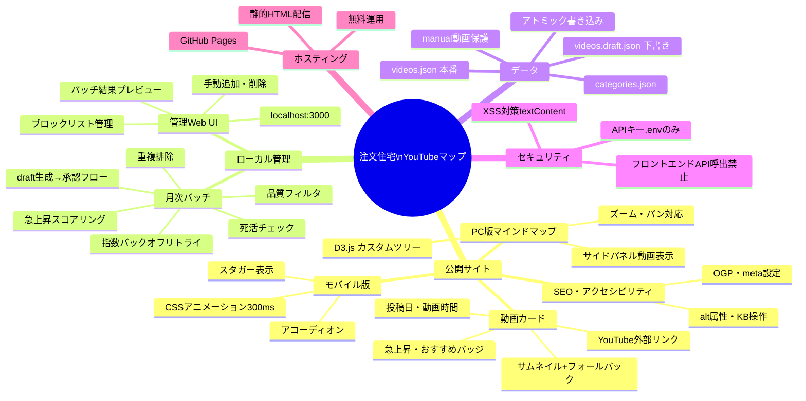

CLAUDE.md（12ルール版）
以下のルールは、明示的に上書きされない限り、このプロジェクトのすべてのタスクに適用する。
基本方針：非自明な作業では速度より慎重さを優先する。

ルール1 — コーディング前に考える
仮定は明示的に述べる。不明な場合は推測せず確認する。
曖昧さがある場合は複数の解釈を提示する。
より単純なアプローチが存在する場合は指摘する。
混乱した場合は停止し、不明点を明示する。

ルール2 — シンプルさを優先する
問題を解決する最小限のコードのみ実装する。投機的な実装は行わない。
求められた以外の機能は追加しない。単一用途のコードに抽象化を持ち込まない。
「シニアエンジニアが過剰と判断するか？」——Yes なら簡略化する。

ルール3 — 外科的な変更のみ行う
必要な箇所だけを変更する。自分が作ったもの以外の整理は行わない。
隣接するコード・コメント・フォーマットを「改善」しない。
壊れていないものをリファクタリングしない。既存のスタイルに合わせる。

ルール4 — 目標駆動で実行する
成功基準を定義し、検証できるまでループする。
手順ではなく「成功の定義」を示し、それに向けて反復する。

ルール5 — モデルは判断が必要な処理にのみ使用する
モデルを使う処理：分類・草稿作成・要約・非構造化テキストからの抽出。
モデルを使わない処理：ルーティング・リトライ・決定論的な変換。
コードで答えられる場合はコードで答える。

ルール6 — トークン予算は厳守する
タスクごと：4,000トークン。セッションごと：30,000トークン。
予算上限に近づいた場合は要約して再スタートする。
超過は黙って進まず、明示的に報告する。

ルール7 — 矛盾は表面化させる。平均化しない
2つのパターンが矛盾する場合、どちらか一方（より新しい／よりテスト済みのもの）を選ぶ。
選択理由を説明し、もう一方はクリーンアップ対象として明示する。
矛盾するパターンを混合しない。

ルール8 — 書く前に読む
コードを追加する前に、該当ファイルのエクスポート・直近の呼び出し元・共有ユーティリティを読む。
既存コードの構造の意図が不明な場合は、追加前に確認する。
「直交して見える」は危険なフレーズである。

ルール9 — テストは意図を検証するものである
テストは「何をするか」だけでなく「なぜその振る舞いが重要か」を表現する。
ビジネスロジックが変わっても失敗しないテストは誤りである。

ルール10 — 重要なステップごとにチェックポイントを設ける
各ステップ完了後：完了内容・検証済み内容・残タスクを要約する。
自分が説明できない状態から次のステップに進まない。
追跡を失った場合は停止して現状を再確認する。

ルール11 — コードベースの規約に従う（異論があっても）
コードベース内では「個人の好み < 規約への準拠」である。
規約に問題があると判断した場合は明示する。黙って別方式を持ち込まない。

ルール12 — 失敗は明示的に報告する
何かをスキップした場合、「完了した」と報告しない。
テストをスキップした場合、「テストがパスした」と報告しない。
不確実性はデフォルトで表面化させる。隠さない。

## 10. CLAUDE.md

```markdown
# CLAUDE.md
# 注文住宅YouTube動画マップ - Claude Code 実装指示書

## プロジェクト概要

注文住宅を検討し始めた初心者向けに、YouTube動画をカテゴリ×ジャンル別にマッピングして
ナビゲーションするWebサイトを構築する。
静的サイト（GitHub Pages）+ ローカル管理ツール（Node.js）構成。

## 技術スタック

| レイヤー | 技術 |
|----------|------|
| フロントエンド | HTML / CSS / Vanilla JS |
| PC可視化 | D3.js（カスタムツリーレイアウト + サイドパネル方式） |
| バックエンド（ローカルのみ） | Node.js + Express |
| データ形式 | JSON ファイル |
| テスト | Jest |
| ホスティング | GitHub Pages（`docs/` ディレクトリ） |

## ディレクトリ構成

```
/
├── docs/                       # GitHub Pages 配信（git管理対象）
│   ├── index.html
│   ├── style.css
│   ├── app.js
│   ├── images/
│   │   └── no-thumbnail.png    # サムネイルフォールバック画像
│   └── data/
│       └── videos.json         # ビルド生成物（src/builder/build.js が生成）
├── src/
│   ├── batch/
│   │   ├── index.js            # バッチエントリーポイント（npm run batch）
│   │   ├── fetch.js            # YouTube API 検索・取得
│   │   ├── score.js            # 急上昇スコアリング
│   │   ├── dedup.js            # 重複排除
│   │   └── health.js           # 死活チェック
│   ├── builder/
│   │   └── build.js            # 静的サイトビルド（npm run build）
│   ├── admin/
│   │   ├── server.js           # Express 管理サーバー（npm run admin）
│   │   └── public/             # 管理UI（HTML/CSS/JS）
│   └── utils/
│       └── fileUtils.js        # アトミック書き込みユーティリティ
├── data/
│   ├── categories.json         # カテゴリ・ジャンル定義（手動編集可）
│   ├── videos.json             # メインデータ・本番（バッチ + 手動管理）
│   └── videos.draft.json       # バッチ実行後の下書き（承認前）
├── logs/
│   ├── batch-YYYY-MM-DD.log
│   ├── health-YYYY-MM-DD.log
│   └── error.log
├── tests/
│   ├── score.test.js
│   ├── dedup.test.js
│   ├── health.test.js
│   └── build.test.js
├── .env                        # 🔴 gitignore 対象
├── .env.example
├── .gitignore
├── package.json
├── CLAUDE.md                   # このファイル
├── OPERATION.md                # 運用マニュアル（Sprint5で作成）
└── README.md
```

## 重要な設計方針

### 1. 静的サイト原則
- 公開サイト（`docs/`）は **完全な静的ファイル** のみで構成する
- ランタイムでのYouTube API呼び出しは **絶対に行わない**
- 全データは事前に `data/videos.json` に保存済みのものを使用する

### 2. データ管理の流れ（必ず守ること）

```
YouTube API
    ↓（バッチ実行）
data/videos.draft.json   ← バッチ出力（本番には即時反映しない）
    ↓（管理UIで承認）
data/videos.json          ← 本番データ（manual動画は保護）
    ↓（ビルド実行）
docs/data/videos.json     ← 公開データ（dead除外・日付更新）
    ↓（git push）
GitHub Pages              ← 公開サイト
```

### 3. manual動画の保護（最重要）
- `source: "manual"` の動画は、バッチ更新・マージ時に **絶対に上書き・削除しない**
- マージロジック：
  - 新規auto動画：draftから追加
  - 既存auto動画：draftの内容で更新
  - manual動画：現在の`videos.json`の内容を常に保持

### 4. APIキーの管理（セキュリティ最重要）
- YouTube Data API キーは `.env` ファイルにのみ記載する
- フロントエンド（`docs/` 以下）には **絶対にAPIキーを含めない**
- `.env` は `.gitignore` で除外する（コミット禁止）
- `docs/` 以下のJSファイルで `fetch('https://www.googleapis.com/...')` を書いてはならない

### 5. YouTube利用規約の遵守
- サイト内での動画再生は行わない（YouTubeへの外部リンクのみ）
- サムネイルは `https://img.youtube.com/vi/{videoId}/hqdefault.jpg` をURLで参照し
  自サーバーには保存しない
- 再生数・登録者数などのAPIデータは **公開サイトに表示しない・videos.jsonに保存しない**
  （バッチ処理中の一時メモリ使用のみ許可）
- フッターに免責事項を必ず表示する

### 6. アトミックファイル書き込み（データ破損防止）
- 全JSONファイルの書き込みは `src/utils/fileUtils.js` の `writeJsonAtomic()` を使用する
- 直接 `fs.writeFile()` でJSONを書き込んではならない

```javascript
// src/utils/fileUtils.js
const fs = require('fs').promises;
const path = require('path');

const writeJsonAtomic = async (filePath, data) => {
  const tmpPath = filePath + '.tmp';
  await fs.writeFile(tmpPath, JSON.stringify(data, null, 2), 'utf-8');
  await fs.rename(tmpPath, filePath);
};

module.exports = { writeJsonAtomic };
```

### 7. D3.jsマインドマップの設計方針
- **動画カードはD3.jsのSVGノード内に直接埋め込まない**
- ジャンルノードのクリックイベントでサイドパネル（通常のHTML要素）に動画カード一覧を表示する
- D3.jsはツリー構造の描画とインタラクションのみを担当する
- ズーム・パン機能を実装する（`zoom.scaleExtent([0.3, 3])`）

## データスキーマ（厳守）

### data/videos.json

```json
{
  "meta": {
    "last_updated": "2025-01-01",
    "schema_version": "1.1"
  },
  "categories": [
    {
      "id": "CAT-01",
      "name": "施主目線",
      "genres": [
        {
          "id": "GNR-01",
          "name": "間取り",
          "videos": [
            {
              "videoId": "string（YouTube動画ID・11文字）",
              "title": "string",
              "channelName": "string",
              "thumbnailUrl": "https://img.youtube.com/vi/{videoId}/hqdefault.jpg",
              "publishedAt": "YYYY-MM-DD",
              "duration": "PT15M30S（ISO 8601形式）",
              "tags": ["trending" | "manual"],
              "source": "auto" | "manual",
              "status": "active" | "dead",
              "order": "number（表示順序）"
            }
          ]
        }
      ]
    }
  ]
}
```

### data/categories.json

```json
{
  "globalSettings": {
    "blockedChannelIds": [],
    "blockedVideoIds": []
  },
  "categories": [
    {
      "id": "CAT-01",
      "name": "string",
      "order": "number",
      "genres": [
        {
          "id": "GNR-01",
          "name": "string",
          "order": "number",
          "searchQuery": "string（メインクエリ）",
          "searchQueryAlt": "string（代替クエリ・件数不足時に使用）"
        }
      ]
    }
  ]
}
```

## バッチスクリプト実装仕様（src/batch/）

### fetch.js
- YouTube Data API `search.list` で各カテゴリ×ジャンルを検索（最大10件取得）
- 必須パラメータ：
  ```javascript
  {
    type: 'video',
    regionCode: 'JP',
    relevanceLanguage: 'ja',
    videoEmbeddable: 'true',
    videoDuration: 'medium',   // 4〜20分
    safeSearch: 'strict',
    maxResults: 10
  }
  ```
- 件数が8件未満の場合、`searchQueryAlt` で再検索して補完
- 指数バックオフリトライ（最大3回: 1s → 2s → 4s）
- グローバルブロックリストによる除外処理
- `videoId` バリデーション：`/^[a-zA-Z0-9_-]{11}$/` に一致しないものは除外

### score.js
- 急上昇判定ロジック：
  ```javascript
  const isTrending = (video) => {
    const { subscriberCount, viewCount, publishedAt } = video._tempApiData;
    // 登録者数が非公開 or 不明の場合はスキップ
    if (!subscriberCount) return false;
    // ゼロ除算ガード
    if (subscriberCount === 0) return false;
    const engagementRate = viewCount / subscriberCount;
    const oneYearAgo = new Date();
    oneYearAgo.setFullYear(oneYearAgo.getFullYear() - 1);
    const isRecent = new Date(publishedAt) > oneYearAgo;
    return subscriberCount <= 20000 && engagementRate >= 0.3 && isRecent;
  };
  ```
- **`_tempApiData` フィールドは `videos.json` に保存しない**（スコアリング処理後に削除）

### dedup.js
- 同一videoIdが複数カテゴリ×ジャンルに存在する場合：カテゴリ順序（`order`）の前のものを残す
- auto・manual問わず同一ルールを適用

### health.js
- `videos.list` APIで `id=videoId1,videoId2,...` の形式でバッチリクエスト
- レスポンスに含まれないvideoIdは `status: "dead"` に更新
- `logs/health-YYYY-MM-DD.log` に結果を出力

## 静的ビルダー実装仕様（src/builder/build.js）

1. `data/videos.json` を読み込む
2. `data/categories.json` との整合性チェック（孤立IDがあれば警告ログ）
3. `status: "dead"` の動画を除外
4. `meta.last_updated` を現在日付（`YYYY-MM-DD`）に更新
5. `docs/data/videos.json` を `writeJsonAtomic()` で書き込む

## 管理Web UI実装仕様（src/admin/）

### バッチ結果承認フロー（最重要）
1. バッチ実行 → `data/videos.draft.json` に保存
2. 管理UI「プレビュー」画面で差分表示（新規追加・削除候補・変更）
3. 管理者が「承認」または「差し戻し」を選択
4. 承認時のマージロジック：
   - `source: "auto"` の動画：draftの内容で追加・更新
   - `source: "manual"` の動画：現在の `videos.json` の内容を保持
   - `status: "dead"` の判定：health.jsが更新するため、マージ時は保持

## 公開サイト実装仕様（docs/）

### app.js
```javascript
// JSONロードのタイムアウト実装
const loadVideos = async () => {
  const controller = new AbortController();
  const timeoutId = setTimeout(() => controller.abort(), 5000);
  
  try {
    const response = await fetch('./data/videos.json', {
      signal: controller.signal
    });
    clearTimeout(timeoutId);
    if (!response.ok) throw new Error('HTTP Error: ' + response.status);
    return await response.json();
  } catch (error) {
    clearTimeout(timeoutId);
    showErrorUI(); // エラーメッセージ + リロードボタンを表示
    throw error;
  }
};
```

### サムネイル表示（XSS対策・フォールバック必須）
```javascript
// textContentを使用してXSS対策
const card = document.createElement('div');
card.className = 'video-card';

const img = document.createElement('img');
img.src = video.thumbnailUrl;
img.alt = video.title + 'のサムネイル'; // textContent相当
img.onerror = function() {
  this.onerror = null;
  this.src = '/images/no-thumbnail.png';
};

const title = document.createElement('p');
title.textContent = video.title; // innerHTML禁止・必ずtextContentを使用

const channel = document.createElement('p');
channel.textContent = video.channelName; // innerHTML禁止
```

### 動画時間の表示変換
```javascript
// ISO 8601（PT15M30S）を MM:SS 形式に変換
const formatDuration = (iso8601) => {
  const match = iso8601.match(/PT(?:(\d+)H)?(?:(\d+)M)?(?:(\d+)S)?/);
  const h = parseInt(match[1] || 0);
  const m = parseInt(match[2] || 0);
  const s = parseInt(match[3] || 0);
  if (h > 0) return `${h}:${String(m).padStart(2, '0')}:${String(s).padStart(2, '0')}`;
  return `${m}:${String(s).padStart(2, '0')}`;
};
```

## npm スクリプト

```json
{
  "scripts": {
    "batch": "node src/batch/index.js",
    "build": "node src/builder/build.js",
    "admin": "node src/admin/server.js",
    "test": "jest",
    "test:watch": "jest --watch",
    "test:coverage": "jest --coverage",
    "test:e2e": "playwright test",
    "test:all": "jest && playwright test",
    "serve": "npx serve docs -p 8080"
  }
}
```

### 開発時依存パッケージ（テスト関連）

```
jest                    # 単体・結合テスト
supertest               # Express管理APIテスト
nock                    # YouTube Data APIモック
@playwright/test        # E2Eテスト（多用）
axe-playwright          # アクセシビリティ自動チェック
jest-junit              # CI連携用テストレポート
```

## 環境変数（.env）

```
YOUTUBE_API_KEY=your_api_key_here
ADMIN_PORT=3000
```

## スプリント計画

### サマリー

| Sprint | 期間 | 主要成果物 | 主要テスト追加 |
|--------|------|-----------|---------------|
| Sprint 0 | 1週間 | プロジェクト基盤・テスト環境・初期データ・クエリ人手検証 | UT-03 / UT-04 / SEC-01〜03 |
| Sprint 1 | 1週間 | UIプロトタイプ・アニメーション 🔴管理者承認が次Sprint進行の前提 | UT-05 / E2E-03 |
| Sprint 2 | 10日間 | バッチスクリプト・draft生成・スコアリング | UT-01 / UT-02 / IT-01 / IT-03 |
| Sprint 3 | 10日間 | ローカル管理Web UI・承認フロー | IT-02 / IT-04 / NS-010 |
| Sprint 4 | 1週間 | 静的ビルド・公開サイト統合・**E2E強化**・デプロイ | UT-06 / IT-05 / E2E-01 / E2E-02 / E2E-04 / SCHEMA |
| Sprint 5 | 1週間 | 品質・仕上げ・運用ドキュメント | カバレッジ補強 / クロスブラウザ |

### テスト戦略（全Sprint共通）

- **言語：JavaScript（Vanilla JS + Node.js）に統一**。テストも同じ言語で記述。
- **テストツール：** Jest（単体・結合）/ supertest（管理API）/ nock（YouTube APIモック）/ Playwright（E2E・多用）/ axe-playwright（A11y）
- **TDD推奨：** スコアリング・重複排除・マージロジック・バリデーションは**テストを先に書く**
- **Playwrightは積極活用：** 公開サイトのレスポンシブ・動画カード操作・JSONロード/タイムアウト・サムネイルfallback・A11yを自動E2E化（目視確認の対象は意図的に絞る）
- **目標：** 自動化率 ≥ 70%、コードカバレッジ Statements ≥ 85%
- 詳細なテスト観点・テストケースは `02-テスト/` 配下のドキュメントを正本とする

---

### Sprint 0：プロジェクト基盤・テスト環境構築（1週間）

**目標：** 開発環境・テスト環境・データスキーマを確立し、Sprint 1以降の実装が即TDDで進められる状態にする。

**実装タスク**
- [ ] GitHubリポジトリ作成・`package.json` 初期化
- [ ] `.env.example`（`YOUTUBE_API_KEY`, `ADMIN_PORT=3000`）・`.gitignore`（`.env`, `node_modules`, `logs/`, `coverage/`, `test-results/`, `playwright-report/`）
- [ ] ディレクトリ構成全体を作成（`docs/`, `src/`, `data/`, `logs/`, `tests/{unit,integration,e2e,security,schema,mocks}`）
- [ ] `src/utils/fileUtils.js`（`writeJsonAtomic()` 実装）
- [ ] `src/utils/validation.js`（`validateVideoId`, `validatePublishedAt`, `validateDuration`）
- [ ] `data/categories.json` 初期データ（2カテゴリ × 12ジャンル + `globalSettings.blockedChannelIds/blockedVideoIds`）
- [ ] `data/videos.json` スキーマ確定・空の初期ファイル
- [ ] `docs/images/no-thumbnail.png` フォールバック画像
- [ ] GitHub Pages 設定（`docs/` 配信）・Hello World 配置
- [ ] 🖐 **検索クエリ24本の人手検証**（FR-06 全クエリをYouTubeで検索し品質確認）

**テストタスク**
- [ ] `npm i -D jest supertest nock @playwright/test axe-playwright jest-junit`
- [ ] `npx playwright install` でブラウザ取得
- [ ] `jest.config.js`（`testMatch`, `coverageThreshold` statements/lines 85%, branches 80%）
- [ ] `playwright.config.js`（`webServer: serve docs -p 8080`、`chromium-desktop` / `chromium-mobile (iPhone 14)` / `boundary-768` の3プロジェクト）
- [ ] `tests/setup.js`（共通テストセットアップ・nock初期化）
- [ ] `tests/mocks/youtube-api.js` 雛形
- [ ] **UT-03** `tests/unit/fileUtils.test.js`（5ケース：正常書込・tmp残らない・中断時破損なし・日本語・ディレクトリ不在時throw）
- [ ] **UT-04** `tests/unit/validation.test.js`（14ケース：videoId/publishedAt/duration バリデーション境界値）
- [ ] **SEC** `tests/security/secrets.test.js`（SEC-01: `docs/` にAPIキー混入なし / SEC-02: `.env` が `.gitignore` 内 / SEC-03: `videos.json` に再生数・登録者数フィールドなし）

**Exit Criteria**
- `npm test` 全GREEN（UT-03: 5, UT-04: 14, SEC: 3 ＝ 計22ケース）
- `npx playwright test --list` で3プロジェクトが認識される
- GitHub Pages で Hello World が表示される
- 検索クエリ24本の人手検証チェックリストが ✅
- `git log -p` にAPIキー混入なし

---

### Sprint 1：UIプロトタイプ・アニメーション確認（1週間）

**目標：** 早期にデザイン・アニメーションを管理者が確認・承認できる状態にする。

**実装タスク**
- [ ] モバイル用アコーディオン（CSS `max-height` + `opacity`, 300ms ease-in-out / アイコン90°回転 / 動画カード stagger 50ms）
- [ ] PC用D3.jsカスタムツリーマインドマップ + サイドパネル方式
  - ジャンルノードクリックでサイドパネルに動画カード一覧表示
  - ノードホバーアニメーション
  - ズーム・パン（`zoom.scaleExtent([0.3, 3])`）+ リセットボタン
- [ ] ブレークポイント切替（768px）
- [ ] 動画カード（サムネイルfallback / タイトル2行省略 / 投稿日 / `formatDuration()` / 🔥急上昇バッジ / ⭐管理者おすすめバッジ）
- [ ] `formatDuration()` 実装（`docs/app.js`、ISO 8601 → `MM:SS` / `HH:MM:SS`）
- [ ] フッター（免責事項 / YouTube利用規約リンク / 最終更新日）
- [ ] SEO（title / meta description / OGP / Twitter Card `summary_large_image`）
- [ ] エラー表示UI + ローディングスピナー（タイムアウト時メッセージ + リロードボタン）

**テストタスク**
- [ ] **UT-05** `tests/unit/formatDuration.test.js`（6ケース：`PT15M30S`, `PT1H5M30S`, `PT5M0S`, `PT30S`, `PT0S`, 不正フォーマット）
- [ ] **E2E-03** `tests/e2e/responsive.spec.js`（3ケース：1280px=D3 / 767px=アコーディオン / 768px境界）
- [ ] 🖐 UIアニメーション目視確認チェックリスト

**Exit Criteria**
- `npm test` 全GREEN
- `npx playwright test responsive` 全PASS
- 🔴 **管理者によるアニメーション承認**（Sprint 2 進行の前提）

---

### Sprint 2：バッチ・データ収集機能（10日間）

**目標：** YouTube APIからデータを自動収集し、`data/videos.draft.json` を生成できる状態にする。`videos.json` には触らない。

**実装タスク**（TDDで進める）
- [ ] `src/batch/fetch.js`（`search.list` + `videos.list`、`regionCode=JP` / `relevanceLanguage=ja` / `videoEmbeddable=true` / `videoDuration=medium` / `safeSearch=strict` / `maxResults=10` / `searchQueryAlt` 補完）
- [ ] 指数バックオフリトライ（最大3回：1s → 2s → 4s）
- [ ] グローバルブロックリスト除外 + `videoId` 正規表現バリデーション
- [ ] `src/batch/score.js`（ゼロ除算ガード必須 / 登録者数非公開はスキップ / 2万人以下 + エンゲージメント率 ≥ 0.3 + 直近1年）
- [ ] `src/batch/dedup.js`（カテゴリ`order`・ジャンル`order`の前を優先、auto/manual共通）
- [ ] `src/batch/health.js`（`videos.list?id=...` バッチリクエスト、`status:"dead"` 更新、`logs/health-YYYY-MM-DD.log`）
- [ ] `src/batch/index.js` エントリポイント
- [ ] 件数不足チェック（8件未満をログ・コンソール出力）+ 前回 `videos.json` からの補完
- [ ] **`data/videos.draft.json` 出力**（`videos.json` は変更しない）
- [ ] `_tempApiData` を出力前に削除（再生数・登録者数を保存しない）
- [ ] ログ `logs/batch-YYYY-MM-DD.log` / `logs/error.log`
- [ ] `npm run batch` 設定

**テストタスク**
- [ ] **UT-01** `tests/unit/score.test.js`（11ケース：ゼロ除算 / 非公開 / `undefined` / 境界値20000・20001・0.29・0.30・364日・366日 / `_tempApiData` 欠落）
- [ ] **UT-02** `tests/unit/dedup.test.js`（7ケース：重複なし / CAT間 / manual重複 / ジャンルorder / 空配列 / 全重複 / auto-manual混在）
- [ ] **IT-01** `tests/integration/batch.test.js`（8ケース：draft生成 / スキーマ一致 / manualがdraftに混入しない / ブロックリスト除外 / 件数不足ログ / 前回manual補完 / 503で3回リトライ / 指数バックオフ 1s/2s/4s）
- [ ] **IT-03** `tests/integration/health.test.js`（5ケース：dead付与 / active保持 / ログ生成 / dead一覧記録 / 全dead時もJSON破損なし）
- [ ] `tests/mocks/youtube-api.js` 整備（正常10件 / 不足3件 / 503 / 空 / 登録者数0 / 登録者数非公開）

**Exit Criteria**
- `npm test` 全GREEN（UT-01: 11, UT-02: 7, IT-01: 8, IT-03: 5）
- `npm test -- --coverage` で `src/batch/` ブランチカバレッジ ≥ 80%
- ゼロ除算ガード（UT-01-05〜07）GREEN
- 指数バックオフ（IT-01-07〜08）GREEN
- `npm run batch` 実行で `data/videos.draft.json` 生成・`data/videos.json` 不変

---

### Sprint 3：ローカル管理Web UI（10日間）

**目標：** ブラウザからデータ管理・バッチ承認・ブロックリスト編集ができる状態にする。

**実装タスク**
- [ ] Express サーバー `src/admin/server.js`（**`127.0.0.1` バインド必須**・外部公開禁止）
- [ ] 管理UI（`src/admin/public/` HTML/CSS/Vanilla JS）
- [ ] 動画一覧画面（カテゴリ×ジャンル別 / 件数不足ハイライト：赤<5、黄<8）
- [ ] **バッチ結果プレビュー画面**（`videos.draft.json` の差分表示：新規追加 / 削除候補 / 変更 / 承認 / 差し戻し）
- [ ] マージロジック実装（auto: draft内容で更新 / manual: 現 `videos.json` を保護 / dead: status保持）
- [ ] 動画手動追加（URL or videoID 入力 / バリデーション / API取得 / プレビュー / `source:"manual"`, `tags:["manual"]` 自動付与）
- [ ] 動画手動削除 / 順序変更（上下ボタン）
- [ ] カテゴリ・ジャンル管理（検索クエリ・代替クエリ編集）
- [ ] ブロックリスト管理UI（channelId / videoId 追加・削除）
- [ ] バッチ実行ボタン / ビルド実行ボタン
- [ ] `npm run admin` 設定

**テストタスク**
- [ ] **IT-02** `tests/integration/merge.test.js`（5ケース：承認後draft反映 / **manual保持** / auto更新 / dead保持 / アトミック書込）
- [ ] **IT-04** `tests/integration/admin-api.test.js`（11ケース：supertestで `/api/videos` `/api/batch` `/api/blocklist` 全エンドポイント）
- [ ] **NS-010** localhost以外からのアクセス拒否テスト
- [ ] 🖐 管理UI操作性チェックリスト（FN-029, FN-035, NU-014）

**Exit Criteria**
- `npm test` 全GREEN（IT-02: 5, IT-04: 11）
- **IT-02-02（manual動画保護）必ずGREEN**
- 動画追加・削除・並び替えが `data/videos.json` に反映される
- バッチ→draft→承認→`videos.json` マージ後も manual 動画が保護されている

---

### Sprint 4：静的ビルド・公開サイト統合 + E2E強化（1週間）

**目標：** 公開サイトを生成・デプロイし、Playwrightによる自動E2Eテストを整備する。

**実装タスク**
- [ ] `src/builder/build.js`（dead除外 / `meta.last_updated` 更新 / `categories.json` 整合性チェック / `writeJsonAtomic` で `docs/data/videos.json` 出力）
- [ ] 公開サイト側 JSONロード処理（`AbortController` で5秒タイムアウト / エラーUI / リロードボタン）
- [ ] D3マインドマップ・アコーディオンに実データバインド
- [ ] **XSS対策最終確認**（全 `innerHTML` を `textContent` に置換、外部データは必ずエスケープ）
- [ ] `npm run build` 設定
- [ ] GitHub Pages デプロイ確認（本番URL）

**テストタスク（Playwright重点：CLAUDE.mdルール7=Playwright多用方針）**
- [ ] **UT-06** `tests/unit/build.test.js`（6ケース：dead除外 / active保持 / 全dead / `last_updated` 更新 / 孤立ID警告 / 整合性OK）
- [ ] **IT-05** `tests/integration/build.test.js`（6ケース：`docs/data/videos.json` 生成 / dead除外 / `last_updated` / 空 `videos.json` でも動作 / 孤立ID警告 / アトミック書込）
- [ ] **E2E-01** `tests/e2e/public-site.spec.js`（7ケース：3秒以内表示 / ロード成功 / ロード失敗UI / 5秒タイムアウトUI / リロードボタン / 免責 / 最終更新日）
- [ ] **E2E-02** `tests/e2e/video-card.spec.js`（6ケース：別タブ遷移 / URL形式 / fallback画像 / 🔥バッジ / ⭐バッジ / 2行省略）
- [ ] **E2E-04** `tests/e2e/accessibility.spec.js`（3ケース：alt属性 / Tabキー移動 / axe違反 0件）
- [ ] **SCHEMA** `tests/schema/videos-schema.test.js`（7ケース：スキーマ準拠 / videoId形式 / publishedAt / duration / status / source / schema_version="1.1"）

**Exit Criteria**
- `npm run test:all`（Jest + Playwright）全PASS
- E2E-04 axe-playwright によるアクセシビリティ違反 0件
- 全体カバレッジ Statements ≥ 85%
- 自動化率 ≥ 70%（テストケース集計）
- GitHub Pages 本番URLで実データ表示・モバイル動作確認

---

### Sprint 5：品質・仕上げ・運用ドキュメント（1週間）

**目標：** 公開リリース判定基準を全て満たし、運用に必要なドキュメントを整備する。

**実装・確認タスク**
- [ ] エッジケース 16件（E-01〜E-16）の全件動作確認・必要なら修正
- [ ] Lighthouse Performance ≥ 80 / Accessibility ≥ 80
- [ ] アクセシビリティ最終確認（alt属性 / Tabキー移動 / Enterで開く / カラーコントラスト 4.5:1 以上）
- [ ] 🖐 クロスブラウザ確認（Chrome / Safari / Firefox / iPhone Safari / Android Chrome）
- [ ] セキュリティ最終チェック：`git log --all -S "AIza"` および `git grep -E "AIza[0-9A-Za-z_-]{35}"` でAPIキー漏洩なし
- [ ] `OPERATION.md` 作成（月次バッチ手順 / 承認手順 / 手動追加手順 / デプロイ手順 / **APIキー漏洩時の即時無効化手順** / ブロックリスト管理 / 障害対応）
- [ ] `README.md` 作成

**テストタスク**
- [ ] `npm run test:all` 最終実行・全テスト 0 FAIL
- [ ] `npm run test:coverage` でカバレッジレポート確認・不足ブランチがあればテスト追加
- [ ] エッジケース 16件 ↔ テストケースのマッピング検証（テスト計画 §5.2）
- [ ] `scripts/run-tests.sh` 作成（unit → integration → security → schema → e2e → coverageサマリ → 自動化率レポートの順に実行）

**Exit Criteria（最終リリース判定 — 必須🔴 / 目標🟡）**

| 基準 | 判定方法 | 合格条件 | 優先度 |
|------|---------|---------|--------|
| 全自動テスト GREEN | `npm run test:all` | 0 FAIL | 🔴必須 |
| コードカバレッジ | `npm run test:coverage` | Statements ≥ 85% | 🔴必須 |
| エッジケース16件対応 | テスト結果 + 手動確認 | 全件対応済み | 🔴必須 |
| セキュリティ（APIキー） | `git log --all -S` | 検出ゼロ | 🔴必須 |
| 自動化率 | テストケース集計 | ≥ 70% | 🔴必須 |
| Lighthouse Performance | Lighthouseレポート | ≥ 80点 | 🟡目標 |
| Lighthouse Accessibility | Lighthouseレポート | ≥ 80点 | 🟡目標 |
| クロスブラウザ表示 | 手動（5環境） | 表示崩れなし | 🟡目標 |
| `OPERATION.md` / `README.md` | 目視 | 整備済み | 🔴必須 |

---

### 将来対応（2nd Step以降）

| 機能 | 概要 |
|------|------|
| 急上昇アルゴリズム精緻化 | 初回バッチ後の実データでエンゲージメント率閾値を再検証 |
| カテゴリ拡張 | 新ジャンル追加（資金計画・土地探し 等） |
| オンボーディング | 初回訪問ユーザー向け使い方ガイド |
| アクセス解析 | Google Analytics 等の導入 |
| 動画時間フィルタ | 短尺（Shorts）除外の精緻化 |

## 実装時の注意事項（優先度順）

1. **APIキーは絶対にコミットしない**
   → コミット前に必ず `git status` と `git diff --staged` でAPIキーが含まれていないことを確認

2. **public（docs/）にAPI通信ロジックを含めない**
   → `docs/` 以下のJSファイルで `googleapis.com` へのfetchを書いてはならない

3. **manual動画の保護ロジックを最優先で実装する**
   → Sprint 2・3でマージロジックのユニットテストを必ず作成する

4. **アトミック書き込みを徹底する**
   → JSONファイルの書き込みは全て `writeJsonAtomic()` を使用する

5. **XSS対策を徹底する**
   → 外部データ（タイトル・チャンネル名等）の表示は必ず `textContent` を使用し、`innerHTML` への直接挿入禁止

6. **Sprint 1は管理者承認が完了してから Sprint 2 に進む**
   → アニメーション・デザインの方向性を確定させることが後続実装の品質に直結する

7. **テストを先に書く（TDD推奨）**
   → 以下のロジックは必ずユニットテストを先に作成する：
   - スコアリング（ゼロ除算・非公開登録者数・閾値境界値）
   - 重複排除（manual/autoの混在ケース）
   - マージロジック（manual保護の確認）
   - バリデーション（不正videoId）

8. **エラーハンドリング**
   → バッチ実行時のAPIエラーは処理を止めず、スキップしてエラーログに記録する
   → 前回データが存在する場合は常にフォールバックとして利用できるようにする

9. **モバイルファースト**
   → CSSはモバイルのスタイルを先に書き、`@media (min-width: 768px)` で拡張する
```

---

## 設計サマリー

